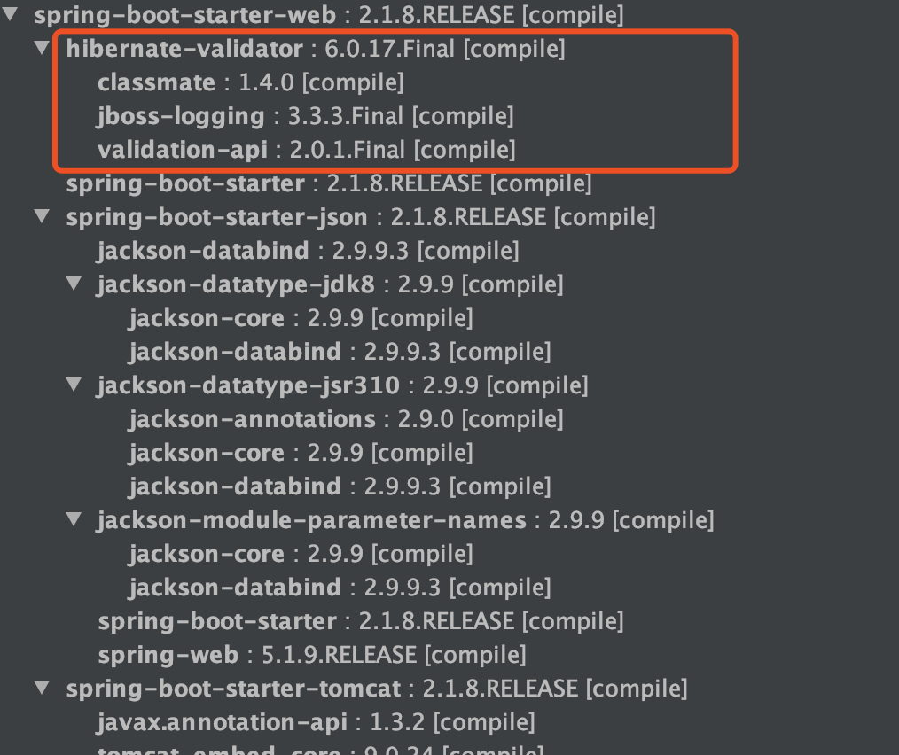

# Spring/Spring Boot 常用注解总结！

## 0.前言
可以毫不夸张地说，这篇文章介绍的 Spring/SpringBoot 常用注解基本已经涵盖你工作中遇到的大部分常用的场景。对于每一个注解我都说了具体用法，掌握搞懂，使用 SpringBoot 来开发项目基本没啥大问题了！

为什么要写这篇文章？

最近看到网上有一篇关于 SpringBoot 常用注解的文章被转载的比较多，我看了文章内容之后属实觉得质量有点低，并且有点会误导没有太多实际使用经验的人（这些人又占据了大多数）。所以，自己索性花了大概 两天时间简单总结一下了。

因为我个人的能力和精力有限，如果有任何不对或者需要完善的地方，请帮忙指出！Guide 哥感激不尽！

## 1. @SpringBootApplication

这里先单独拎出@SpringBootApplication 注解说一下，虽然我们一般不会主动去使用它。

这个注解是 Spring Boot 项目的基石，创建 SpringBoot 项目之后会默认在主类加上。

```java
@SpringBootApplication
public class SpringSecurityJwtGuideApplication {
    public static void main(java.lang.String[] args) {
        SpringApplication.run(SpringSecurityJwtGuideApplication.class, args);
    }
}
```

我们可以把 @SpringBootApplication看作是 @Configuration、@EnableAutoConfiguration、@ComponentScan 注解的集合。

```java
package org.springframework.boot.autoconfigure;
@Target(ElementType.TYPE)
@Retention(RetentionPolicy.RUNTIME)
@Documented
@Inherited
@SpringBootConfiguration
@EnableAutoConfiguration
@ComponentScan(excludeFilters = {
        @Filter(type = FilterType.CUSTOM, classes = TypeExcludeFilter.class),
        @Filter(type = FilterType.CUSTOM, classes = AutoConfigurationExcludeFilter.class) })
public @interface SpringBootApplication {
   // ......
}

package org.springframework.boot;
@Target(ElementType.TYPE)
@Retention(RetentionPolicy.RUNTIME)
@Documented
@Configuration
public @interface SpringBootConfiguration {

}
```

根据 SpringBoot 官网，这三个注解的作用分别是：
<ul>
<li>
@EnableAutoConfiguration：启用 SpringBoot 的自动配置机制
</li>
<li>
@ComponentScan： 扫描被@Component (@Service,@Controller)注解的 bean，注解默认会扫描该类所在的包下所有的类。
</li>
<li>
@Configuration：允许在 Spring 上下文中注册额外的 bean 或导入其他配置类</li>
</ul>

## 2. Spring Bean 相关
### 2.1. @Autowired
自动导入对象到类中，被注入进的类同样要被 Spring 容器管理比如：Service 类注入到 Controller 类中。
```java
@Service
public class UserService {
//  ......
}

@RestController
@RequestMapping("/users")
public class UserController {
   @Autowired
   private UserService userService;
//   ......
}
```
### 2.2. @Component,@Repository,@Service, @Controller
我们一般使用 @Autowired 注解让 Spring 容器帮我们自动装配 bean。要想把类标识成可用于 @Autowired 注解自动装配的 bean 的类,可以采用以下注解实现：

<ul>
<li>@Component ：通用的注解，可标注任意类为 Spring 组件。如果一个 Bean 不知道属于哪个层，可以使用@Component 注解标注。</li>
<li>@Repository : 对应持久层即 Dao 层，主要用于数据库相关操作。</li>
<li>@Service : 对应服务层，主要涉及一些复杂的逻辑，需要用到 Dao 层。</li>
<li>@Controller : 对应 Spring MVC 控制层，主要用于接受用户请求并调用 Service 层返回数据给前端页面。</li>
</ul>

### 2.3. @RestController
@RestController注解是@Controller和@ResponseBody的合集,表示这是个控制器 bean,并且是将函数的返回值直接填入 HTTP 响应体中,是 REST 风格的控制器。

Guide 哥：现在都是前后端分离，说实话我已经很久没有用过@Controller。如果你的项目太老了的话，就当我没说。

单独使用 @Controller 不加 @ResponseBody的话一般是用在要返回一个视图的情况，这种情况属于比较传统的 Spring MVC 的应用，对应于前后端不分离的情况。@Controller +@ResponseBody 返回 JSON 或 XML 形式数据

关于@RestController 和 @Controller的对比，请看这篇文章：@RestController vs @Controller。

### 2.4. @Scope
声明 Spring Bean 的作用域，使用方法:
```java
@Bean
@Scope("singleton")
public Person personSingleton() {
    return new Person();
}
```
四种常见的 Spring Bean 的作用域：
<ul>
<li>singleton : 唯一 bean 实例，Spring 中的 bean 默认都是单例的。</li>
<li>prototype : 每次请求都会创建一个新的 bean 实例。</li>
<li>request : 每一次 HTTP 请求都会产生一个新的 bean，该 bean 仅在当前 HTTP request 内有效。</li>
<li>session : 每一个 HTTP Session 会产生一个新的 bean，该 bean 仅在当前 HTTP session 内有效。</li>
</ul>

### 2.5. @Configuration
一般用来声明配置类，可以使用 @Component注解替代，不过使用@Configuration注解声明配置类更加语义化。
```java
@Configuration
public class AppConfig {
    @Bean
    public TransferService transferService() {
        return new TransferServiceImpl();
    }
}
```

## 3. 处理常见的 HTTP 请求类型
5 种常见的请求类型:
<ul>
<li>GET ：请求从服务器获取特定资源。举个例子：GET /users（获取所有学生）</li>
<li>POST ：在服务器上创建一个新的资源。举个例子：POST /users（创建学生）</li>
<li>PUT ：更新服务器上的资源（客户端提供更新后的整个资源）。举个例子：PUT /users/12（更新编号为 12 的学生）</li>
<li>DELETE ：从服务器删除特定的资源。举个例子：DELETE /users/12（删除编号为 12 的学生）</li>
<li>PATCH ：更新服务器上的资源（客户端提供更改的属性，可以看做作是部分更新），使用的比较少，这里就不举例子了。</li>
</ul>

### 3.1. GET 请求
@GetMapping("users") 等价于@RequestMapping(value="/users",method=RequestMethod.GET)
```java
@GetMapping("/users")
public ResponseEntity<List<User>> getAllUsers() {
 return userRepository.findAll();
}
```

### 3.2. POST 请求
@PostMapping("users") 等价于@RequestMapping(value="/users",method=RequestMethod.POST)

关于@RequestBody注解的使用，在下面的“前后端传值”这块会讲到。

```java
@PostMapping("/users")
public ResponseEntity<User> createUser(@Valid @RequestBody UserCreateRequest userCreateRequest) {
    return userRespository.save(userCreateRequest);
}
```

### 3.3. PUT 请求
@PutMapping("/users/{userId}") 等价于@RequestMapping(value="/users/{userId}",method=RequestMethod.PUT)
```java
@PutMapping("/users/{userId}")
public ResponseEntity<User> updateUser(@PathVariable(value = "userId") Long userId,
  @Valid @RequestBody UserUpdateRequest userUpdateRequest) {
  ......
}
```

### 3.4. DELETE 请求
@DeleteMapping("/users/{userId}")等价于@RequestMapping(value="/users/{userId}",method=RequestMethod.DELETE)
```java
@DeleteMapping("/users/{userId}")
public ResponseEntity deleteUser(@PathVariable(value = "userId") Long userId){
  ......
}
```

### 3.5. PATCH 请求
一般实际项目中，我们都是 PUT 不够用了之后才用 PATCH 请求去更新数据。
```java
@PatchMapping("/profile")
public ResponseEntity updateStudent(@RequestBody StudentUpdateRequest studentUpdateRequest) {
        studentRepository.updateDetail(studentUpdateRequest);
        return ResponseEntity.ok().build();
}
```

## 4. 前后端传值
掌握前后端传值的正确姿势，是你开始 CRUD 的第一步！

### 4.1. @PathVariable 和 @RequestParam
@PathVariable用于获取路径参数，@RequestParam用于获取查询参数。

举个简单的例子：
```java
@GetMapping("/klasses/{klassId}/teachers")
public List<Teacher> getKlassRelatedTeachers(
         @PathVariable("klassId") Long klassId,
         @RequestParam(value = "type", required = false) String type ) {
...
}
```

如果我们请求的 url 是：/klasses/123456/teachers?type=web

那么我们服务获取到的数据就是：klassId=123456,type=web。

### 4.2. @RequestBody
用于读取 Request 请求（可能是 POST,PUT,DELETE,GET 请求）的 body 部分并且Content-Type 为 application/json 格式的数据，接收到数据之后会自动将数据绑定到 Java 对象上去。系统会使用HttpMessageConverter或者自定义的HttpMessageConverter将请求的 body 中的 json 字符串转换为 java 对象。

我用一个简单的例子来给演示一下基本使用！

我们有一个注册的接口：

```java
@PostMapping("/sign-up")
public ResponseEntity signUp(@RequestBody @Valid UserRegisterRequest userRegisterRequest) {
  userService.save(userRegisterRequest);
  return ResponseEntity.ok().build();
}
```

UserRegisterRequest对象：

```java
@Data
@AllArgsConstructor
@NoArgsConstructor
public class UserRegisterRequest {
    @NotBlank
    private String userName;
    @NotBlank
    private String password;
    @NotBlank
    private String fullName;
}
```

我们发送 post 请求到这个接口，并且 body 携带 JSON 数据：

```json
{"userName":"coder","fullName":"shuangkou","password":"123456"}
```

这样我们的后端就可以直接把 json 格式的数据映射到我们的 UserRegisterRequest 类上。


👉 需要注意的是：一个请求方法只可以有一个@RequestBody，但是可以有多个@RequestParam和@PathVariable。 如果你的方法必须要用两个 @RequestBody来接受数据的话，大概率是你的数据库设计或者系统设计出问题了！

## 5. 读取配置信息
很多时候我们需要将一些常用的配置信息比如阿里云 oss、发送短信、微信认证的相关配置信息等等放到配置文件中。

下面我们来看一下 Spring 为我们提供了哪些方式帮助我们从配置文件中读取这些配置信息。

我们的数据源application.yml内容如下：
```yaml
wuhan2020: 2020年初武汉爆发了新型冠状病毒，疫情严重，但是，我相信一切都会过去！武汉加油！中国加油！

my-profile:
  name: Guide哥
  email: koushuangbwcx@163.com

library:
  location: 湖北武汉加油中国加油
  books:
    - name: 天才基本法
      description: 二十二岁的林朝夕在父亲确诊阿尔茨海默病这天，得知自己暗恋多年的校园男神裴之即将出国深造的消息——对方考取的学校，恰是父亲当年为她放弃的那所。
    - name: 时间的秩序
      description: 为什么我们记得过去，而非未来？时间“流逝”意味着什么？是我们存在于时间之内，还是时间存在于我们之中？卡洛·罗韦利用诗意的文字，邀请我们思考这一亘古难题——时间的本质。
    - name: 了不起的我
      description: 如何养成一个新习惯？如何让心智变得更成熟？如何拥有高质量的关系？ 如何走出人生的艰难时刻？
```

### 5.1. @Value(常用)
使用 @Value("${property}") 读取比较简单的配置信息：
```java
@Value("${wuhan2020}")
String wuhan2020;
```

### 5.2. @ConfigurationProperties(常用)
通过@ConfigurationProperties读取配置信息并与 bean 绑定。
```java
@Component
@ConfigurationProperties(prefix = "library")
class LibraryProperties {
    @NotEmpty
    private String location;
    private List<Book> books;

    @Setter
    @Getter
    @ToString
    static class Book {
        String name;
        String description;
    }
//  省略getter/setter
//  ......
}
```
你可以像使用普通的 Spring bean 一样，将其注入到类中使用。

### 5.3. @PropertySource（不常用）
@PropertySource读取指定 properties 文件
```java
@Component
@PropertySource("classpath:website.properties")

class WebSite {
    @Value("${url}")
    private String url;

//  省略getter/setter
//  ......
}
```

# 6. 参数校验
数据的校验的重要性就不用说了，即使在前端对数据进行校验的情况下，我们还是要对传入后端的数据再进行一遍校验，避免用户绕过浏览器直接通过一些 HTTP 工具直接向后端请求一些违法数据。

JSR(Java Specification Requests） 是一套 JavaBean 参数校验的标准，它定义了很多常用的校验注解，我们可以直接将这些注解加在我们 JavaBean 的属性上面，这样就可以在需要校验的时候进行校验了，非常方便！

校验的时候我们实际用的是 Hibernate Validator 框架。Hibernate Validator 是 Hibernate 团队最初的数据校验框架，Hibernate Validator 4.x 是 Bean Validation 1.0（JSR 303）的参考实现，Hibernate Validator 5.x 是 Bean Validation 1.1（JSR 349）的参考实现，目前最新版的 Hibernate Validator 6.x 是 Bean Validation 2.0（JSR 380）的参考实现。

SpringBoot 项目的 spring-boot-starter-web 依赖中已经有 hibernate-validator 包，不需要引用相关依赖。如下图所示（通过 idea 插件—Maven Helper 生成）：

注：更新版本的 spring-boot-starter-web 依赖中不再有 hibernate-validator 包（如2.3.11.RELEASE），需要自己引入 spring-boot-starter-validation 依赖。



非 SpringBoot 项目需要自行引入相关依赖包，这里不多做讲解，具体可以查看我的这篇文章：《如何在 Spring/Spring Boot 中做参数校验？你需要了解的都在这里！》。

👉 需要注意的是： 所有的注解，推荐使用 JSR 注解，即javax.validation.constraints，而不是org.hibernate.validator.constraints

### 6.1. 一些常用的字段验证的注解

<ul>
<li>@NotEmpty 被注释的字符串的不能为 null 也不能为空</li>
<li>@NotBlank 被注释的字符串非 null，并且必须包含一个非空白字符</li>
<li>@Null 被注释的元素必须为 null</li>
<li>@NotNull 被注释的元素必须不为 null</li>
<li>@AssertTrue 被注释的元素必须为 true</li>
<li>@AssertFalse 被注释的元素必须为 false</li>
<li>@Pattern(regex=,flag=)被注释的元素必须符合指定的正则表达式</li>
<li>@Email 被注释的元素必须是 Email 格式。</li>
<li>@Min(value)被注释的元素必须是一个数字，其值必须大于等于指定的最小值</li>
<li>@Max(value)被注释的元素必须是一个数字，其值必须小于等于指定的最大值</li>
<li>@DecimalMin(value)被注释的元素必须是一个数字，其值必须大于等于指定的最小值</li>
<li>@DecimalMax(value) 被注释的元素必须是一个数字，其值必须小于等于指定的最大值</li>
<li>@Size(max=, min=)被注释的元素的大小必须在指定的范围内</li>
<li>@Digits(integer, fraction)被注释的元素必须是一个数字，其值必须在可接受的范围内</li>
<li>@Past被注释的元素必须是一个过去的日期</li>
<li>@Future 被注释的元素必须是一个将来的日期</li>
<li>......</li>
</ul>

### 6.2. 验证请求体(RequestBody)

```java
@Data
@AllArgsConstructor
@NoArgsConstructor
public class Person {

    @NotNull(message = "classId 不能为空")
    private String classId;

    @Size(max = 33)
    @NotNull(message = "name 不能为空")
    private String name;

    @Pattern(regexp = "((^Man$|^Woman$|^UGM$))", message = "sex 值不在可选范围")
    @NotNull(message = "sex 不能为空")
    private String sex;

    @Email(message = "email 格式不正确")
    @NotNull(message = "email 不能为空")
    private String email;

}
```

我们在需要验证的参数上加上了@Valid注解，如果验证失败，它将抛出MethodArgumentNotValidException。

```java
@RestController
@RequestMapping("/api")
public class PersonController {

    @PostMapping("/person")
    public ResponseEntity<Person> getPerson(@RequestBody @Valid Person person) {
        return ResponseEntity.ok().body(person);
    }
}
```

### 6.3. 验证请求参数(Path Variables 和 Request Parameters)
一定一定不要忘记在类上加上 @Validated 注解了，这个参数可以告诉 Spring 去校验方法参数。

```java
@RestController
@RequestMapping("/api")
@Validated
public class PersonController {

    @GetMapping("/person/{id}")
    public ResponseEntity<Integer> getPersonByID(@Valid @PathVariable("id") @Max(value = 5,message = "超过 id 的范围了") Integer id) {
        return ResponseEntity.ok().body(id);
    }
}
```

更多关于如何在 Spring 项目中进行参数校验的内容，请看《如何在 Spring/Spring Boot 中做参数校验？你需要了解的都在这里！》这篇文章。

## 7. 全局处理 Controller 层异常
介绍一下我们 Spring 项目必备的全局处理 Controller 层异常。

相关注解：
<ol>
<li>
@ControllerAdvice :注解定义全局异常处理类
</li>
<li>
@ExceptionHandler :注解声明异常处理方法
</li>
</ol>

如何使用呢？拿我们在第 5 节参数校验这块来举例子。如果方法参数不对的话就会抛出MethodArgumentNotValidException，我们来处理这个异常。

```java
@ControllerAdvice
@ResponseBody
public class GlobalExceptionHandler {

    /**
     * 请求参数异常处理
     */
    @ExceptionHandler(MethodArgumentNotValidException.class)
    public ResponseEntity<?> handleMethodArgumentNotValidException(MethodArgumentNotValidException ex, HttpServletRequest request) {
//       ......
    }
}
```

## 8. JPA 相关
### 8.1. 创建表
@Entity声明一个类对应一个数据库实体。

@Table 设置表名

```java
@Entity
@Table(name = "role")
public class Role {
    @Id
    @GeneratedValue(strategy = GenerationType.IDENTITY)
    private Long id;
    private String name;
    private String description;
//    省略getter/setter......
}
```

### 8.2. 创建主键
@Id ：声明一个字段为主键。

使用@Id声明之后，我们还需要定义主键的生成策略。我们可以使用 @GeneratedValue 指定主键生成策略。

1.通过 @GeneratedValue直接使用 JPA 内置提供的四种主键生成策略来指定主键生成策略。

```java
@Id
@GeneratedValue(strategy = GenerationType.IDENTITY)
private Long id;
```

JPA 使用枚举定义了 4 种常见的主键生成策略，如下：
枚举替代常量的一种用法

```java
public enum GenerationType {

    /**
     * 使用一个特定的数据库表格来保存主键
     * 持久化引擎通过关系数据库的一张特定的表格来生成主键,
     */
    TABLE,

    /**
     *在某些数据库中,不支持主键自增长,比如Oracle、PostgreSQL其提供了一种叫做"序列(sequence)"的机制生成主键
     */
    SEQUENCE,

    /**
     * 主键自增长
     */
    IDENTITY,

    /**
     *把主键生成策略交给持久化引擎(persistence engine),
     *持久化引擎会根据数据库在以上三种主键生成 策略中选择其中一种
     */
    AUTO
}
```
@GeneratedValue注解默认使用的策略是GenerationType.AUTO
```java
public @interface GeneratedValue {

    GenerationType strategy() default AUTO;
    String generator() default "";
}
```
一般使用 MySQL 数据库的话，使用GenerationType.IDENTITY策略比较普遍一点（分布式系统的话需要另外考虑使用分布式 ID）。

2.通过 @GenericGenerator声明一个主键策略，然后 @GeneratedValue使用这个策略
```java
@Id
@GeneratedValue(generator = "IdentityIdGenerator")
@GenericGenerator(name = "IdentityIdGenerator", strategy = "identity")
private Long id;
```

等价于：

```java
@Id
@GeneratedValue(strategy = GenerationType.IDENTITY)
private Long id;
```

jpa 提供的主键生成策略有如下几种：

```java
public class DefaultIdentifierGeneratorFactory
		implements MutableIdentifierGeneratorFactory, Serializable, ServiceRegistryAwareService {

	@SuppressWarnings("deprecation")
	public DefaultIdentifierGeneratorFactory() {
		register( "uuid2", UUIDGenerator.class );
		register( "guid", GUIDGenerator.class );			// can be done with UUIDGenerator + strategy
		register( "uuid", UUIDHexGenerator.class );			// "deprecated" for new use
		register( "uuid.hex", UUIDHexGenerator.class ); 	// uuid.hex is deprecated
		register( "assigned", Assigned.class );
		register( "identity", IdentityGenerator.class );
		register( "select", SelectGenerator.class );
		register( "sequence", SequenceStyleGenerator.class );
		register( "seqhilo", SequenceHiLoGenerator.class );
		register( "increment", IncrementGenerator.class );
		register( "foreign", ForeignGenerator.class );
		register( "sequence-identity", SequenceIdentityGenerator.class );
		register( "enhanced-sequence", SequenceStyleGenerator.class );
		register( "enhanced-table", TableGenerator.class );
	}

	public void register(String strategy, Class generatorClass) {
		LOG.debugf( "Registering IdentifierGenerator strategy [%s] -> [%s]", strategy, generatorClass.getName() );
		final Class previous = generatorStrategyToClassNameMap.put( strategy, generatorClass );
		if ( previous != null ) {
			LOG.debugf( "    - overriding [%s]", previous.getName() );
		}
	}
}
```

### 8.3. 设置字段类型
@Column 声明字段。

示例：

设置属性 userName 对应的数据库字段名为 user_name，长度为 32，非空

```java
@Column(name = "user_name", nullable = false, length=32)
private String userName;
```

设置字段类型并且加默认值，这个还是挺常用的。

```java
@Column(columnDefinition = "tinyint(1) default 1")
private Boolean enabled;
```

### 8.4. 指定不持久化特定字段
@Transient ：声明不需要与数据库映射的字段，在保存的时候不需要保存进数据库 。

如果我们想让secrect 这个字段不被持久化，可以使用 @Transient关键字声明。

```java
@Entity(name="USER")
public class User {

//    ......
    @Transient
    private String secrect; // not persistent because of @Transient

}
```

除了 @Transient关键字声明， 还可以采用下面几种方法：

```java
static String secrect; // not persistent because of static
final String secrect = "Satish"; // not persistent because of final
transient String secrect; // not persistent because of transient
```

一般使用注解的方式比较多。

### 8.5. 声明大字段
@Lob:声明某个字段为大字段。
```java
@Lob
private String content;
```
更详细的声明：

```java

@Lob
//指定 Lob 类型数据的获取策略， FetchType.EAGER 表示非延迟加载，而 FetchType.LAZY 表示延迟加载 ；
@Basic(fetch = FetchType.EAGER)
//columnDefinition 属性指定数据表对应的 Lob 字段类型
@Column(name = "content", columnDefinition = "LONGTEXT NOT NULL")
private String content;
```

### 8.6. 创建枚举类型的字段
可以使用枚举类型的字段，不过枚举字段要用@Enumerated注解修饰。

```java
public enum Gender {
MALE("男性"),
FEMALE("女性");

    private String value;
    Gender(String str){
        value=str;
    }
}
```
```java
@Entity
@Table(name = "role")
public class Role {
    @Id
    @GeneratedValue(strategy = GenerationType.IDENTITY)
    private Long id;
    private String name;
    private String description;
    @Enumerated(EnumType.STRING)
    private Gender gender;
//    省略getter/setter......
}
```
数据库里面对应存储的是 MALE/FEMALE。

### 8.7. 增加审计功能
只要继承了 AbstractAuditBase的类都会默认加上下面四个字段。
```java
@Data
@AllArgsConstructor
@NoArgsConstructor
@MappedSuperclass
@EntityListeners(value = AuditingEntityListener.class)
public abstract class AbstractAuditBase {

    @CreatedDate
    @Column(updatable = false)
    @JsonIgnore
    private Instant createdAt;

    @LastModifiedDate
    @JsonIgnore
    private Instant updatedAt;

    @CreatedBy
    @Column(updatable = false)
    @JsonIgnore
    private String createdBy;

    @LastModifiedBy
    @JsonIgnore
    private String updatedBy;
}
```
我们对应的审计功能对应地配置类可能是下面这样的（Spring Security 项目）:
```java
@Configuration
@EnableJpaAuditing
public class AuditSecurityConfiguration {
    @Bean
    AuditorAware<String> auditorAware() {
        return () -> Optional.ofNullable(SecurityContextHolder.getContext())
                .map(SecurityContext::getAuthentication)
                .filter(Authentication::isAuthenticated)
                .map(Authentication::getName);
    }
}
```
简单介绍一下上面涉及到的一些注解：

@CreatedDate: 表示该字段为创建时间字段，在这个实体被 insert 的时候，会设置值

@CreatedBy :表示该字段为创建人，在这个实体被 insert 的时候，会设置值

@LastModifiedDate、@LastModifiedBy同理。

@EnableJpaAuditing：开启 JPA 审计功能。

### 8.8. 删除/修改数据
@Modifying 注解提示 JPA 该操作是修改操作,注意还要配合@Transactional注解使用。
```java
@Repository
public interface UserRepository extends JpaRepository<User, Integer> {

    @Modifying
    @Transactional(rollbackFor = Exception.class)
    void deleteByUserName(String userName);
}
```
### 8.9. 关联关系
<ul>
<li>@OneToOne 声明一对一关系</li>
<li>@OneToMany 声明一对多关系</li>
<li>@ManyToOne 声明多对一关系</li>
<li>@MangToMang 声明多对多关系</li>
</ul>

## 9. 事务 @Transactional
在要开启事务的方法上使用@Transactional注解即可!

```java
@Transactional(rollbackFor = Exception.class)
public void save() {
......
}
```

我们知道 Exception 分为运行时异常 RuntimeException 和非运行时异常。在@Transactional注解中如果不配置rollbackFor属性,那么事务只会在遇到RuntimeException的时候才会回滚,加上rollbackFor=Exception.class,可以让事务在遇到非运行时异常时也回滚。

@Transactional 注解一般可以作用在类或者方法上。
<ul>
<li>作用于类：当把@Transactional 注解放在类上时，表示所有该类的 public 方法都配置相同的事务属性信息。</li>
<li>作用于方法：当类配置了@Transactional，方法也配置了@Transactional，方法的事务会覆盖类的事务配置信息。</li>
</ul>

## 10. json 数据处理
### 10.1. 过滤 json 数据
@JsonIgnoreProperties 作用在类上用于过滤掉特定字段不返回或者不解析。

```java
//生成json时将userRoles属性过滤
@JsonIgnoreProperties({"userRoles"})
public class User {

    private String userName;
    private String fullName;
    private String password;
    private List<UserRole> userRoles = new ArrayList<>();
}
```

@JsonIgnore一般用于类的属性上，作用和上面的@JsonIgnoreProperties 一样。

```java
public class User {

    private String userName;
    private String fullName;
    private String password;
   //生成json时将userRoles属性过滤
    @JsonIgnore
    private List<UserRole> userRoles = new ArrayList<>();
}
```
### 10.2. 格式化 json 数据
@JsonFormat一般用来格式化 json 数据。

比如：
```java

@JsonFormat(shape=JsonFormat.Shape.STRING, pattern="yyyy-MM-dd'T'HH:mm:ss.SSS'Z'", timezone="GMT")
private Date date;
```

#10.3. 扁平化对象

```java
@Getter
@Setter
@ToString
public class Account {
    private Location location;
    private PersonInfo personInfo;

  @Getter
  @Setter
  @ToString
  public static class Location {
     private String provinceName;
     private String countyName;
  }
  @Getter
  @Setter
  @ToString
  public static class PersonInfo {
    private String userName;
    private String fullName;
  }
}
```
```json
{
    "location": {
        "provinceName":"湖北",
        "countyName":"武汉"
    },
    "personInfo": {
        "userName": "coder1234",
        "fullName": "shaungkou"
    }
}
```
使用@JsonUnwrapped 扁平对象之后：
```java
@Getter
@Setter
@ToString
public class Account {
    @JsonUnwrapped
    private Location location;
    @JsonUnwrapped
    private PersonInfo personInfo;
//    ......
}
```
```json
{
  "provinceName":"湖北",
  "countyName":"武汉",
  "userName": "coder1234",
  "fullName": "shaungkou"
}
```

## 11. 测试相关
@ActiveProfiles一般作用于测试类上， 用于声明生效的 Spring 配置文件。

```java
@SpringBootTest(webEnvironment = RANDOM_PORT)
@ActiveProfiles("test")
@Slf4j
public abstract class TestBase {
//......
}
```
@Test声明一个方法为测试方法

@Transactional被声明的测试方法的数据会回滚，避免污染测试数据。

@WithMockUser Spring Security 提供的，用来模拟一个真实用户，并且可以赋予权限。
```java
@Test
@Transactional
@WithMockUser(username = "user-id-18163138155", authorities = "ROLE_TEACHER")
public void shouldImportStudentSuccess() throws Exception {
......
}
```
暂时总结到这里吧！虽然花了挺长时间才写完，不过可能还是会一些常用的注解的被漏掉，所以，我将文章也同步到了 Github 上去，Github 地址： 欢迎完善！
