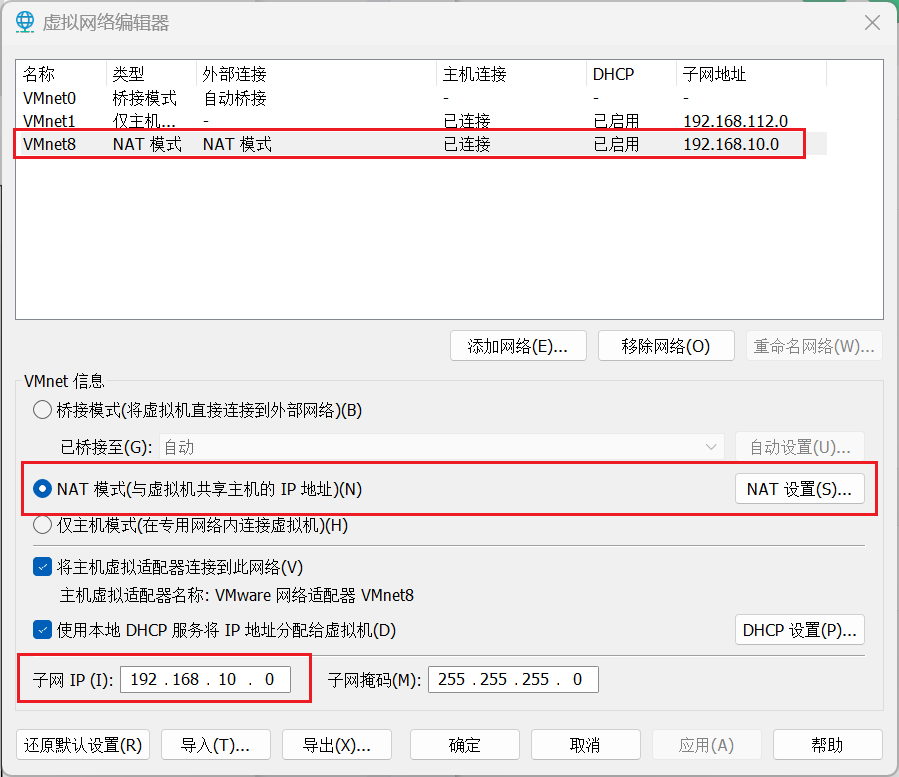
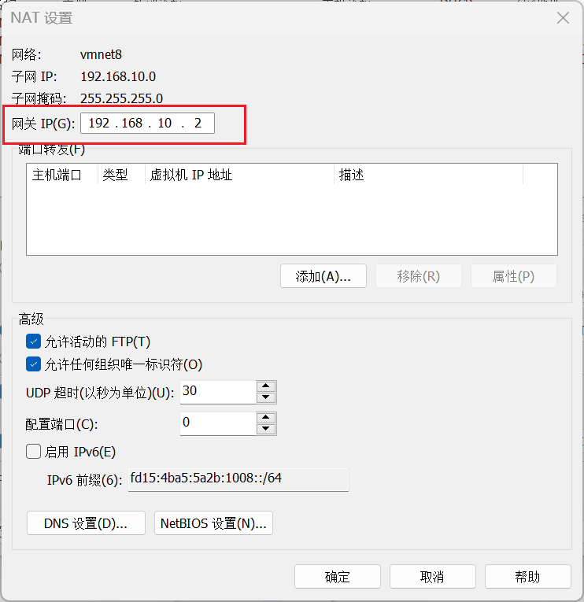
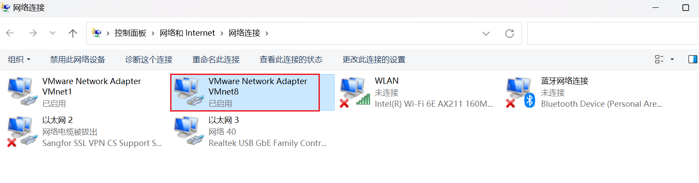
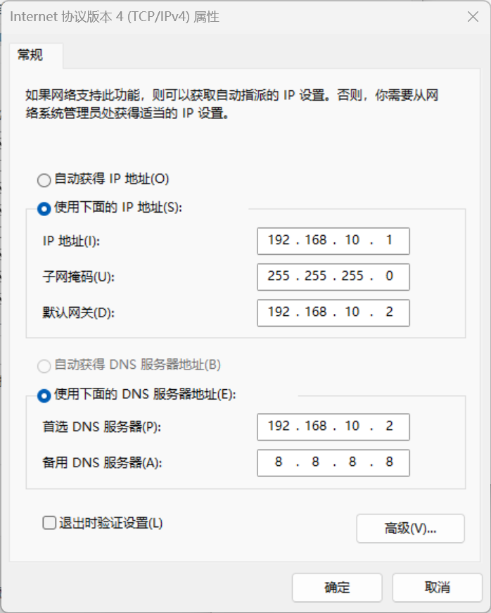

# 1.模板虚拟机环境准备

安装模板虚拟机，IP地址 192.168.10.100、主机名称 hadoop100、内存 4G、硬盘 50G

1.hadoop100 虚拟机配置要求如下（本文 Linux 系统全部以 CentOS-7.5-x86-1804 为例）

（1）使用 yum 安装需要虚拟机可以正常上网，yum 安装前可以先测试下虚拟机联网情况

```xml
[root@hadoop100 ~]# ping www.baidu.com
PING www.baidu.com (14.215.177.39) 56(84) bytes of data.
64 bytes from 14.215.177.39 (14.215.177.39): icmp_seq=1 
ttl=128 time=8.60 ms
64 bytes from 14.215.177.39 (14.215.177.39): icmp_seq=2 
ttl=128 time=7.72 ms
```

（2）安装 epel-release

注：Extra Packages for Enterprise Linux 是为“红帽系”的操作系统提供额外的软件包，适用于 RHEL、CentOS 和 Scientific Linux。相当于是一个软件仓库，大多数 rpm 包在官方repository 中是找不到的）

```sh
[root@hadoop100 ~]# yum install -y epel-release
```

（3）注意：如果 Linux 安装的是最小系统版，还需要安装如下工具；如果安装的是 Linux桌面标准版，不需要执行如下操作

➢ net-tool：工具包集合，包含 ifconfig 等命令

```sh
[root@hadoop100 ~]# yum install -y net-tools 
```

➢ vim：编辑器

```sh
[root@hadoop100 ~]# yum install -y vim
```

2.关闭防火墙，关闭防火墙开机自启

```sh
[root@hadoop100 ~]# systemctl stop firewalld
[root@hadoop100 ~]# systemctl disable firewalld.service
```

注意：在企业开发时，通常单个服务器的防火墙时关闭的。公司整体对外会设置非常安全的防火墙

3.创建atguigu用户，并修改atguigu用户的密码

```sh
[root@hadoop100 ~]# useradd atguigu
[root@hadoop100 ~]# passwd atguigu
```

4.配置atguigu用户具有root权限，方便后期加sudo执行root权限的命令

```sh
[root@hadoop100 ~]# vim /etc/sudoers
```

修改/etc/sudoers 文件，在%wheel 这行下面添加一行，如下所示：

```sh
## Allow root to run any commands anywhere
root ALL=(ALL) ALL
## Allows people in group wheel to run all commands
%wheel ALL=(ALL) ALL 
atguigu ALL=(ALL) NOPASSWD:ALL
```

注意：atguigu 这一行不要直接放到 root 行下面，因为所有用户都属于 wheel 组，你先配置了 atguigu 具有免密功能，但是程序执行到%wheel 行时，该功能又被覆盖回需要密码。所以 atguigu 要放到%wheel 这行下面。

5.在/opt 目录下创建文件夹，并修改所属主和所属组

（1）在/opt 目录下创建 module、software 文件夹

```sh
[root@hadoop100 ~]# mkdir /opt/module
[root@hadoop100 ~]# mkdir /opt/software
```

（2）修改 module、software 文件夹的所有者和所属组均为 atguigu 用户

```sh
[root@hadoop100 ~]# chown atguigu:atguigu /opt/module
[root@hadoop100 ~]# chown atguigu:atguigu /opt/software
```

（3）查看 module、software 文件夹的所有者和所属组

```sh
[root@hadoop100 ~]# cd /opt/

[root@hadoop100 opt]# ll

总用量 12

drwxr-xr-x. 2 atguigu atguigu 4096 5 月 28 17:18 module

drwxr-xr-x. 2 root root 4096 9 月 7 2017 rh

drwxr-xr-x. 2 atguigu atguigu 4096 5 月 28 17:18 software
```

6.卸载虚拟机自带的 JDK

注意：如果你的虚拟机是最小化安装不需要执行这一步。

```sh
[root@hadoop100 ~]# rpm -qa | grep -i java | xargs -n1 rpm -e --nodeps

➢ rpm -qa：查询所安装的所有 rpm 软件包

➢ grep -i：忽略大小写

➢ xargs -n1：表示每次只传递一个参数

➢ rpm -e –nodeps：强制卸载软件
```

7）重启虚拟机

```sh
[root@hadoop100 ~]# reboot
```

# 2.克隆虚拟机

1.利用模板机hadoop100，克隆三台虚拟机：hadoop102、hadoop103、hadoop104

注意：克隆时，要先关闭 hadoop100

2.修改克隆机 IP，以下以hadoop102 举例说明

（1）修改克隆虚拟机的静态 IP

```sh
[root@hadoop100 ~]# vim /etc/sysconfig/network-scripts/ifcfg-ens33
```

改成

```sh
DEVICE=ens33
TYPE=Ethernet
ONBOOT=yes
BOOTPROTO=static
NAME="ens33"
IPADDR=192.168.10.102
PREFIX=24
GATEWAY=192.168.10.2
DNS1=192.168.10.2
```

（2）查看 Linux 虚拟机的虚拟网络编辑器，编辑->虚拟网络编辑器->VMnet8





（3）查看 Windows 系统适配器 VMware Network Adapter VMnet8 的 IP 地址



（4）保证 Linux 系统 ifcfg-ens33 文件中 IP 地址、虚拟网络编辑器地址和 Windows 系统 VM8 网络 IP 地址相同。

3.修改克隆机主机名，以下以hadoop102 举例说明

（1）修改主机名称

```sh
[root@hadoop100 ~]# vim /etc/hostname
hadoop102
```

（2）配置 Linux 克隆机主机名称映射 hosts 文件，打开/etc/hosts

```sh
[root@hadoop100 ~]# vim /etc/hosts
```

添加如下内容

```sh
192.168.10.100 hadoop100
192.168.10.101 hadoop101
192.168.10.102 hadoop102
192.168.10.103 hadoop103
192.168.10.104 hadoop104
192.168.10.105 hadoop105
192.168.10.106 hadoop106
192.168.10.107 hadoop107
192.168.10.108 hadoop108
```

4.重启克隆机hadoop102

```sh
[root@hadoop100 ~]# reboot
```

5.修改 windows 的主机映射文件（hosts 文件）

（1）如果操作系统是 window7，可以直接修改

- 进入 C:\Windows\System32\drivers\etc 路径

- 打开 hosts 文件并添加如下内容，然后保存


```sh
192.168.10.100 hadoop100
192.168.10.101 hadoop101
192.168.10.102 hadoop102
192.168.10.103 hadoop103
192.168.10.104 hadoop104
192.168.10.105 hadoop105
192.168.10.106 hadoop106
192.168.10.107 hadoop107
192.168.10.108 hadoop108
```

（2）如果操作系统是 Windows11，先拷贝出来，修改保存以后，再覆盖即可

- 进入 C:\Windows\System32\drivers\etc 路径
- 拷贝 hosts 文件到桌面
- 打开桌面 hosts 文件并添加如下内容

```sh
192.168.10.100 hadoop100
192.168.10.101 hadoop101
192.168.10.102 hadoop102
192.168.10.103 hadoop103
192.168.10.104 hadoop104
192.168.10.105 hadoop105
192.168.10.106 hadoop106
192.168.10.107 hadoop107
192.168.10.108 hadoop108
```

- 将桌面 hosts 文件覆盖 C:\Windows\System32\drivers\etc 路径 hosts 文件

# 3.在hadoop102安装 JDK

[参见文档：安装配置JDK](https://www.2021cn.top/#/./docs/linux/Linux%E9%85%8D%E7%BD%AEJDK)

# 4.在hadoop102安装Hadoop

1.用XShell文件传输工具将hadoop-3.1.3.tar.gz导入到opt目录下面的software文件夹下面

2.进入到Hadoop安装包路径下

```sh
[atguigu@hadoop102 ~]$ cd /opt/software/
```

3.解压安装文件到/opt/module下面

```sh
[atguigu@hadoop102 software]$ tar -zxvf hadoop-3.1.3.tar.gz -C /opt/module/
```

4.查看是否解压成功

```sh
[atguigu@hadoop102 software]$ ls /opt/module/hadoop-3.1.3
```

5.将Hadoop添加到环境变量

（1）获取 Hadoop 安装路径

```sh
[atguigu@hadoop102 hadoop-3.1.3]$ pwd
/opt/module/hadoop-3.1.3
```

（2）打开vim /etc/profile 文件

```sh
[atguigu@hadoop102 hadoop-3.1.3]$ sudo vim /etc/profile
#HADOOP_HOME
export HADOOP_HOME=/opt/module/hadoop-3.1.3
export PATH=$PATH:$HADOOP_HOME/bin
export PATH=$PATH:$HADOOP_HOME/sbin
```

（3）让修改后的文件生效

```sh
[atguigu@hadoop102 hadoop-3.1.3]$ source /etc/profile
```

6.测试是否安装成功

```sh
[atguigu@hadoop102 hadoop-3.1.3]$ hadoop version
Hadoop 3.1.3
```

7.重启（如果 Hadoop 命令不能用再重启虚拟机）

```sh
[atguigu@hadoop102 hadoop-3.1.3]$ sudo reboot
```

# 5.Hadoop 目录结构

1.查看 Hadoop 目录结构

```sh
[atguigu@hadoop102 hadoop-3.1.3]$ ll
总用量 52
drwxr-xr-x. 2 atguigu atguigu 4096 5 月 22 2017 bin
drwxr-xr-x. 3 atguigu atguigu 4096 5 月 22 2017 etc
drwxr-xr-x. 2 atguigu atguigu 4096 5 月 22 2017 include
drwxr-xr-x. 3 atguigu atguigu 4096 5 月 22 2017 lib
drwxr-xr-x. 2 atguigu atguigu 4096 5 月 22 2017 libexec
-rw-r--r--. 1 atguigu atguigu 15429 5 月 22 2017 LICENSE.txt
-rw-r--r--. 1 atguigu atguigu 101 5 月 22 2017 NOTICE.txt
-rw-r--r--. 1 atguigu atguigu 1366 5 月 22 2017 README.txt
drwxr-xr-x. 2 atguigu atguigu 4096 5 月 22 2017 sbin
drwxr-xr-x. 4 atguigu atguigu 4096 5 月 22 2017 share
```

2.重要目录

（1）bin 目录：存放对 Hadoop 相关服务（hdfs，yarn，mapred）进行操作的脚本

（2）etc 目录：Hadoop 的配置文件目录，存放 Hadoop 的配置文件

（3）lib 目录：存放 Hadoop 的本地库（对数据进行压缩解压缩功能）

（4）sbin 目录：存放启动或停止 Hadoop 相关服务的脚本

（5）share 目录：存放 Hadoop 的依赖 jar 包、文档、和官方案例
