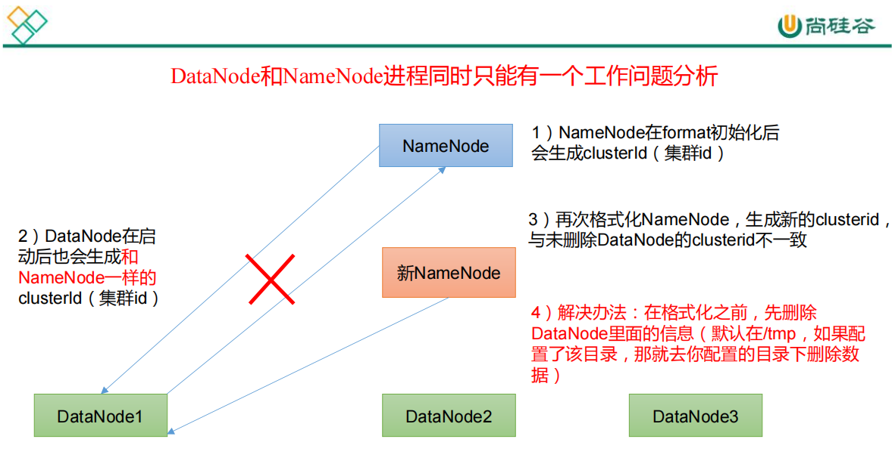

# 常见错误及解决方案
1）防火墙没关闭、或者没有启动 YARN
INFO client.RMProxy: Connecting to ResourceManager at hadoop108/192.168.10.108:8032
2）主机名称配置错误
3）IP 地址配置错误
4）ssh 没有配置好
5）root 用户和 atguigu 两个用户启动集群不统一
6）配置文件修改不细心
7）不识别主机名称

```
java.net.UnknownHostException: hadoop102: hadoop102
 at 
java.net.InetAddress.getLocalHost(InetAddress.java:1475)
 at 
org.apache.hadoop.mapreduce.JobSubmitter.submitJobInternal(Job
Submitter.java:146)
 at org.apache.hadoop.mapreduce.Job$10.run(Job.java:1290)
 at org.apache.hadoop.mapreduce.Job$10.run(Job.java:1287)
 at java.security.AccessController.doPrivileged(Native 
Method)
at javax.security.auth.Subject.doAs(Subject.java:415)
```
解决办法：
		在/etc/hosts 文件中添加 192.168.10.102 hadoop102
		主机名称不要起 hadoop hadoop000 等特殊名称
8）DataNode 和 NameNode 进程同时只能工作一个。

9）执行命令不生效，粘贴 Word 中命令时，遇到-和长–没区分开。导致命令失效
解决办法：尽量不要粘贴 Word 中代码。
10）jps 发现进程已经没有，但是重新启动集群，提示进程已经开启。
原因是在 Linux 的根目录下/tmp 目录中存在启动的进程临时文件，将集群相关进程删除掉，再重新启动集群。
11)、jps 不生效
原因：全局变量 hadoop java 没有生效。解决办法：需要 source /etc/profile 文件。
12)、8088 端口连接不上
```sh
[atguigu@hadoop102 桌面]$ cat /etc/hosts
```
注释掉如下代码
```shell
#127.0.0.1 localhost localhost.localdomain localhost4 localhost4.localdomain4
#::1 hadoop102
```