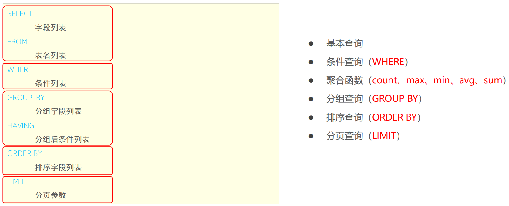

# 面试题
⚫ 什么是事务,以及事务的四大特性? 
⚫ 事务的隔离级别有哪些,MySQL默认是哪个? 
⚫ 内连接与左外连接的区别是什么? 
⚫ 常用的存储引擎？InnoDB与MyISAM的区别？
⚫ MySQL默认InnoDB引擎的索引是什么数据结构? 
⚫ 如何查看MySQL的执行计划? 
⚫ 索引失效的情况有哪些? 
⚫ 什么是回表查询? 
⚫ 什么是MVCC?
⚫ MySQL主从复制的原理是什么? 
⚫ 主从复制之后的读写分离如何实现? 
⚫ 数据库的分库分表如何实现?
# MySQL概述
## 数据库相关概念
⚫ 数据库
Database，简称DB。按照一定的数据结构来组织、存储和管理数据的仓库。
⚫ 数据库管理系统
Database Management System，一种操纵和管理数据库的大型软件，用于创建、使用和维护数据库，简称DBMS。
⚫ 数据库管理系统
➢ 关系型数据库（RDBMS）
    概念： 关系型数据库，是建立在关系模型基础上，由多张相互连接的二维表组成的数据库。
    特点：
        1. 使用表存储数据，格式统一，便于维护
        2. 使用SQL语句操作，标准统一，使用方便
        3. 数据存储在磁盘中，安全
➢ 非关系型数据库(NoSQL)
    概念：Not-Only SQL，泛指非关系型数据库，是对关系型数据库的补充。
    特点：
        1. 数据结构灵活
        2. 伸缩性强
⚫ SQL
    • 结构化查询语言（Structured Query Language），简称SQL。
    • 是一种操作关系型数据库的编程语言，定义了一套操作关系型数据库统一标准。

# SQL
## SQL通用语法
⚫ SQL通用语法
1. SQL语句可以单行或多行书写，以分号结尾。
2. SQL语句可以使用空格/缩进来增强语句的可读性。
3. MySQL数据库的SQL语句不区分大小写，关键字建议使用大写。
4. 注释：
    • 单行注释：-- 注释内容 或 # 注释内容(MySQL特有) 
    • 多行注释： /* 注释内容 */

## SQL分类

| **分类** | **说明**                                               |
| -------- | ------------------------------------------------------ |
| DDL      | 数据定义语言，用来定义数据库对象(数据库，表，字段)     |
| DML      | 数据操作语言，用来对数据库表中的数据进行增删改         |
| DQL      | 数据查询语言，用来查询数据库中表的记录                 |
| DCL      | 数据控制语言，用来创建数据库用户、控制数据库的访问权限 |


## DDL
⚫ DDL-数据库操作

➢ 查询

查询所有数据库

```sql
show databases;
```

查询当前数据库

```sql
select database();
```

➢ 创建

```sql
create database [if not exists] 数据库名 [default charset 字符集] [collate 排序规则];
```

➢ 删除

```sql
drop database [if exists] 数据库名
```

➢ 使用

```sql
use 数据库名
```

⚫ DDL-表操作-查询

➢ 查询当前数据库所有表
```sql
show tables;
```

➢ 查询表结构
```sql
desc 表名;
```

➢ 查询指定表的建表语句
```sql
show create table 表名;
```

⚫ DDL-表操作-创建
```sql
create table 表名（
    字段1 字段1类型[comment 字段1注释],
    字段2 字段2类型[comment 字段2注释],
    字段3 字段3类型[comment 字段3注释],
    ...
    字段n 字段n类型[comment 字段n注释],
)[comment 表注释];
```
注意 ：[ ... ] 为可选参数， 最后一个字段后面没有逗号

⚫ DDL-表操作-数据类型
MySQL中的数据类型有很多，主要分为三类：数值类型、字符串类型、日期时间类型。

**案例**
根据需求创建表(设计合理的数据类型、长度)
设计一张员工信息表，要求如下：
1. 编号（纯数字）
2. 员工工号 (字符串类型，长度不超过10位)
3. 员工姓名（字符串类型，长度不超过10位）
4. 性别（男/女，存储一个汉字）
5. 年龄（正常人年龄，不可能存储负数）
6. 身份证号（二代身份证号均为18位，身份证中有X这样的字符）
7. 入职时间（取值年月日即可）

⚫ DDL-表操作-修改
> 添加字段
```sql
alter table 表名 add 字段名 类型(长度) [comment 注释] [约束];
```
案例：
为emp表增加一个新的字段”昵称“为nickname，类型为varchar(20)
```sql
alter table emp add nickname varchar(20) comment '昵称'；
```
> 修改数据类型
```sql
alter table 表名 modify 字段名 新数据类型(长度)；
```
> 修改字段名和字段类型
```sql
alter table 表名 change 旧字段名 新字段名 类型(长度) [comment 注释] [约束];
```
**案例：**
将emp表的nickname字段修改为username，类型为varchar(30)
```sql
alter table emp change nickname, username varchar(30) comment '昵称'；
```
> 删除字段
```sql
alter table 表名 drop 字段名
```
**案例：**
将emp表的字段username删除
```sql
alter table emp drop username;
```
> 修改表名
```sql
alter table 表名 rename to 新表名;
```
**案例：**
将emp表的表名修改为 employee
```sql
alter table emp rename to employee;
```
⚫ DDL-表操作-删除
> 删除表
```sql
drop table [if exists] 表名;
```
删除指定表，并重新创建该表
```sql
truncate table 表名;
```
注意：在删除表时，表中的全部数据也会被删除。

## DML
⚫ DML-介绍
DML英文全称是Data Manipulation Language(数据操作语言)，用来对数据库中表的数据记录进行增删改操作。
➢ 添加数据（INSERT） 
➢ 修改数据（UPDATE） 
➢ 删除数据（DELETE）
⚫ DML-添加数据

1. 给指定字段添加数据

   ```sql
   insert into 表名(字段名1, 字段名2, ...) values (value1, value2,....);
   ```

2. 给全部字段添加数据

   ```sql
   insert into 表名 values (value1, value2,....);
   ```

3. 批量添加数据

   ```SQL
   insert into 表名(字段名1, 字段名2, ...) values (value1, value2,....),(value1, value2,....),(value1, value2,....);
   insert into 表名 values (value1, value2,....),(value1, value2,....),(value1, value2,....);
   ```

   注意：

   • 插入数据时，指定的字段顺序需要与值的顺序是一一对应的。

   • 字符串和日期型数据应该包含在引号中。

   • 插入的数据大小，应该在字段的规定范围内。

⚫ DML-修改数据

```sql
update 表名 set 字段名1=值1，字段名2=值2, ... [where 条件]；
```

注意：修改语句的条件可以有，也可以没有，如果没有条件，则会修改整张表的所有数据。

⚫ DML-删除数据

```sql
delete from 表名 [where 条件];
```

注意：

• DELETE 语句的条件可以有，也可以没有，如果没有条件，则会删除整张表的所有数据。

• DELETE 语句不能删除某一个字段的值(可以使用UPDATE)。

## DQL

⚫ DQL-介绍

DQL英文全称是Data Query Language(数据查询语言)，数据查询语言，用来查询数据库中表的记录。

查询关键字：SELECT

⚫ DQL-语法




## DCL
