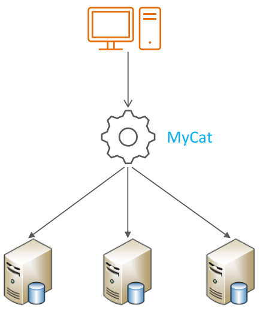
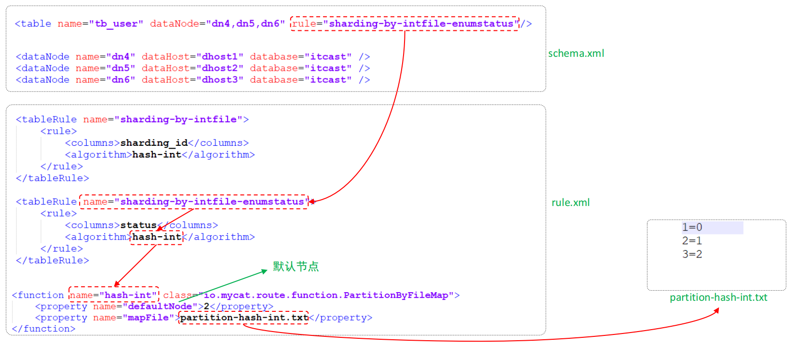

# 日志

## 错误日志

错误日志是 MySQL 中最重要的日志之一，它记录了当 mysqld 启动和停止时，以及服务器在运行过程中发生任何严重错误时的相关信息。

当数据库出现任何故障导致无法正常使用时，建议首先查看此日志。

该日志是默认开启的，默认存放目录 /var/log/，默认的日志文件名为 mysqld.log 。查看日志位置：

```sql
show variables like '%log_error%'
```

## 二进制日志

### 介绍

二进制日志（BINLOG）记录了所有的 DDL（数据定义语言）语句和 DML（数据操纵语言）语句，但不包括数据查询（SELECT、SHOW）语句。

作用：①. 灾难时的数据恢复；②. MySQL的主从复制。在MySQL8版本中，默认二进制日志是开启着的，涉及到的参数如下：

```sql
show variables like '%log_bin%'
```


### 日志格式

MySQL服务器中提供了多种格式来记录二进制日志，具体格式及特点如下：

| 日志格式  | 含义                                                         |
| --------- | ------------------------------------------------------------ |
| STATEMENT | 基于SQL语句的日志记录，记录的是SQL语句，对数据进行修改的SQL都会记录在日志文件中。 |
| ROW       | 基于行的日志记录，记录的是每一行的数据变更。（默认）         |
| MIXED     | 混合了STATEMENT和ROW两种格式，默认采用STATEMENT，在某些特殊情况下会自动切换为ROW进行记录。 |

```sql
show variables like '%binlog_format%'
```

### 日志查看

由于日志是以二进制方式存储的，不能直接读取，需要通过二进制日志查询工具 mysqlbinlog 来查看，具体语法：


### 日志删除

对于比较繁忙的业务系统，每天生成的binlog数据巨大，如果长时间不清除，将会占用大量磁盘空间。可以通过以下几种方式清理日志：

| 指令                                                  | 含义                                                         |
| ----------------------------------------------------- | ------------------------------------------------------------ |
| reset master                                          | 删除全部 binlog 日志，删除之后，日志编号，将从 binlog.000001重新开始 |
| purge master logs to 'binlog.***********************' | 删除 ******************编号之前的所有日志                    |
| purge master logs before 'yyyy-mm-dd hh 24:mi:ss'     | 删除日志为 "yyyy-mm-dd hh24:mi:ss" 之前产生的所有日志        |

也可以在mysql的配置文件中配置二进制日志的过期时间，设置了之后，二进制日志过期会自动删除。

```sql
show variables like '%binlog_expire_logs_seconds%';
```

### 查询日志

查询日志中记录了客户端的所有操作语句，而二进制日志不包含查询数据的SQL语句。默认情况下， 查询日志是未开启的。如果需要开启查询日志，可以设置以下配置 ：


修改MySQL的配置文件 /etc/my.cnf 文件，添加如下内容：

```sql
#该选项用来开启查询日志，可选值 ： 0或者1； 0代表关闭， 1代表开启
general_log=1
#设置日志的文件名 ， 如果没有指定， 默认的文件名为host_name.log
general_log_file=mysql_query.log
```

### 慢查询日志

慢查询日志记录了所有执行时间超过参数 long_query_time 设置值并且扫描记录数不小于 min_examined_row_limit的所有的SQL语句的日志，默认未开启。long_query_time 默认为 10 秒，最小为 0， 精度可以到微秒。

```sql
#慢查询日志
slow_query_log=1
#执行时间参数
long_query_time=2
```

默认情况下，不会记录管理语句，也不会记录不使用索引进行查找的查询。可以使用log_slow_admin_statements和更改此行为 log_queries_not_using_indexes，如下所述。

```sql
#记录执行较慢的管理语句
log_slow_admin_statements=1
#记录执行较慢的未使用索引的语句
log_queries_not_using_indexes=1
```

# 主从复制

## 概述

主从复制是指将主数据库的DDL 和 DML 操作通过二进制日志传到从库服务器中，然后在从库上对这些日志重新执行（也叫重做），从而使得从库和主库的数据保持同步。

MySQL支持一台主库同时向多台从库进行复制， 从库同时也可以作为其他从服务器的主库，实现链状复制。


MySQL 复制的有点主要包含以下三个方面：

1. 主库出现问题，可以快速切换到从库提供服务。

2. 实现读写分离，降低主库的访问压力。

3. 可以在从库中执行备份，以避免备份期间影响主库服务。

## 原理

MySQL 的主从复制原理如下。


从上图来看，复制分成三步：

1. Master 主库在事务提交时，会把数据变更记录在二进制日志文件 Binlog 中。

2. 从库读取主库的二进制日志文件 Binlog ，写入到从库的中继日志 Relay Log 。

3. slave重做中继日志中的事件，将改变反映它自己的数据。

## 搭建

### 服务器准备


准备好两台服务器之后，在上述的两台服务器中分别安装好MySQL，并完成基础的初始化准备工作。

### 主库的配置

1.修改配置文件 /etc/my.cnf

```sql
#mysql服务id，保证整个集群环境中唯一，取值范围：1-2^(32-1)，默认为1
server-id=1
#是否只读，1代表只读，0代表读写
read-only=0
#忽略的数据 指不需要同步的数据库
#binlog-ignore-db=mysql
#binlog-do-db=db01
```

2.重启MySQL服务

```sql
systemctl restart mysqld
```

3.登录MySQL，创建远程连接的账号，并授予主从复制权限

```sql
#创建itcast用户，并设置密码，该用户可在任意主机连接该MySQL服务
create user 'itcast'@'%' identified with mysql_native_password by 'Root@123456';
#为itcast@%用户分配主从复制权限
grant replication slave on *.* to 'itcast'@'%';
```

4.通过指令，查看二进制日志坐标

```sql
show master status;
```

字段含义说明：

​	file : 从哪个日志文件开始推送日志文件

​	position ： 从哪个位置开始推送日志

​	binlog_ignore_db : 指定不需要同步的数据库 

### 从库的配置

1.修改配置文件/etc/my.cnf

```sql
#mysql服务id，保证整个集群环境中唯一，取值范围：1-2^(32-1)，和主库不一样即可
server-id=2
#是否只读，1代表只读，0代表读写
read-only=1
```

2.重启MySQL服务

```sql
systemctl restart mysqld
```

3.登录MySQL，设置主库配置

```sql
change replication source to source_host='192.168.10.102',source_user='itcast',source_password='Root@123456',source_log_file='binlog.000004',source_log_pos=1985;
```

上述是8.0.23中的语法，如果MySQL是8.0.23之前版本，执行如下SQL：

```sql
change master to master_host='192.168.10.102',master_user='itcast',master_password='Root@123456',master_log_file='binlog.000004',master_log_pos=743;
```

| 参数名          | 含义               | 8.0.23之前      |
| --------------- | ------------------ | --------------- |
| source_host     | 主库IP地址         | master_host     |
| source_user     | 连接主库的用户名   | master_user     |
| source_password | 连接主库的密码     | master_password |
| source_log_file | binlog日志文件名   | master_log_file |
| source_log_pos  | binlog日志文件位置 | master_log_pos  |

4.开启同步操作

```sql
start replica; #after 8.0.22
start slave; #before 8.0.22
```

5.查看主从同步状态

```sql
show replica status\G; #after 8.0.22
show slave status; #before 8.0.22
```


### 测试

1.在主库上创建数据库、表，并插入数据

```sql
create database db01;
use db01;
CREATE TABLE tb_user (
	id INT (10) PRIMARY KEY NOT NULL auto_increment,
	username VARCHAR (255),
	age INT (10)
) ENGINE = INNODB DEFAULT CHARSET = utf8mb4;
INSERT INTO tb_user(id, name, sex) VALUES(NULL, '完颜雍', 10)(NULL, '完颜宗弼', 10);
```

2.在从库中查询数据，验证主从是否同步

### 总结

1.概述

将主库的数据变更同步到从库，从而保证主库和从库数据一致。

数据备份、失败迁移，读写分离，降低单库读写压力。

2.原理

（1）主库会把数据变更记录在二进制日志文件binlog中

（2）从库连接主库，读取binlog日志，并写入自身中继日志relaylog

（3）slave重做中继日志，将改变反映它自己的数据

3.搭建

（1）准备服务器

（2）配置主库

（3）配置从库

（4）测试主从复制

# 分库分表

## 介绍

> 问题分析


随着互联网及移动互联网的发展，应用系统的数据量也是成指数式增长，若采用单数据库进行数据存储，存在以下性能瓶颈：

1.IO瓶颈：热点数据太多，数据库缓存不足，产生大量磁盘IO，效率较低。 请求数据太多，带宽不够，网络IO瓶颈。

2.CPU瓶颈：排序、分组、连接查询、聚合统计等SQL会耗费大量的CPU资源，请求数太多，CPU出现瓶颈。

> 拆分策略


> 垂直拆分


垂直分库：以表为依据，根据业务将不同表拆分到不同库中。

特点：

1.每个库的表结构都不一样。

2.每个库的数据也不一样。

3.所有库的并集是全量数据。


垂直分表：以字段为依据，根据字段属性将不同字段拆分到不同表中。

特点：

1.每个表的结构都不一样。

2.每个表的数据也不一样，一般通过一列（主键/外键）关联。

3.所有表的并集是全量数据。

> 水平拆分


水平分库：以字段为依据，按照一定策略，将一个库的数据拆分到多个库中。

特点：

1. 每个库的表结构都一样。

2. 每个库的数据都不一样。

3. 所有库的并集是全量数据。


水平分表：以字段为依据，按照一定策略，将一个表的数据拆分到多个表中。

特点：

1. 每个表的表结构都一样。

2. 每个表的数据都不一样。

3. 所有表的并集是全量数据。

> 实现技术


shardingJDBC：基于AOP原理，在应用程序中对本地执行的SQL进行拦截，解析、改写、路由处理。需要自行编码配置实现，只支持java语言，性能较高。

MyCat：数据库分库分表中间件，不用调整代码即可实现分库分表，支持多种语言，性能不及前者。

## MyCat概述

### 介绍

Mycat是开源的、活跃的、基于Java语言编写的MySQL数据库中间件。可以像使用mysql一样来使用mycat，对于开发人员来说根本感觉

不到mycat的存在。

优势：

• 性能可靠稳定

• 强大的技术团队

• 体系完善

• 社区活跃



下载地址：http://dl.mycat.org.cn/

### 安装

Mycat是采用java语言开发的开源的数据库中间件，支持Windows和Linux运行环境，下面介绍MyCat的Linux中的环境搭建。我们需要在准备好的服务器中安装如下软件。

| 服务器         | 安装软件   | 说明              |
| -------------- | ---------- | ----------------- |
| 192.168.10.100 | JDK、MyCat | MyCat中间件服务器 |
| 192.168.10.102 | MySQL      | 分片服务器        |
| 192.168.10.103 | MySQL      | 分片服务器        |
| 192.168.10.104 | MySQL      | 分片服务器        |

### 目录结构


bin : 存放可执行文件，用于启动停止mycat

conf：存放mycat的配置文件

lib：存放mycat的项目依赖包（jar）

logs：存放mycat的日志文件

### 概念介绍


## MyCat入门

### 需求

由于 tb_order 表中数据量很大，磁盘IO及容量都到达了瓶颈，现在需要对 tb_order表进行数据分片，分为三个数据节点，每一个节点主机位于不同的服务器上, 具体的结构，参考下图：


### 环境准备


### 分片配置（schema.xml）


```xml
<?xml version="1.0"?>
<!DOCTYPE mycat:schema SYSTEM "schema.dtd">
<mycat:schema xmlns:mycat="http://io.mycat/">

	<!--逻辑库-->
	<schema name="dcp" checkSQLschema="true" sqlMaxLimit="100">
		<!--逻辑表
		rule：分片规则
		插入数据在dataNode节点进行分布，取决于rule
		引用rule.xml值
		-->
		<table name="tb_order" dataNode="dn1,dn2,dn3" rule="auto-sharding-long" />
	</schema>

	<dataNode name="dn1" dataHost="dhost1" database="dcp" />
	<dataNode name="dn2" dataHost="dhost2" database="dcp" />
	<dataNode name="dn3" dataHost="dhost3" database="dcp" />

	<!--节点主机
		dbDriver：native (MySQL8.0不支持)、jdbc
	-->
	<dataHost name="dhost1" maxCon="1000" minCon="10" balance="0"
			  writeType="0" dbType="mysql" dbDriver="jdbc" switchType="1"  slaveThreshold="100">
		<heartbeat>select user()</heartbeat>

		<!--数据库连接信息-->
		<writeHost host="master" url="jdbc:mysql://192.168.10.102:3306?useSSL=false&amp;serverTimezone=Asia/Shanghai&amp;characterEncoding=utf8" user="root"
				   password="1234" />
	</dataHost>
	
	<dataHost name="dhost2" maxCon="1000" minCon="10" balance="0"
			  writeType="0" dbType="mysql" dbDriver="jdbc" switchType="1"  slaveThreshold="100">
		<heartbeat>select user()</heartbeat>

		<!--数据库连接信息-->
		<writeHost host="master" url="jdbc:mysql://192.168.10.103:3306?useSSL=false&amp;serverTimezone=Asia/Shanghai&amp;characterEncoding=utf8" user="root"
				   password="1234" />
	</dataHost>
	
	<dataHost name="dhost3" maxCon="1000" minCon="10" balance="0"
			  writeType="0" dbType="mysql" dbDriver="jdbc" switchType="1"  slaveThreshold="100">
		<heartbeat>select user()</heartbeat>

		<!--数据库连接信息-->
		<writeHost host="master" url="jdbc:mysql://192.168.10.104:3306?useSSL=false&amp;serverTimezone=Asia/Shanghai&amp;characterEncoding=utf8" user="root"
				   password="1234" />
	</dataHost>
</mycat:schema>
```

配置mycat的用户及用户的权限信息：

server.xml

```xml
<user name="root" defaultAccount="true">
		<property name="password">1234</property>
		<!-- 访问的逻辑库 -->
		<property name="schemas">dcp</property>
		
		<!-- 表级 DML 权限设置 -->
		<!-- 		
		<privileges check="false">
			<schema name="TESTDB" dml="0110" >
				<table name="tb01" dml="0000"></table>
				<table name="tb02" dml="1111"></table>
			</schema>
		</privileges>		
		 -->
	</user>

	<user name="user">
		<property name="password">1234</property>
		<property name="schemas">dcp</property>
		<property name="readOnly">true</property>
	</user>
```


### 启动服务

切换到Mycat的安装目录，执行如下指令，启动Mycat：

```sql
#启动
bin/mycat start
#停止
bin/mycat stop
```

Mycat启动之后，占用端口号 8066。

启动完毕之后，可以查看logs目录下的启动日志，查看Mycat是否启动完成。


### 分片测试

通过如下指令，就可以连接并登陆MyCat。

```sql
mysql -h 192.168.200.210 -P 8066 -uroot -p123456
```

然后就可以在MyCat中来创建表，并往表结构中插入数据，查看数据在MySQL中的分布情况。

```sql
CREATE TABLE tb_order (
	id BIGINT (20) PRIMARY KEY NOT NULL auto_increment,
	title VARCHAR (100) NOT NULL,
	PRIMARY KEY (id)
) ENGINE = INNODB DEFAULT CHARSET = utf8mb4;
INSERT INTO tb_order(id, title) VALUES(1, 'goods1');
INSERT INTO tb_order(id, title) VALUES(1, 'goods2');
INSERT INTO tb_order(id, title) VALUES(1, 'goods3');
INSERT INTO tb_order(id, title) VALUES(1000000, 'goods1000000');
INSERT INTO tb_order(id, title) VALUES(10000000, 'goods10000000');
```

## MyCat配置

### schema.xml

schema.xml 作为MyCat中最重要的配置文件之一 , 涵盖了MyCat的逻辑库 、 逻辑表 、 分片规则、分片节点及数据源的配置。

主要包含以下三组标签：

➢ schema标签

➢ datanode标签

➢ datahost标签

➢ schema标签


schema 标签用于定义 MyCat实例中的逻辑库 , 一个MyCat实例中, 可以有多个逻辑库 , 可以通过 schema 标签来划分不同的逻辑库。

MyCat中的逻辑库的概念 ， 等同于MySQL中的database概念 , 需要操作某个逻辑库下的表时, 也需要切换逻辑库(use xxx)。

```sql
核心属性：
name：指定自定义的逻辑库库名
checkSQLschema：在SQL预计操作时指定了数据库名称，执行时是否自动去除；true：自动去除；false：不自动去除
sqlMaxLimit：如果未指定limit进行查询，列表查询模式查询多少条记录
```

➢ schema标签(table)

table 标签定义了MyCat中逻辑库schema下的逻辑表 , 所有需要拆分的表都需要在table标签中定义 

```sql
核心属性：
name：定义逻辑表表名，在该逻辑库下唯一
dataNode：定义逻辑表所属的dataNode，该属性需要与dataNode标签中name对应
rule：分片规则的名字，分片规则名字是在rule.xml中定义的
primaryKey：逻辑表对应真实表的主键
type：逻辑表的类型，目前逻辑表只有全局表和普通表，如果未配置，就是普通表；全局表，配置为global
```

➢ dataNode标签


dataNode标签中定义了MyCat中的数据节点, 也就是我们通常说的数据分片。一个dataNode标签就是一个独立的数据分片。

```sql
核心属性：
name：定义数据节点名称
dataHost：数据库实例主机名称，引用自dataHost标签中的name属性
database：定义分片所属数据库
```

➢ dataHost标签


该标签在MyCat逻辑库中作为底层标签存在, 直接定义了具体的数据库实例、读写分离、心跳语句。

```sql
核心属性：
name：唯一标识，供上层标签使用
maxCon/minCon：最大连接数/最小连接数
balance：负载均衡策略，取值0，1，2，3
writeType：写操作分发方式（
	0：写操作转发到第一个writeHost，第一个挂了，切换到第二个；
	1：写操作随机分发到配置的writeHost）
dbDriver：数据库驱动，支持native、jdbc
```


### rule.xml

rule.xml中定义所有拆分表的规则, 在使用过程中可以灵活的使用分片算法, 或者对同一个分片算法使用不同的参数, 它让分片过程可配置化。主要包含两类标签：tableRule、Function。


### server.xml

server.xml配置文件包含了MyCat的系统配置信息，主要有两个重要的标签：system、user。

➢ system标签

对应的系统配置项及其含义，参考资料。


➢ user标签 


## MyCat分片

### 垂直拆分

➢ 场景

在业务系统中, 涉及以下表结构 ,但是由于用户与订单每天都会产生大量的数据, 单台服务器的数据存储及处理能力是有限的, 可以对数据库表进行拆分, 原有的数据库表如下。


➢ 准备


分别在三台MySQL中创建数据库shopping。

➢ 配置


```xml
<?xml version="1.0"?>
<!DOCTYPE mycat:schema SYSTEM "schema.dtd">
<mycat:schema xmlns:mycat="http://io.mycat/">

	<!--逻辑库-->
	<schema name="shopping" checkSQLschema="true" sqlMaxLimit="100">
		<!--逻辑表
		rule：分片规则 [分表时用]
		插入数据在dataNode节点进行分布，取决于rule
		引用rule.xml值
		<table name="tb_order" dataNode="dn1,dn2,dn3" rule="auto-sharding-long" />
		-->
		<table name="tb_goods_base" dataNode="dn1" primaryKey="id" />
		<table name="tb_goods_brand" dataNode="dn1" primaryKey="id" />
		<table name="tb_goods_cat" dataNode="dn1" primaryKey="id" />
		<table name="tb_goods_desc" dataNode="dn1" primaryKey="goods_id" />
		<table name="tb_goods_item" dataNode="dn1" primaryKey="id" />
		
		<table name="tb_order_item" dataNode="dn2" primaryKey="id" />
		<table name="tb_order_master" dataNode="dn2" primaryKey="order_id" />
		<table name="tb_order_pay_log" dataNode="dn2" primaryKey="out_trade_no" />
		
		<table name="tb_user" dataNode="dn3" primaryKey="id" />
		<table name="tb_user_address" dataNode="dn3" primaryKey="id" />
		<table name="tb_areas_provinces" dataNode="dn3" primaryKey="id" />
		<table name="tb_areas_city" dataNode="dn3" primaryKey="id" />
		<table name="tb_areas_region" dataNode="dn3" primaryKey="id" />
		
	</schema>

	<dataNode name="dn1" dataHost="dhost1" database="shopping" />
	<dataNode name="dn2" dataHost="dhost2" database="shopping" />
	<dataNode name="dn3" dataHost="dhost3" database="shopping" />

	<!--节点主机
		dbDriver：native (MySQL8.0不支持)、jdbc
	-->
	<dataHost name="dhost1" maxCon="1000" minCon="10" balance="0"
			  writeType="0" dbType="mysql" dbDriver="jdbc" switchType="1"  slaveThreshold="100">
		<heartbeat>select user()</heartbeat>

		<!--数据库连接信息-->
		<writeHost host="master" url="jdbc:mysql://192.168.10.102:3306?useSSL=false&amp;serverTimezone=Asia/Shanghai&amp;characterEncoding=utf8" user="root"
				   password="1234" />
	</dataHost>
	
	<dataHost name="dhost2" maxCon="1000" minCon="10" balance="0"
			  writeType="0" dbType="mysql" dbDriver="jdbc" switchType="1"  slaveThreshold="100">
		<heartbeat>select user()</heartbeat>

		<!--数据库连接信息-->
		<writeHost host="master" url="jdbc:mysql://192.168.10.103:3306?useSSL=false&amp;serverTimezone=Asia/Shanghai&amp;characterEncoding=utf8" user="root"
				   password="1234" />
	</dataHost>
	
	<dataHost name="dhost3" maxCon="1000" minCon="10" balance="0"
			  writeType="0" dbType="mysql" dbDriver="jdbc" switchType="1"  slaveThreshold="100">
		<heartbeat>select user()</heartbeat>

		<!--数据库连接信息-->
		<writeHost host="master" url="jdbc:mysql://192.168.10.104:3306?useSSL=false&amp;serverTimezone=Asia/Shanghai&amp;characterEncoding=utf8" user="root"
				   password="1234" />
	</dataHost>
</mycat:schema>
```

➢ 测试

在mycat的命令行中，通过source指令导入表结构，以及对应的数据，查看数据分布情况。

```sql
source /root/shopping-table.sql
source /root/shopping-insert.sql
```

查询用户的收件人及收件人地址信息(包含省、市、区)。

```sql
select ua.user_id,ua.contact,p.province,c.city, r.area, ua.address from tb_user_address ua, tb_areas_city c, tb_areas_provinces p, tb_areas_region r where ua.province_id=p.provinceid and ua.city_id=c.cityid and ua.town_id=r.areaid;
```

查询每一笔订单及订单的收件地址信息(包含省、市、区)。

```sql
select order_id,payment, receiver,province, city, area 
from tb_order_master o, tb_areas_provinces p, tb_areas_city c, tb_areas_region r where o.receiver_province=p.provinceid and o.receiver_city=c.cityid and o.receiver_region=r.areaid;
错误：invalid route in sql, multi tables found but datanode has no intersection 
原因：tb_order_master在第3分片，tb_areas_provinces p, tb_areas_city c, tb_areas_region r在第4分片，不知道该路由到哪
```

➢ 全局表配置

对于省、市、区/县表tb_areas_provinces , tb_areas_city , tb_areas_region，是属于数据字典表，在多个业务模块中都可能会遇到，可以将其设置为全局表，利于业务操作。


### 水平拆分

➢ 场景

在业务系统中, 有一张表(日志表), 业务系统每天都会产生大量的日志数据 , 单台服务器的数据存储及处理能力是有限的, 可以对数据库表进行拆分。


➢ 准备


分别在三台MySQL中创建数据库 itcast。

➢ 配置


➢ 测试

在mycat的命令行中，执行如下SQL创建表、并插入数据，查看数据分布情况。

```sql
CREATE TABLE tb_log (
  id bigint(20) NOT NULL COMMENT 'ID',
  model_name varchar(200) DEFAULT NULL COMMENT '模块名',
  model_value varchar(200) DEFAULT NULL COMMENT '模块值',
  return_value varchar(200) DEFAULT NULL COMMENT '返回值',
  return_class varchar(200) DEFAULT NULL COMMENT '返回值类型',
  operate_user varchar(20) DEFAULT NULL COMMENT '操作用户',
  operate_time varchar(20) DEFAULT NULL COMMENT '操作时间',
  param_and_value varchar(500) DEFAULT NULL COMMENT '请求参数名及参数值',
  operate_class varchar(200) DEFAULT NULL COMMENT '操作类',
  operate_method varchar(200) DEFAULT NULL COMMENT '操作方法',
  cost_time bigint(20) DEFAULT NULL COMMENT '执行方法耗时, 单位 ms',
  source int(1) DEFAULT NULL COMMENT '来源 : 1 PC , 2 Android , 3 IOS',
  PRIMARY KEY (id)
) ENGINE=InnoDB DEFAULT CHARSET=utf8mb4;
INSERT INTO tb_log (id, model_name, model_value, return_value, return_class, operate_user, operate_time, param_and_value, operate_class, operate_method, cost_time，source) VALUES('1','user','insert','success','java.lang.String','10001','2022-01-06 18:12:28','{\"age\":\"20\",\"name\":\"Tom\",\"gender\":\"1\"}','cn.itcast.controller.UserController','insert','10',1);
INSERT INTO tb_log (id, model_name, model_value, return_value, return_class, operate_user, operate_time, param_and_value, operate_class, operate_method, cost_time，source) VALUES('2','user','insert','success','java.lang.String','10001','2022-01-06 18:12:27','{\"age\":\"20\",\"name\":\"Tom\",\"gender\":\"1\"}','cn.itcast.controller.UserController','insert','23',1);
INSERT INTO tb_log (id, model_name, model_value, return_value, return_class, operate_user, operate_time, param_and_value, operate_class, operate_method, cost_time，source) VALUES('3','user','update','success','java.lang.String','10001','2022-01-06 18:16:45','{\"age\":\"20\",\"name\":\"Tom\",\"gender\":\"1\"}','cn.itcast.controller.UserController','update','34',1);
INSERT INTO tb_log (id, model_name, model_value, return_value, return_class, operate_user, operate_time, param_and_value, operate_class, operate_method, cost_time，source) VALUES('4','user','update','success','java.lang.String','10001','2022-01-06 18:16:45','{\"age\":\"20\",\"name\":\"Tom\",\"gender\":\"1\"}','cn.itcast.controller.UserController','update','13',2);
INSERT INTO tb_log (id, model_name, model_value, return_value, return_class, operate_user, operate_time, param_and_value, operate_class, operate_method, cost_time，source) VALUES('5','user','insert','success','java.lang.String','10001','2022-01-06 18:30:31','{\"age\":\"200\",\"name\":\"TomCat\",\"gender\":\"0\"}','cn.itcast.controller.UserController','insert','29',3);
INSERT INTO tb_log (id, model_name, model_value, return_value, return_class, operate_user, operate_time, param_and_value, operate_class, operate_method, cost_time，source) VALUES('6','user','find','success','java.lang.String','10001','2022-01-06 18:30:31','{\"age\":\"200\",\"name\":\"TomCat\",\"gender\":\"0\"}','cn.itcast.controller.UserController','find','29',2);
```

### 分片规则-范围

根据指定的字段及其配置的范围与数据节点的对应情况， 来决定该数据属于哪一个分片。


### 分片规则-取模

根据指定的字段值与节点数量进行求模运算，根据运算结果， 来决定该数据属于哪一个分片。


### 分片规则-一致性hash

所谓一致性哈希， 相同的哈希因子计算值总是被划分到相同的分区表中，不会因为分区节点的增加而改变原来数据的分区位置。


### 分片规则-枚举

通过在配置文件中配置可能的枚举值, 指定数据分布到不同数据节点上, 本规则适用于按照省份、性别、状态拆分数据等业务 。




### 分片规则-应用指定

运行阶段由应用自主决定路由到那个分片 , 直接根据字符子串（必须是数字）计算分片号。


### 分片规则-固定分片hash算法

该算法类似于十进制的求模运算，但是为二进制的操作，例如，取 id 的二进制低 10 位 与 1111111111 进行位 & 运算。


### 分片规则-字符串hash解析

截取字符串中的指定位置的子字符串, 进行hash算法， 算出分片。


### 分片规则-按（天）日期分片


### 分片规则-自然月

使用场景为按照月份来分片, 每个自然月为一个分片。


## Mycat管理及监控

### Mycat原理


### Mycat管理

Mycat默认开通2个端口，可以在server.xml中进行修改。

➢ 8066 数据访问端口，即进行 DML 和 DDL 操作。

➢ 9066 数据库管理端口，即 mycat 服务管理控制功能，用于管理mycat的整个集群状态

```sql
mysql -h 192.168.200.210 -p 9066 -uroot -p123456
```

| 命令              | 含义                        |
| ----------------- | --------------------------- |
| show @@help       | 查看MyCat管理工具帮助文档   |
| show @@version    | 查看MyCat的版本             |
| show @@config     | 重新加载MyCat的配置文件     |
| show @@datasource | 查看MyCat的数据源信息       |
| show @@datanode   | 查看MyCat现有的分片节点信息 |
| show @@threadpool | 查看MyCat的线程池信息       |
| show @@sql        | 查看执行的SQL               |
| show @@sql.sum    | 查看执行的SQL统计           |

### Mycat-eye

➢ 介绍

Mycat-web(Mycat-eye)是对mycat-server提供监控服务，功能不局限于对mycat-server使用。他通过JDBC连接对Mycat、Mysql监控，监控远程服务器(目前仅限于linux系统)的cpu、内存、网络、磁盘。

Mycat-eye运行过程中需要依赖zookeeper，因此需要先安装zookeeper。

➢ 安装

• Zookeeper安装

• MyCat-web安装

➢ 访问

http://192.168.200.210:8082/mycat

➢ 配置

开启Mycat的实时统计功能(server.xml)


在Mycat监控界面配置服务地址


# 读写分离

## 介绍

读写分离,简单地说是把对数据库的读和写操作分开,以对应不同的数据库服务器。主数据库提供写操作，从数据库提供读操作，这样能有效地减轻单台数据库的压力。

通过MyCat即可轻易实现上述功能，不仅可以支持MySQL，也可以支持Oracle和SQL Server。


## 一主一从

### 原理

MySQL的主从复制，是基于二进制日志（binlog）实现的。


### 环境准备

| 主机            | 角色   | 用户名 | 密码 |
| --------------- | ------ | ------ | ---- |
| 192.168.200.211 | master | root   | 1234 |
| 192.168.200.212 | slave  | root   | 1234 |

主从复制的搭建，可以参考前面课程中讲解的步骤操作。

## 一主一从读写分离

### 配置

MyCat控制后台数据库的读写分离和负载均衡由schema.xml文件datahost标签的balance属性控制。


| 参数值 | 含义                                                         |
| ------ | ------------------------------------------------------------ |
| 0      | 不开启读写分离机制 所有读操作都发送到当前可用的writeHost上   |
| 1      | 全部的readHost与备用的writeHost都参与select语句的负载均衡（主要针对于双主双从模式） |
| 2      | 所有的读写操作都随机在writeHost，readHost上分发              |
| 3      | 所有的读请求随机分发到writeHost对应的readHost上执行，writeHost不负担读压力 |

### 测试

连接Mycat，并在Mycat中执行DML、DQL查看是否能够进行读写分离。

问题：主节点Master宕机之后，业务系统就只能够读，而不能写入数据了。

## 双主双从

### 介绍

一个主机 Master1 用于处理所有写请求，它的从机 Slave1 和另一台主机 Master2 还有它的从机 Slave2 负责所有读请求。当 Master1 主机宕机后，Master2 主机负责写请求，Master1 、Master2 互为备机。架构图如下: 


### 准备工作

我们需要准备5台服务器，具体的服务器及软件安装情况如下：

| 编号 | IP              | 预装软件     | 角色              |
| ---- | --------------- | ------------ | ----------------- |
| 1    | 192.168.200.210 | MyCat、MySQL | MyCat中间件服务器 |
| 2    | 192.168.200.211 | MySQL        | M1                |
| 3    | 192.168.200.212 | MySQL        | S1                |
| 4    | 192.168.200.213 | MySQL        | M2                |
| 5    | 192.168.200.214 | MySQL        | S2                |

关闭以上所有服务器的防火墙：

• systemctl stop firewalld

• systemctl disable firewalld

### 搭建

➢ 主库配置（ Master1-192.168.200.211 ）

1. 修改配置文件 /etc/my.cnf

```sql
#mysql服务id，保证整个集群环境中唯一，取值范围：1-2^32-1，默认为1
server-id=1
#指定同步的数据库
binlog-do-db=db01
binlog-do-db=db02
binlog-do-db=db03
#在作为从数据库的时候，有写入操作也要更新二进制日志文件
log-slave-updates
```

2. 重启MySQL服务器

```sql
systemctl restart mysqld
```

➢ 主库配置（ Master2-192.168.200.213 ）

1. 修改配置文件 /etc/my.cnf

```xml
#mysql服务id，保证整个集群环境中唯一，取值范围：1-2^32-1，默认为1
server-id=3
#指定同步的数据库
binlog-do-db=db01
binlog-do-db=db02
binlog-do-db=db03
#在作为从数据库的时候，有写入操作也要更新二进制日志文件
log-slave-updates
```

2. 重启MySQL服务器

```xml
systemctl restart mysqld
```

➢ 两台主库创建账户并授权

```sql
#创建itcast用户，并设置密码，该用户可在任意主机连接该mysql服务
create user 'itcast'@'%' identified with mysql_native_password by 'Root@123456';
#为'itcast'@'%'用户分配主从复制权限
grant replication slave on *.* to 'itcast'@'%';
```

通过指令，查看两台主库的二进制日志坐标

```sql
show master status;
```

➢ 从库配置（ Slave1-192.168.200.212 ）

1. 修改配置文件 /etc/my.cnf

   ```xml
   #mysql服务id，保证整个集群环境中唯一，取值范围：1-2^32-1，默认为1
   server-id=2
   ```

2. 重启MySQL服务器

```sql
systemctl restart mysqld
```

➢ 从库配置（ Slave2-192.168.200.214 ）

1. 修改配置文件 /etc/my.cnf

```xml
#mysql服务id，保证整个集群环境中唯一，取值范围：1-2^32-1，默认为1
server-id=2
```

2. 重启MySQL服务器

```sql
systemctl restart mysqld
```

➢ 两台从库配置关联的主库

需要注意slave1对应的是master1，slave2对应的是master2。

```sql
change master to master_host='xxx.xxx.xxx.xxx', master_user='xxx', master_password='xxx',master_log_file='xxx', master_log_pos=xxx;
```

启动两台从库主从复制，查看从库状态

```sq
start slave;
show slave status \G;
```

➢ 两台主库相互复制

Master2 复制 Master1，Master1 复制 Master2。

```sql
change master to master_host='xxx.xxx.xxx.xxx', master_user='xxx', master_password='xxx',master_log_file='xxx', master_log_pos=xxx;
```

启动两台从库主从复制，查看从库状态

```sql
start slave;
show slave status \G;
```

### 测试

分别在两台主库Master1、Master2上执行DDL、DML语句，查看涉及到的数据库服务器的数据同步情况。

```sql
create database db01;
use db01;
create table tb_user(
    id int(11) not null primary key,
    name varchar(50) not null,
    sex varchar(1)
)engine=innodb default charset=utf8mb4;

insert into tb_user(id, name, sex) values(1,'完颜亮', '1');
insert into tb_user(id, name, sex) values(2,'完颜宗弼', '1');
insert into tb_user(id, name, sex) values(3,'完颜雍', '0');
insert into tb_user(id, name, sex) values(4,'朱五四', '1');
insert into tb_user(id, name, sex) values(5,'朱四九', '0');
```

## 双主双从读写分离

### 配置

MyCat控制后台数据库的读写分离和负载均衡由schema.xml文件datahost标签的balance属性控制，通过writeType及switchType来完成失败自动切换的。


### 测试

登录MyCat，测试查询及更新操作，判定是否能够进行读写分离，以及读写分离的策略是否正确。

当主库挂掉一个之后，是否能够自动切换。
