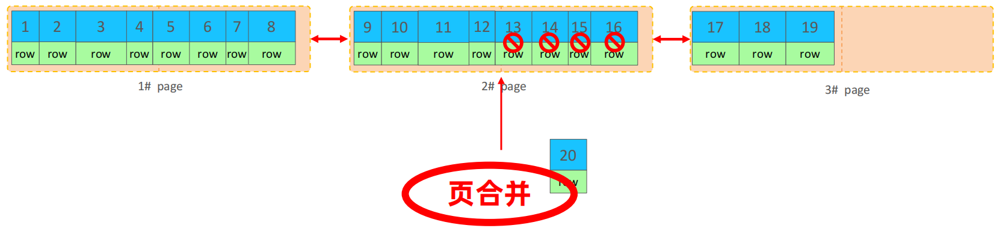

# 存储引擎

## MySQL体系结构


⚫ 连接层

最上层是一些客户端和链接服务，主要完成一些类似于连接处理、授权认证、及相关的安全方案。服务器也会为安全接入的每个客户

端验证它所具有的操作权限。

⚫ 服务层

第二层架构主要完成大多数的核心服务功能，如SQL接口，并完成缓存的查询，SQL的分析和优化，部分内置函数的执行。所有跨存

储引擎的功能也在这一层实现，如 过程、函数等。

⚫ 引擎层

存储引擎真正的负责了MySQL中数据的存储和提取，服务器通过API和存储引擎进行通信。不同的存储引擎具有不同的功能，这样我

们可以根据自己的需要，来选取合适的存储引擎。

⚫ 存储层

主要是将数据存储在文件系统之上，并完成与存储引擎的交互。

## 存储引擎简介


存储引擎就是存储数据、建立索引、更新/查询数据等技术的实现方式 。存储引擎是基于表的，而不是基于库的，所以存储引擎也可被称为表类型。

1.在创建表时，指定存储引擎

```sql
create table 表名(
    字段1 字段1类型 [comment 字段1注释],
    ...
    字段n 字段n类型 [comment 字段n注释],
)engine=innodb [comment 表注释];
```

2.查看当前数据库支持的存储引擎

```sql
show engines;
```

## 存储引擎特点

⚫ InnoDB

➢ 介绍

InnoDB是一种兼顾高可靠性和高性能的通用存储引擎，在 MySQL 5.5 之后，InnoDB是默认的 MySQL 存储引擎。

➢ 特点

DML操作遵循ACID模型，支持事务 ；

行级锁 ，提高并发访问性能；

支持外键 FOREIGN KEY约束，保证数据的完整性和正确性；

➢ 文件

xxx.ibd：xxx代表的是表名，innoDB引擎的每张表都会对应这样一个表空间文件，存储该表的表结构（frm、sdi）、数据和索引。

参数：innodb_file_per_table


⚫ MyISAM

➢ 介绍

​	MyISAM是MySQL早期的默认存储引擎。

➢ 特点

​	不支持事务，不支持外键

​	支持表锁，不支持行锁

​	访问速度快

➢ 文件

​	xxx.sdi：存储表结构信息

​	xxx.MYD: 存储数据

​	xxx.MYI: 存储索引

⚫ Memory

➢ 介绍

​	Memory引擎的表数据时存储在内存中的，由于受到硬件问题、或断电问题的影响，只能将这些表作为临时表或缓存使用。

➢ 特点

​	内存存放

​	hash索引（默认）

➢ 文件

​	xxx.sdi：存储表结构信息


## 存储引擎选择

在选择存储引擎时，应该根据应用系统的特点选择合适的存储引擎。对于复杂的应用系统，还可以根据实际情况选择多种存储引擎进行组合。

➢ InnoDB : 是Mysql的默认存储引擎，支持事务、外键。如果应用对事务的完整性有比较高的要求，在并发条件下要求数据的一致性，数据操作除了插入和查询之外，还包含很多的更新、删除操作，那么InnoDB存储引擎是比较合适的选择。

➢ MyISAM ： 如果应用是以读操作和插入操作为主，只有很少的更新和删除操作，并且对事务的完整性、并发性要求不是很高，那么选择这个存储引擎是非常合适的。

➢ MEMORY：将所有数据保存在内存中，访问速度快，通常用于临时表及缓存。MEMORY的缺陷就是对表的大小有限制，太大的表无法缓存在内存中，而且无法保障数据的安全性。

# 索引

## 索引概述

⚫ 介绍

索引（index）是帮助MySQL 高效获取数据的数据结构（有序）。在数据之外，数据库系统还维护着满足特定查找算法的数据结构，这些数据结构以某种方式引用（指向）数据， 这样就可以在这些数据结构上实现高级查找算法，这种数据结构就是索引。


⚫ 演示


备注：上述二叉树索引结构的只是一个示意图，并不是真实的索引结构。

⚫ 优缺点

| 优势                                                         | 劣势                                                       |
| ------------------------------------------------------------ | ---------------------------------------------------------- |
| 提高数据检索的效率，降低数据库的IO成本                       | 索引列也是要占用空间的。                                   |
| 通过索引列对数据进行排序，降低数据排序的成本，降低CPU的消耗。 | 索引大大提高了查询效率，同时却也降低更新表的速度，如对表进 |

## 索引结构

| 索引       | InnoDB          | MyISAM | Memory |
| ---------- | --------------- | ------ | ------ |
| B+tree索引 | 支持            | 支持   | 支持   |
| Hash索引   | 不支持          | 不支持 | 支持   |
| R-tree索引 | 不支持          | 支持   | 不支持 |
| Full-text  | 5.6版本之后支持 | 支持   | 不支持 |

我们平常所说的索引，如果没有特别指明，都是指B+树结构组织的索引。

⚫ 二叉树


二叉树缺点：顺序插入时，会形成一个链表，查询性能大大降低。 大数据量情况下，层级较深，检索速度慢。

红黑树：大数据量情况下，层级较深，检索速度慢。

⚫ B-Tree（多路平衡查找树）

以一颗最大度数（max-degree）为5(5阶)的b-tree为例(每个节点最多存储4个key，5个指针)：


知识小贴士: 树的度数指的是一个节点的子节点个数。


⚫ B+Tree

以一颗最大度数（max-degree）为4（4阶）的b+tree为例：


相对于B-Tree区别:

①. 所有的数据都会出现在叶子节点

②. 叶子节点形成一个单向链表

MySQL索引数据结构对经典的B+Tree进行了优化。在原B+Tree的基础上，增加一个指向相邻叶子节点的链表指针，就形成了带有顺序指针的B+Tree，提高区间访问的性能。


⚫ Hash

哈希索引就是采用一定的hash算法，将键值换算成新的hash值，映射到对应的槽位上，然后存储在hash表中。

如果两个(或多个)键值，映射到一个相同的槽位上，他们就产生了hash冲突（也称为hash碰撞），可以通过链表来解决。


➢ Hash索引特点

1. Hash索引只能用于对等比较(=，in)，不支持范围查询（between，>，< ，...）

2. 无法利用索引完成排序操作

3. 查询效率高，通常只需要一次检索就可以了，效率通常要高于B+tree索引

➢ 存储引擎支持

​	在MySQL中，支持hash索引的是Memory引擎，而InnoDB中具有自适应hash功能，hash索引是存储引擎根据B+Tree索引在指定条件下自动构建的。

**思考：**为什么InnoDB存储引擎选择使用B+tree索引结构?

➢ 相对于二叉树，层级更少，搜索效率高；

➢ 对于B-tree，无论是叶子节点还是非叶子节点，都会保存数据，这样导致一

页中存储的键值减少，指针跟着减少，要同样保存大量数据，只能增加树的

高度，导致性能降低；

➢ 相对Hash索引，B+tree支持范围匹配及排序操作；

## 索引分类

| 分类     | 含义                                                 | 特点                     | 关键字   |
| -------- | ---------------------------------------------------- | ------------------------ | -------- |
| 主键索引 | 针对于表中主键创建的索引                             | 默认自动创建, 只能有一个 | PRIMARY  |
| 唯一索引 | 避免同一个表中某数据列中的值重复                     | 可以有多个               | UNIQUE   |
| 常规索引 | 快速定位特定数据                                     | 可以有多个               |          |
| 全文索引 | 全文索引查找的是文本中的关键词，而不是比较索引中的值 | 可以有多个               | FULLTEXT |

在InnoDB存储引擎中，根据索引的存储形式，又可以分为以下两种：

| 分类                      | 含义                                                       | 特点                |
| ------------------------- | ---------------------------------------------------------- | ------------------- |
| 聚集索引(Clustered Index) | 将数据存储与索引放到了一块，索引结构的叶子节点保存了行数据 | 必须有,而且只有一个 |
| 二级索引(Secondary Index) | 将数据与索引分开存储，索引结构的叶子节点关联的是对应的主键 | 可以存在多个        |

聚集索引选取规则:

​	➢ 如果存在主键，主键索引就是聚集索引。

​	➢ 如果不存在主键，将使用第一个唯一（UNIQUE）索引作为聚集索引。

​	➢ 如果表没有主键，或没有合适的唯一索引，则InnoDB会自动生成一个rowid作为隐藏的聚集索引。


**思考**：InnoDB主键索引的B+tree高度为多高呢?

假设:

​	一行数据大小为1k，一页中可以存储16行这样的数据。InnoDB的指针占用6个字节的空间，主键即使为bigint，占用字节数为8。

高度为2：

​	n * 8 + (n + 1) * 6 = 16*1024 , 算出n约为 1170 

​	1171* 16 = 18736 

高度为3：

​	1171 * 1171 * 16 = 21939856

## 索引语法

⚫ 创建索引

```sql
create [unique | fulltext] index index_name on table_name (index_col_name,...);
```

⚫ 查看索引

```sql
show index from table_name;
```

⚫ 删除索引

```sql
drop index index_name on table_name;
```

**案例**：按照下列的需求，完成索引的创建

1. name字段为姓名字段，该字段的值可能会重复，为该字段创建索引。

2. phone手机号字段的值，是非空，且唯一的，为该字段创建唯一索引。

3. 为profession、age、status创建联合索引。

4. 为email建立合适的索引来提升查询效率。

```sql
create index idx_user_name on tb_user(name);
create unique index idx_user_phone on tb_user(name);
create index idx_user_pro_age_sta on tb_user(profession, age, status);
create index idx_email on tb_user(email);
```

## SQL性能分析

⚫ SQL执行频率

MySQL 客户端连接成功后，通过 show [session|global] status 命令可以提供服务器状态信息。通过如下指令，可以查看当前数据库的INSERT、UPDATE、DELETE、SELECT的访问频次：

```sql
show global status like 'Com_______'; #7个_
```


⚫ 慢查询日志

慢查询日志记录了所有执行时间超过指定参数（long_query_time，单位：秒，默认10秒）的所有SQL语句的日志。

MySQL的慢查询日志默认没有开启，需要在MySQL的配置文件（/etc/my.cnf）中配置如下信息：

```sql
#开启mysql慢日志查询开关
slow_query_log=1
#设置慢日志的时间为2s，SQL语句执行时间超过2s，就会视为慢查询，记录慢查询日志
long_query_time=2
```

配置完毕之后，通过以下指令重新启动MySQL服务器进行测试，查看慢日志文件中记录的信息 /var/lib/mysql/localhost-slow.log。

⚫ profile详情

show profiles 能够在做SQL优化时帮助我们了解时间都耗费到哪里去了。通过have_profiling参数，能够看到当前MySQL是否支持

profile操作：

```sql
select @@have_profiling;
```

默认profiling是关闭的，可以通过set语句在session/global级别开启profiling：

```sql
set profiling = 1;
```

执行一系列的业务SQL的操作，然后通过如下指令查看指令的执行耗时：

```sql
#查看每一条sql的耗时基本情况
show profiles;
#查看指定query_id的sql语句各个阶段的耗时情况
show profile for query query_id;
#查看指定query_id的sql语句cpu的使用情况
show profile cpu for query query_id;
```

⚫ explain执行计划

EXPLAIN 或者 DESC命令获取 MySQL 如何执行 SELECT 语句的信息，包括在 SELECT 语句执行过程中表如何连接和连接的顺序。

语法：

```sql
#直接在select语句之前加上关键字explain/desc
explain select 字段列表 from 表名 where 条件;
```


**EXPLAIN 执行计划各字段含义：**

➢ Id

select查询的序列号，表示查询中执行select子句或者是操作表的顺序(id相同，执行顺序从上到下；id不同，值越大，越先执行)。

➢ select_type

表示 SELECT 的类型，常见的取值有 SIMPLE（简单表，即不使用表连接或者子查询）、PRIMARY（主查询，即外层的查询）、

UNION（UNION 中的第二个或者后面的查询语句）、SUBQUERY（SELECT/WHERE之后包含了子查询）等

➢ type

表示连接类型，性能由好到差的连接类型为NULL、system、const、eq_ref、ref、range、 index、all 。

➢ possible_key

显示可能应用在这张表上的索引，一个或多个。

**EXPLAIN 执行计划各字段含义：**

➢ Key

实际使用的索引，如果为NULL，则没有使用索引。

➢ Key_len

表示索引中使用的字节数， 该值为索引字段最大可能长度，并非实际使用长度，在不损失精确性的前提下， 长度越短越好 。

➢ rows

MySQL认为必须要执行查询的行数，在innodb引擎的表中，是一个估计值，可能并不总是准确的。

➢ filtered

表示返回结果的行数占需读取行数的百分比， filtered 的值越大越好。

## 索引使用

⚫ 验证索引效率

在未建立索引之前，执行如下SQL语句，查看SQL的耗时。

```sql
select * from tb_sku where sn='a22ddd4b5b0b84bd7794edd24b25fc64';
```

针对字段创建索引

```sql
create index idx_sku_sn on tb_sku(sn);
```

然后再次执行相同的SQL语句，再次查看SQL的耗时。

```sql
select * from tb_sku where sn='a22ddd4b5b0b84bd7794edd24b25fc64';
```

⚫ 最左前缀法则

如果索引了多列（联合索引），要遵守最左前缀法则。最左前缀法则指的是查询从索引的最左列开始，并且不跳过索引中的列。

如果跳跃某一列，索引将部分失效(后面的字段索引失效)。

```sql
explain select * from tb_user where profession='软件工程' and age=31 and status='0';
explain select * from tb_user where profession='软件工程' and age=31;
explain select * from tb_user where profession='软件工程';
explain select * from tb_user where age=31 and status='0';
explain select * from tb_user where status='0';
```

⚫ 范围查询

联合索引中，出现范围查询(>,<)，范围查询右侧的列索引失效

```sql
explain select * from tb_user where profession='软件工程' and age>30 and status='0';
explain select * from tb_user where profession='软件工程' and age>=30 and status='0';
```

⚫ 索引列运算

不要在索引列上进行运算操作， 索引将失效。

```sql
explain select * from tb_user where substring(phone, 10.2) = '15';
```

⚫ 字符串不加引号

字符串类型字段使用时，不加引号， 索引将失效。

```sql
explain select * from tb_user where profession='软件工程' and age=31 and status=0;
explain select * from tb_user where phone=17799990015;
```

⚫ 模糊查询

如果仅仅是尾部模糊匹配，索引不会失效。如果是头部模糊匹配，索引失效。

```sql
explain select * from tb_user where profession like '软件%';
explain select * from tb_user where profession like '%工程';
explain select * from tb_user where profession like '%工%';
```

⚫ or连接的条件

用or分割开的条件， 如果or前的条件中的列有索引，而后面的列中没有索引，那么涉及的索引都不会被用到。

```sql
explain select * from tb_user where id=10 or age=23;
explain select * from tb_user where phone='17799990017' or age=23;
```

由于age没有索引，所以即使id、phone有索引，索引也会失效。所以需要针对于age也要建立索引。

⚫ 数据分布影响

如果MySQL评估使用索引比全表更慢，则不使用索引。

```sql
select * from tb_user where phone>='17799990005';
select * from tb_user where phone>='17799990005';
```

⚫ SQL提示

SQL提示，是优化数据库的一个重要手段，简单来说，就是在SQL语句中加入一些人为的提示来达到优化操作的目的。

use index：

```sql
explain select * from tb_user use index(idx_user_pro) where profession='软件工程';
```

ignore index：

```sql
explain select * from tb_user ignore index(idx_user_pro) where profession='软件工程';
```

force index：

```sql
explain select * from tb_user force index(idx_user_pro) where profession='软件工程';
```

⚫ 覆盖索引

尽量使用覆盖索引（查询使用了索引，并且需要返回的列，在该索引中已经全部能够找到），减少select*。

```sql
explain select id,profession from tb_user where profession='软件工程' and age=31 and status='0';
explain select id,profession,age,status from tb_user where profession='软件工程' and age=31 and status='0';

explain select id,profession,age,status,name from tb_user where profession='软件工程' and age=31 and status='0';
explain select * from tb_user where profession='软件工程' and age=31 and status='0';
```

知识小贴士：

​	using index condition ：查找使用了索引，但是需要回表查询数据

​	using where; using index ：查找使用了索引，但是需要的数据都在索引列中能找到，所以不需要回表查询数据


**思考：**

一张表, 有四个字段(id, username, password, status), 由于数据量大, 需要对以下SQL语句进行优化, 该如何进

行才是最优方案：

```sql
select id,username,password from tb_user where username='itcast';
```

⚫ 前缀索引

当字段类型为字符串（varchar，text等）时，有时候需要索引很长的字符串，这会让索引变得很大，查询时，浪费大量的磁盘IO， 影响查询效率。此时可以只将字符串的一部分前缀，建立索引，这样可以大大节约索引空间，从而提高索引效率。

➢ 语法

```sql
cache index idx_xxx on table_name(column(n));
```

➢ 前缀长度

可以根据索引的选择性来决定，而选择性是指不重复的索引值（基数）和数据表的记录总数的比值，索引选择性越高则查询效率越高， 唯一索引的选择性是1，这是最好的索引选择性，性能也是最好的。

```sql
select count(distinct email) / count(*) from tb_user;
select count(distinct substring(email, 1, 5)) / count(*) from tb_user;
```

➢ 前缀索引查询流程


⚫ 单列索引与联合索引

单列索引：即一个索引只包含单个列。

联合索引：即一个索引包含了多个列。

在业务场景中，如果存在多个查询条件，考虑针对于查询字段建立索引时，建议建立联合索引，而非单列索引。

单列索引情况：


多条件联合查询时， mysql优化器会评估哪个字段的索引效率更高，会选择该索引完成本次查询。

⚫ 单列索引与联合索引

联合索引情况：


## 索引设计原则

1. 针对于数据量较大，且查询比较频繁的表建立索引。

2. 针对于常作为查询条件（where）、排序（order by）、分组（group by）操作的字段建立索引。

3. 尽量选择区分度高的列作为索引，尽量建立唯一索引，区分度越高，使用索引的效率越高。

4. 如果是字符串类型的字段，字段的长度较长，可以针对于字段的特点，建立前缀索引。

5. 尽量使用联合索引，减少单列索引，查询时，联合索引很多时候可以覆盖索引，节省存储空间，避免回表，提高查询效率。

6. 要控制索引的数量，索引并不是多多益善，索引越多，维护索引结构的代价也就越大，会影响增删改的效率。

7. 如果索引列不能存储NULL值，请在创建表时使用NOT NULL约束它。当优化器知道每列是否包含NULL值时，它可以更好地确定哪个索引最有效地用于查询。

# SQL优化

## 插入数据

⚫ insert优化

```sql
insert into tb_test values(1, '朱厚照');
insert into tb_test values(2, '朱允炆');
```

➢ 手动提交事务

~~~sql
start transaction;
insert into tb_test values(1, '朱厚照'),(3, '朱百六');
insert into tb_test values(2, '朱允炆'),(4, '朱初一');
commit;
~~~

➢ 主键顺序插入

```sql
主键乱序插入：8 1 9 21 88 2 4 15
主键顺序插入：1 2 3 4 5 6 7 8 9
```

⚫ 大批量插入数据

如果一次性需要插入大批量数据，使用insert语句插入性能较低，此时可以使用MySQL数据库提供的load指令进行插入。操作如下：


```sql
#客户端连接服务端时，加上参数 --local-infile
mysql --local-infile -uroot -p
#设置全局参数local_infile为1，开启从本地加载文件导入数据的开关
set global local_infile=1;
#执行load指令将准备好的数据，加载到表结构中
load data local infile '/root/sql1.log' into table `tb_user` fields terminated by ',' lines terminated by '\n';
```

主键顺序插入性能高于乱序插入

## 主键优化

⚫ 数据组织方式

在InnoDB存储引擎中，表数据都是根据主键顺序组织存放的，这种存储方式的表称为索引组织表(index organized table IOT)。


⚫ 页分裂

页可以为空，也可以填充一半，也可以填充100%。每个页包含了2-N行数据(如果一行数据多大，会行溢出)，根据主键排列。


⚫ 页合并

当删除一行记录时，实际上记录并没有被物理删除，只是记录被标记（flaged）为删除并且它的空间变得允许被其他记录声明使用。

当页中删除的记录达到 MERGE_THRESHOLD（默认为页的50%），InnoDB会开始寻找最靠近的页（前或后）看看是否可以将两个页合并以优化空间使用。



知识小贴士：

​	MERGE_THRESHOLD：合并页的阈值，可以自己设置，在创建表或者创建索引时指定。

⚫ 主键设计原则

​	➢ 满足业务需求的情况下，尽量降低主键的长度。

​	➢ 插入数据时，尽量选择顺序插入，选择使用AUTO_INCREMENT自增主键。

​	➢ 尽量不要使用UUID做主键或者是其他自然主键，如身份证号。

​	➢ 业务操作时，避免对主键的修改。


## order by优化

① using filesort：通过表的索引或全表扫描，读取满足条件的数据行，然后在排序缓冲区sort buffer中完成排序操作，所有不是通过索引直接返回排序结果的排序都叫FileSort排序。

② using index：通过有序索引顺序扫描直接返回有序数据，这种情况即为 using index，不需要额外排序，操作效率高。

```sql
#没有创建索引时，根据age,phone进行排序
explain select id, age, phone from tb_user order by age, phone;
#创建索引
create index idx_user_age_phone_aa on tb_user(age, phone);
#创建索引后，根据age, phone进行升序排序
explain select id, age, phone from tb_user order by age,phone;
#创建索引后，根据age, phone进行降序排序
explain select id, age, phone from tb_user order by age desc, phone desc;
#根据age, phone进行降序一个升序，一个降序
explain select id, age, phone from tb_user order by age asc , phone desc;
#创建索引
create index idx_user_age_phone_ad on tb_user(age asc, phone desc);
#根据age, phone进行降序一个升序，一个降序
explain select id, age, phone from tb_user order by age asc , phone desc;
```


➢ 根据排序字段建立合适的索引，多字段排序时，也遵循最左前缀法则。

➢ 尽量使用覆盖索引。

➢ 多字段排序 一个升序一个降序，此时需要注意联合索引在创建时的规则（ asc/desc）。

➢ 如果不可避免的出现filesort，大数据量排序时，可以适当增大排序缓冲区大小sort_buffer_size(默认256k)

## group by优化

```sql
#删除掉目前的联合索引idx_user_pro_age_sta
drop index idx_user_pro_age_sta on tb_user;
#执行分组操作，根据profession字段分组
explain select profession,count(*) from tb_user group by profession;
#创建索引
create index idx_user_pro_age_sta on tb_user(profession, age, status);
#执行分组操作，根据profession字段分组
explain select profession,count(*) from tb_user group by profession;
#执行分组操作，根据profession字段分组
explain select profession,count(*) from tb_user group by profession, age;
```

➢ 在分组操作时，可以通过索引来提高效率。

➢ 分组操作时，索引的使用也是满足最左前缀法则的。

## limit优化

一个常见又非常头疼的问题就是 limit 2000000,10 ，此时需要MySQL排序前2000010 记录，仅仅返回2000000 - 2000010 的记录，其他记录丢弃，查询排序的代价非常大 。

优化思路：一般分页查询时，通过创建 覆盖索引 能够比较好地提高性能，可以通过覆盖索引加子查询形式进行优化。

```sql
explain select * from tb_sku t, (select id from tb_sku order by id limit 2000000, 10) a where t.id=a.id
```

## count优化

⚫ count的几种用法

➢ count() 是一个聚合函数，对于返回的结果集，一行行地判断，如果 count 函数的参数不是 NULL，累计值就加 1，否则不加，最后返回累计值。

➢ 用法：count（*）、count（主键）、count（字段）、count（1）

⚫ count的几种用法

➢ count（主键）

InnoDB 引擎会遍历整张表，把每一行的 主键id 值都取出来，返回给服务层。服务层拿到主键后，直接按行进行累加(主键不可能为null)

➢ count（字段）

没有not null 约束 : InnoDB 引擎会遍历整张表把每一行的字段值都取出来，返回给服务层，服务层判断是否为null，不为null，计数累加。

有not null 约束：InnoDB 引擎会遍历整张表把每一行的字段值都取出来，返回给服务层，直接按行进行累加。

➢ count（1）

InnoDB 引擎遍历整张表，但不取值。服务层对于返回的每一行，放一个数字“1”进去，直接按行进行累加。

➢ count（*）

InnoDB引擎并不会把全部字段取出来，而是专门做了优化，不取值，服务层直接按行进行累加。

按照效率排序的话，count(字段) < count(主键 id) < count(1) ≈ count(*)，所以尽量使用 count(*)。

## update优化

```sql
update student set no='2000100100' where id=1;
update student set no='2000100105' where name='朱五四';
```

InnoDB的行锁是针对索引加的锁，不是针对记录加的锁 ,并且该索引不能失效，否则会从行锁升级为表锁 。

# 视图/存储过程/触发器

## 视图

⚫ 介绍

视图（View）是一种虚拟存在的表。视图中的数据并不在数据库中实际存在，行和列数据来自定义视图的查询中使用的表，并且是在使用视图时动态生成的。

通俗的讲，视图只保存了查询的SQL逻辑，不保存查询结果。所以我们在创建视图的时候，主要的工作就落在创建这条SQL查询语句上。

⚫ 创建

```sql
create [or replace] view 视图名称[(列表名称)] as select语句 [with [cascaded | local] check option] 
```

⚫ 查询

```sql
查看创建视图语句：show create view 视图名称
查看视图数据：select * from 视图名称...;
```

⚫ 修改

```sql
方式一：create [or replace] view 视图名称[(列名列表)] as select 语句 [with [cascaded | local] check option] 
方式二：alter view 视图名称[(列名列表)] as select语句 [with [cascaded | local] check option] 
```

⚫ 删除

```sql
drop view [if exists] 视图名称[,视图名称]...
```

⚫ 视图的检查选项

当使用WITH CHECK OPTION子句创建视图时，MySQL会通过视图检查正在更改的每个行，例如 插入，更新，删除，以使其符合视图的定

义。 MySQL允许基于另一个视图创建视图，它还会检查依赖视图中的规则以保持一致性。为了确定检查的范围，mysql提供了两个选项：CASCADED 和 LOCAL ，默认值为 CASCADED 。

CASCADED :


LOCAL :


⚫ 视图的更新

要使视图可更新，视图中的行与基础表中的行之间必须存在一对一的关系。如果视图包含以下任何一项，则该视图不可更新：

1. 聚合函数或窗口函数（SUM()、 MIN()、 MAX()、 COUNT()等）

2. DISTINCT

3. GROUP BY

4. HAVING

5. UNION 或者 UNION ALL

⚫ 作用

➢ 简单

​	视图不仅可以简化用户对数据的理解，也可以简化他们的操作。那些被经常使用的查询可以被定义为视图，从而使得用户不必为以后的操

作每次指定全部的条件。

➢ 安全

​	数据库可以授权，但不能授权到数据库特定行和特定的列上。通过视图用户只能查询和修改他们所能见到的数据

➢ 数据独立

​	视图可帮助用户屏蔽真实表结构变化带来的影响。

**案例**

根据如下需求，定义视图

1. 为了保证数据库表的安全性，开发人员在操作tb_user表时，只能看到的用户的基本字段，屏蔽手机号和邮箱两个

字段。

2. 查询每个学生所选修的课程（三张表联查），这个功能在很多的业务中都有使用到，为了简化操作，定义一个视

图。

## 存储过程

⚫ 介绍

存储过程是事先经过编译并存储在数据库中的一段 SQL 语句的集合，调用存储过程可以简化应用开发人员的很多工作，减少数据在数据库和应用服务器之间的传输，对于提高数据处理的效率是有好处的。

存储过程思想上很简单，就是数据库 SQL 语言层面的代码封装与重用。


⚫ 特点

​	封装，复用

​	可以接收参数，也可以返回数据

​	减少网络交互，效率提升

⚫ 创建

```sql
create procedure 存储过程名称([参数列表])
begin 
    -- sql语句
end;
```

⚫ 调用

```sql
call 名称([参数]);
```

⚫ 查看

```sql
select * from information_schema.ROUTINES where ROUTINE_SCHEMA='xxx';-- 查询指定数据库的存储过程及状态信息
show create procedure 存储过程名称; -- 查询某个存储过程的定义
```

⚫ 删除

```sql
drop procedure [if exists] 存储过程名称;
```

注意: 在命令行中，执行创建存储过程的SQL时，需要通过关键字 delimiter 指定SQL语句的结束符。

⚫ 变量

系统变量 是MySQL服务器提供，不是用户定义的，属于服务器层面。分为全局变量（GLOBAL）、会话变量（SESSION）。

➢ 查看系统变量

```sql
show [session | global] variables;-- 查看所有系统变量
show [session | global] variables like '...';-- 可以通过like模糊匹配方式查找变量
select @@[session | global] 系统变量名;-- 查看指定变量的值
```

➢ 设置系统变量

```sql
set [session | global] 系统变量名=值;
set @@[session | global] 系统变量名=值;
```

注意: 

​	如果没有指定SESSION/GLOBAL，默认是SESSION，会话变量。

​	mysql服务重新启动之后，所设置的全局参数会失效，要想不失效，可以在 /etc/my.cnf 中配置。

⚫ 变量

用户定义变量 是用户根据需要自己定义的变量，用户变量不用提前声明，在用的时候直接用“@变量名”使用就可以。其作用域为当前连接。

➢ 赋值

```sql
set @var_name=expr[,@var_name=expr]...;
set @var_name:=expr[,@var_name:=expr]...;

select @var_name:=expr[,@var_name:=expr]...
select 字段名 into @var_name from 表名;
```

➢ 使用

```sql
select @var_name;
```

注意: 

用户定义的变量无需对其进行声明或初始化，只不过获取到的值为NULL。

⚫ 变量

局部变量 是根据需要定义的在局部生效的变量，访问之前，需要DECLARE声明。可用作存储过程内的局部变量和输入参数，局部变量的范围是在其内声明的BEGIN ... END块。

➢ 声明

```sql
declare 变量名 变量类型 [default ...];
```

变量类型就是数据库字段类型：INT、BIGINT、CHAR、VARCHAR、DATE、TIME等。

➢ 赋值

```sql
set 变量名=值;
set 变量名:=值;
select 字段名 into 变量名 from 表名 ...;
```

⚫ if

语法：

```sql
if 条件1 then
	...
elseif 条件2 then  -- 可选
    ...
else  -- 可选
	...
end if;
```

**练习**

定义存储过程，完成如下需求

根据定义的分数score变量，判定当前分数对应的分数等级。

1. score >= 85分，等级为优秀。

2. score >= 60分 且 score < 85分，等级为及格。

3. score < 60分，等级为不及格。

⚫ 参数

| 类型  | 含义                                         | 备注 |
| ----- | -------------------------------------------- | ---- |
| in    | 该类参数作为输入，也就是需要调用时传入值     | 默认 |
| out   | 该类参数作为输出，也就是该参数可以作为返回值 |      |
| inout | 既可以作为输入参数，也可以作为输出参数       |      |

用法：
```sql
create procedure 存储过程名称([in/out/inout 参数名 参数类型])
begin
    -- sql语句
end;
```
**练习**：
定义存储过程，完成如下需求
    1. 根据传入参数score，判定当前分数对应的分数等级，并返回。 
    ① score >= 85分，等级为优秀。
    ② score >= 60分 且 score < 85分，等级为及格。
    ③ score < 60分，等级为不及格。

2. 将传入的 200分制的分数,进行换算,换算成百分制 , 然后返回。

⚫ case
➢ 语法一
```sql
case case_value
    when when_value1 then statement_list1
    [when when_value2 then statement_list2]...
    [else statement_list]
end case;
```
➢ 语法二
```sql
case
    when search_condition1 then statement_list1
    [when search_condition2 then statement_list2]...
    [else statement_list]
end case;
```
**练习**
定义存储过程，完成如下需求
根据传入的月份，判定月份所属的季节（要求采用case结构）。
    1. 1-3月份，为第一季度
    2. 4-6月份，为第二季度
    3. 7-9月份，为第三季度
    4. 10-12月份，为第四季度

⚫ while
while 循环是有条件的循环控制语句。满足条件后，再执行循环体中的SQL语句。具体语法为：
```sql
#先判定条件，如果条件为true ，则执行逻辑，否则，不执行逻辑
when 条件 do
    -- SQL逻辑
end while;
```
**练习**
定义存储过程，完成如下需求
计算从1累加到n的值，n为传入的参数值。

⚫ repeat
repeat是有条件的循环控制语句, 当满足条件的时候退出循环 。具体语法为：
```sql
#先执行一次逻辑，然后判定逻辑是否满足，如果满足，则退出。如果不满足，则继续下一次循环
repeat
    -- sql逻辑
    -- until条件
end repeat;
```
**练习**
定义存储过程，完成如下需求
计算从1累加到n的值，n为传入的参数值。

⚫ loop
LOOP 实现简单的循环，如果不在SQL逻辑中增加退出循环的条件，可以用其来实现简单的死循环。LOOP可以配合一下两个语句使用：
• LEAVE ：配合循环使用，退出循环。
• ITERATE：必须用在循环中，作用是跳过当前循环剩下的语句，直接进入下一次循环。
```sql
[begin_label:] loop
    -- sql逻辑
end loop [end_label];

leave label;-- 退出指定标记的循环体
iterate label;-- 直接进入下一次循环
```
**练习**
定义存储过程，完成如下需求
1. 计算从1累加到n的值，n为传入的参数值。
2. 计算从1到n之间的偶数累加的值，n为传入的参数值。

⚫ 游标
游标（CURSOR）是用来存储查询结果集的数据类型 , 在存储过程和函数中可以使用游标对结果集进行循环的处理。游标的使用包括游标
的声明、OPEN、FETCH 和 CLOSE，其语法分别如下。
➢ 声明游标
```sql
declare 游标名称 cursor for 查询语句;
```
➢ 打开游标
```sql
open 游标名称;
```
➢ 获取游标记录
```sql
fetch 游标名称 into 变量[,变量];
```
➢ 关闭游标
```sql
close 游标名称;
```
**案例**
定义存储过程，完成如下需求
根据传入的参数uage，来查询用户表tb_user中，所有的用户年龄小于等于uage的用户姓名（name）和专业（
profession），并将用户的姓名和专业插入到所创建的一张新表(id,name,profession)中。
⚫ 条件处理程序
条件处理程序（Handler）可以用来定义在流程控制结构执行过程中遇到问题时相应的处理步骤。具体语法为：
```sql
DECLARE handler_action HANDLER FOR condition_value [,condition_value]... statement;

handler_action
    CONTINUE: 继续执行当前程序
    EXIT: 终止执行当前程序
condition_value
    SQLSTATE sqlstate_value: 状态码，如02000
    SQLWARNING: 所有以01开头的SQLSTATE代码的简写
    NOT FOUND: 所有以02开头的SQLSTATE代码的简写
    SQLEXCEPTION: 所有没有被SQLWARNING或NOT FOUND捕获的SQLSTATE代码的简写
```
https://dev.mysql.com/doc/mysql-errors/8.0/en/server-error-reference.html

**案例**
定义存储过程，完成如下需求
根据传入的参数uage，来查询用户表tb_user中，所有的用户年龄小于等于uage的用户姓名（name）和专业（
profession），并将用户的姓名和专业插入到所创建的一张新表(id,name,profession)中。

## 存储函数
存储函数是有返回值的存储过程，存储函数的参数只能是IN类型的。具体语法如下：
```sql
create function 存储函数名称 ([参数列表])
returns type [characteristic ...]
begin
    -- SQL语句
    return ...;
end;

characteristic说明：
    DETERMINISTIC: 相同的输入参数总是产生相同的结果
    NO SQL: 不包含SQL语句
    READS SQL DATA: 包含读取数据的语句，但不包含写入数据的语句
```
**练习**
定义存储函数，完成如下需求
计算从1累加到n的值，n为传入的参数值。


## 触发器
⚫ 介绍
触发器是与表有关的数据库对象，指在 insert/update/delete 之前或之后，触发并执行触发器中定义的SQL语句集合。触发器的这种特
性可以协助应用在数据库端确保数据的完整性 , 日志记录 , 数据校验等操作 。
使用别名 OLD 和 NEW 来引用触发器中发生变化的记录内容，这与其他的数据库是相似的。现在触发器还只支持行级触发，不支持语句
级触发。

⚫ 语法
➢ 创建
```sql
create trigger trigger_name
before/after insert/update/delete
on tbl_name for each row -- 行级触发器
begin
    trigger_stmt;
end;
```
➢ 查看
```sql
show triggers;
```
➢ 删除
```sql
drop trigger [schema_name.] trigger_name;--如果没有指定schema_name，默认为当前数据库 。
```
**练习**
定义触发器，完成如下需求
通过触发器记录 tb_user 表的数据变更日志，将变更日志插入到日志表user_logs中, 包含增加, 修改 , 删除 ;
```sql
create table user_logs (
    id int(10) not null auto_increment,
    operation varchar(20) not null comment '操作类型, insert/update/delete',
    operation_time datetime not null comment '操作时间',
    operation_id int(11) not null comment '操作id',
    operation_params varchar(500) not null comment '操作参数',
    primary key ('id')
)engine=innodb default charset=utf8;
```

# 锁
## 概述
⚫ 介绍
锁是计算机协调多个进程或线程并发访问某一资源的机制。在数据库中，除传统的计算资源（CPU、RAM、I/O）的争用以外，数据也是
一种供许多用户共享的资源。如何保证数据并发访问的一致性、有效性是所有数据库必须解决的一个问题，锁冲突也是影响数据库并发访
问性能的一个重要因素。从这个角度来说，锁对数据库而言显得尤其重要，也更加复杂。
⚫ 分类
MySQL中的锁，按照锁的粒度分，分为以下三类：
1. 全局锁：锁定数据库中的所有表。
2. 表级锁：每次操作锁住整张表。
3. 行级锁：每次操作锁住对应的行数据。
## 全局锁
⚫ 介绍
全局锁就是对整个数据库实例加锁，加锁后整个实例就处于只读状态，后续的DML的写语句，DDL语句，已经更新操作的事务提交语句都
将被阻塞。
其典型的使用场景是做全库的逻辑备份，对所有的表进行锁定，从而获取一致性视图，保证数据的完整性。


⚫ 演示

⚫ 特点
数据库中加全局锁，是一个比较重的操作，存在以下问题：
    1. 如果在主库上备份，那么在备份期间都不能执行更新，业务基本上就得停摆。
    2. 如果在从库上备份，那么在备份期间从库不能执行主库同步过来的二进制日志（binlog），会导致主从延迟。
在InnoDB引擎中，我们可以在备份时加上参数 --single-transaction 参数来完成不加锁的一致性数据备份。
```sql
mysqldump --single-transaction -uroot -p123456 itcast>itcast.sql
```

## 表级锁
⚫ 介绍
表级锁，每次操作锁住整张表。锁定粒度大，发生锁冲突的概率最高，并发度最低。应用在MyISAM、InnoDB、BDB等存储引擎中。
对于表级锁，主要分为以下三类：
    1. 表锁
    2. 元数据锁（meta data lock，MDL）
    3. 意向锁
⚫ 表锁
对于表锁，分为两类：
1. 表共享读锁（read lock）
2. 表独占写锁（write lock）
语法：
1. 加锁：lock tables 表名... read/write。
2. 释放锁：unlock tables / 客户端断开连接 。

读锁不会阻塞其他客户端的读，但是会阻塞写。写锁既会阻塞其他客户端的读，又会阻塞其他客户端的写。
⚫ 元数据锁（ meta data lock， MDL）
MDL加锁过程是系统自动控制，无需显式使用，在访问一张表的时候会自动加上。MDL锁主要作用是维护表元数据的数据一致性，在表
上有活动事务的时候，不可以对元数据进行写入操作。
为了避免DML与DDL冲突，保证读写的正确性。

在MySQL5.5中引入了MDL，当对一张表进行增删改查的时候，加MDL读锁(共享)；当对表结构进行变更操作的时候，加MDL写锁(排他)。

| 对应SQL                              | 锁类型 | 说明 |
| ------------------------------------ | ------ | ---- |
| lock tables xxx read/write           | SHARED_READ_ONLY / SHARED_NO_READ_WRITE |      |
| Select 、select...lock in share mode | SHARED_READ | 与SHARED_READ、SHARED_WRITE兼容，与EXCLUSIVE互斥 |
| Insert、update、delete、select...for update | SHARED_WRITE | 与SHARED_READ、SHARED_WRITE兼容，与EXCLUSIVE互斥 |
| Alter table... | EXCLUSIVE | 与其他的MDL都互斥 |

查看元数据锁:
```sql
select object_type,object_schema, object_name, lock_duration from performance_schema.metadata_locks;
```
⚫ 意向锁
为了避免DML在执行时，加的行锁与表锁的冲突，在InnoDB中引入了意向锁，使得表锁不用检查每行数据是否加锁，使用意向锁来减
少表锁的检查。

1. 意向共享锁（IS）：由语句 select ... lock in share mode添加。
2. 意向排他锁（IX）：由insert、update、delete、select ... for update 添加。

可以通过以下SQL，查看意向锁及行锁的加锁情况：
```sql
select object_schema, object_name, lock_type,lock_mode, lock_data from performance_schema.metadata_locks;
```

## 行级锁
⚫ 介绍
行级锁，每次操作锁住对应的行数据。锁定粒度最小，发生锁冲突的概率最低，并发度最高。应用在InnoDB存储引擎中。
InnoDB的数据是基于索引组织的，行锁是通过对索引上的索引项加锁来实现的，而不是对记录加的锁。对于行级锁，主要分为以下三类：
    1. ​行锁（Record Lock）：锁定单个行记录的锁，防止其他事务对此行进行update和delete。在RC、RR隔离级别下都支持。
    2. 间隙锁（Gap Lock）：锁定索引记录间隙（不含该记录），确保索引记录间隙不变，防止其他事务在这个间隙进行insert，产生幻读。在RR隔离级别下都支持。
    3. 临键锁（Next-Key Lock）：行锁和间隙锁组合，同时锁住数据，并锁住数据前面的间隙Gap。在RR隔离级别下支持。

  ⚫ 行锁

  InnoDB实现了以下两种类型的行锁：
    1.共享锁（S）：允许一个事务去读一行，阻止其他事务获得相同数据集的排它锁。
    2.排他锁（X）：允许获取排他锁的事务更新数据，阻止其他事务获得相同数据集的共享锁和排他锁。
    

| SQL                           | 行锁类型   | 说明                                     |
| ----------------------------- | ---------- | ---------------------------------------- |
| INSERT ...                    | 排他锁     | 自动加锁                                 |
| UPDATE ...                    | 排他锁     | 自动加锁                                 |
| DELETE ...                    | 排他锁     | 自动加锁                                 |
| SELECT（正常）                | 不加任何锁 |                                          |
| SELECT ... LOCK IN SHARE MODE | 共享锁     | 需要手动在SELECT之后加LOCK IN SHARE MODE |
| SELECT ... FOR UPDATE         | 排他锁     | 需要手动在SELECT之后加FOR UPDATE         |

⚫ 行锁-演示

默认情况下，InnoDB在 REPEATABLE READ事务隔离级别运行，InnoDB使用 next-key 锁进行搜索和索引扫描，以防止幻读。

1. 针对唯一索引进行检索时，对已存在的记录进行等值匹配时，将会自动优化为行锁。

2. InnoDB的行锁是针对于索引加的锁，不通过索引条件检索数据，那么InnoDB将对表中的所有记录加锁，此时 就会升级为表锁。

可以通过以下SQL，查看意向锁及行锁的加锁情况：
```sql
select object_schema, object_name, index_name, lock_type, lock_mode, lock_data
from performance_schema.metadata_locks;
```
⚫ 间隙锁/临键锁-演示
默认情况下，InnoDB在 REPEATABLE READ事务隔离级别运行，InnoDB使用 next-key 锁进行搜索和索引扫描，以防止幻读。
1. 索引上的等值查询(唯一索引)，给不存在的记录加锁时, 优化为间隙锁 。
2. 索引上的等值查询(普通索引)，向右遍历时最后一个值不满足查询需求时，next-key lock 退化为间隙锁。
3. 索引上的范围查询(唯一索引)--会访问到不满足条件的第一个值为止。


# InnoDB引擎

## 逻辑存储结构


## 架构
MySQL5.5 版本开始，默认使用InnoDB存储引擎，它擅长事务处理，具有崩溃恢复特性，在日常开发中使用非常广泛。下面是InnoDB架构图，左侧为内存结构，右
侧为磁盘结构。


**架构-内存架构**


**架构-磁盘结构**


**架构-后台线程**

1. Master Thread
    核心后台线程，负责调度其他线程，还负责将缓冲池中的数据异步刷新到磁盘中, 保持数据的一致性，
    还包括脏页的刷新、合并插入缓存、undo页的回收 。

2. IO Thread
    在InnoDB存储引擎中大量使用了AIO来处理IO请求, 这样可以极大地提高数据库的性能，而IO 
    Thread主要负责这些IO请求的回调。

  | 线程类型             | 默认个数 | 职责                         |
  | -------------------- | -------- | ---------------------------- |
  | Read thread          | 4        | 负责读操作                   |
  | Write thread         | 4        | 负责写操作                   |
  | Log thread           | 1        | 负责将日志缓冲区刷新到磁盘   |
  | Insert buffer thread | 1        | 负责将写缓冲区内容刷新到磁盘 |

3. Purge Thread
    主要用于回收事务已经提交了的undo log，在事务提交之后，undo log可能不用了，就用它来回收。

4. Page Cleaner Thread
协助 Master Thread 刷新脏页到磁盘的线程，它可以减轻 Master Thread 的工作压力，减少阻塞。

## 事务原理
⚫ 事务
事务 是一组操作的集合，它是一个不可分割的工作单位，事务会把所有的操作作为一个整体一起向系统提交或撤销操作请求，即这些操作
要么同时成功，要么同时失败。

⚫ 特性
• 原子性（Atomicity）：事务是不可分割的最小操作单元，要么全部成功，要么全部失败。
• 一致性（Consistency）：事务完成时，必须使所有的数据都保持一致状态。
• 隔离性（Isolation）：数据库系统提供的隔离机制，保证事务在不受外部并发操作影响的独立环境下运行。
• 持久性（Durability）：事务一旦提交或回滚，它对数据库中的数据的改变就是永久的。


⚫ redo log

重做日志，记录的是事务提交时数据页的物理修改，是用来实现事务的持久性。
该日志文件由两部分组成：重做日志缓冲（redo log buffer）以及重做日志文件（redo log file）,前者是在内存中，后者在磁盘中。当事务
提交之后会把所有修改信息都存到该日志文件中, 用于在刷新脏页到磁盘,发生错误时, 进行数据恢复使用。


⚫ undo log

回滚日志，用于记录数据被修改前的信息 , 作用包含两个 : 提供回滚 和 MVCC(多版本并发控制) 。
undo log和redo log记录物理日志不一样，它是逻辑日志。可以认为当delete一条记录时，undo log中会记录一条对应的insert记录，反之亦然，当update一条记录时，它记录一条对应相反的update记录。当执行rollback时，就可以从undo log中的逻辑记录读取到相应的内容并进行回滚。
Undo log销毁：undo log在事务执行时产生，事务提交时，并不会立即删除undo log，因为这些日志可能还用于MVCC。
Undo log存储：undo log采用段的方式进行管理和记录，存放在前面介绍的 rollback segment 回滚段中，内部包含1024个undo log segment。

## MVCC
### MVCC-基本概念
⚫ 当前读
读取的是记录的最新版本，读取时还要保证其他并发事务不能修改当前记录，会对读取的记录进行加锁。对于我们日常的操作，如：
select ... lock in share mode(共享锁)，select ... for update、update、insert、delete(排他锁)都是一种当前读。
⚫ 快照读
简单的select（不加锁）就是快照读，快照读，读取的是记录数据的可见版本，有可能是历史数据，不加锁，是非阻塞读。
• Read Committed：每次select，都生成一个快照读。
• Repeatable Read：开启事务后第一个select语句才是快照读的地方。
• Serializable：快照读会退化为当前读。
⚫ MVCC
全称 Multi-Version Concurrency Control，多版本并发控制。指维护一个数据的多个版本，使得读写操作没有冲突，快照读为MySQL实现
MVCC提供了一个非阻塞读功能。MVCC的具体实现，还需要依赖于数据库记录中的三个隐式字段、undo log日志、readView。
### MVCC-实现原理
⚫ 记录中的隐藏字段

⚫ undo log
回滚日志，在insert、update、delete的时候产生的便于数据回滚的日志。
当insert的时候，产生的undo log日志只在回滚时需要，在事务提交后，可被立即删除。
而update、delete的时候，产生的undo log日志不仅在回滚时需要，在快照读时也需要，不会立即被删除。
⚫ undo log版本链


不同事务或相同事务对同一条记录进行修改，会导致该记录的undolog生成一条记录版本链表，链表的头部是最新的旧记录，链表尾部是最早的旧记录。
⚫ readview
ReadView（读视图）是 快照读 SQL执行时MVCC提取数据的依据，记录并维护系统当前活跃的事务（未提交的)id。
ReadView中包含了四个核心字段：

| 字段           | 含义                                                 |
| -------------- | ---------------------------------------------------- |
| m_ids          | 当前活跃的事务ID集合                                 |
| min_trx_id     | 最小活跃事务ID                                       |
| max_trx_id     | 预分配事务ID，当前最大事务ID+1（因为事务ID是自增的） |
| creator_trx_id | ReadView创建者的事务ID                               |


不同的隔离级别，生成ReadView的时机不同：
➢ READ COMMITTED ：在事务中每一次执行快照读时生成ReadView。 
➢ REPEATABLE READ：仅在事务中第一次执行快照读时生成ReadView，后续复用该ReadView。
RC隔离级别下，在事务中每一次执行快照读时生成ReadView。


RR隔离级别下，仅在事务中第一次执行快照读时生成ReadView，后续复用该ReadView。


# MySQL管理
## 系统数据库
Mysql数据库安装完成后，自带了一下四个数据库，具体作用如下：

| 数据库 | 含义                                                         |
| ------ | ------------------------------------------------------------ |
| MySQL  | 存储MySQL服务器正常运行所需要的各种信息 （时区、主从、用户、权限等） |

⚫ mysql

该mysql不是指mysql服务，而是指mysql的客户端工具。

```sql
语法：
    mysql [options] [database]
选项：
    -u, --username         #指定用户名
    -p, --password[=name]  #指定密码
    -h, --host=name        #指定服务器 或域名
    -P, --port=port        #指定连接端口
    -e,--execute=name      #执行SQL语句并退出
```
-e选项可以在Mysql客户端执行SQL语句，而不用连接到MySQL数据库再执行，对于一些批处理脚本，这种方式尤其方便。
```sql
示例：
    mysql -uroot -p123456 db01 -e 'select * from stu';
```

## 常用工具

⚫ mysqladmin
mysqladmin 是一个执行管理操作的客户端程序。可以用它来检查服务器的配置和当前状态、创建并删除数据库等。
```sql
通过帮助文档查看选项：
mysqladmin --help
```

```sql
示例：
    mysqladmin -uroot -p123456 drop 'test01';
    mysqladmin -uroot -p123456 version;
```
⚫ mysqlbinlog
由于服务器生成的二进制日志文件以二进制格式保存，所以如果想要检查这些文本的文本格式，就会使用到mysqlbinlog 日志管理
工具。
```sql
语法：
    mysqlbinlog [options] log-files1 log-files2 ...
选项：
    -d, --database=name     指定数据库名称，只列出指定的数据库相关操作。
    -o, --offset=#          忽略掉日志中的前 行命令。
    -r, --result-file=name  将输出的文本格式日志输出到指定文件。
    -s, --short-form        显示简单格式， 省略掉一些信息。
    --start-datatime=date1 --stop-datetime=date2
    --start-position=pos1 --stop-position=pos2
```
⚫ mysqlshow
mysqlshow 客户端对象查找工具，用来很快地查找存在哪些数据库、数据库中的表、表中的列或者索引。
```sql
语法：
    mysqlshow [options] [db_name[table_name[col_name]]]
选项：
    --count  显示数据库及表的统计信息（数据库，表 均可以不指定）
    --i      显示指定数据库或者指定表的状态信息
示例：
    #查询每个数据库的表的数量及表中记录的数量
    mysqlshow -uroot -p2143 --count
    #查询test库中每个表中的字段数，及行数
    mysqlshow -uroot -p2143 test --count
    #查询test库中book表的详细情况
    mysqlshow -uroot -p2143 test book --count
```
⚫ mysqldump
mysqldump 客户端工具用来备份数据库或在不同数据库之间进行数据迁移。备份内容包含创建表，及插入表的SQL语句。
```sql
语法：
    mysqldump [options] db_name [tables]
    mysqldump [options] --database/ -B db1 [db2,db3]
    mysqldump [options] --all-databases/ -A
连接选项：
    -u, --user=name        #指定用户名
    -p, --password[=name]  #指定密码
    -h, --host=name        #指定服务器 或域名
    -P, --port=#           #指定连接端口
输出选项：
    --add-drop-database    在每个数据库创建语句前加上drop database语句
    --add-drop-table       在每个表创建语句前加上drop table语句 默认开启 不开启(--skip-add-drop-table)
    -n, --no-create-db     不包含数据库的创建语句
    -t, --no-create-info   不包含数据表的创建语句
    -d, --no-data          不包含数据
    -T, --tab=name         自动生成两个文件：一个SQL文件，创建表结构的语句；一个txt文件，数据文件
```

⚫ mysqlimport/source

mysqlimport 是客户端数据导入工具，用来导入mysqldump 加 -T 参数后导出的文本文件。
```sql
语法：
    mysqlimport [options] db_name textfile1 [textfile2]
示例：
    mysqlimport -uroot -p2143 test /tmp/city.txt
```
如果需要导入sql文件,可以使用mysql中的source 指令:
```sql
语法：
    source /root/xxx.sql
```