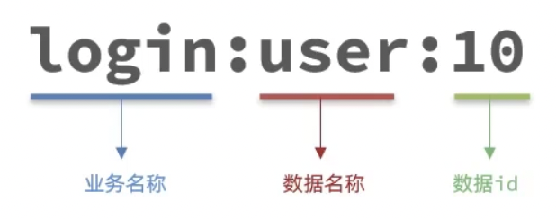
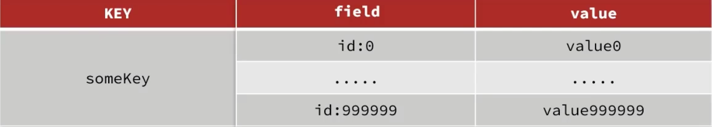
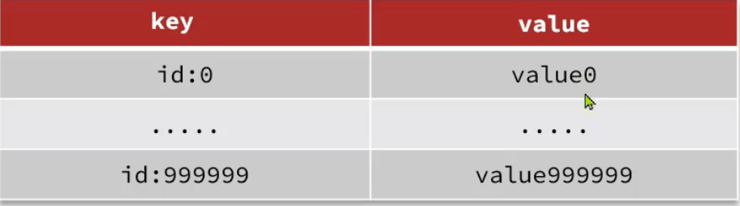
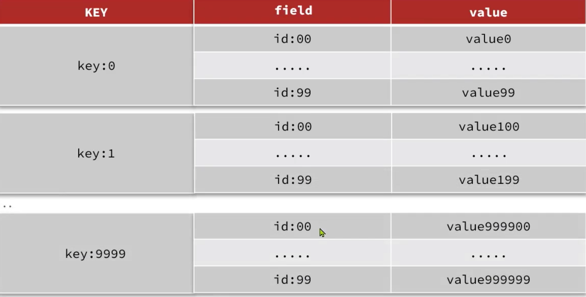

# 优雅的key结构

Redis的key虽然可以自定义，但最好遵循下面的几个最佳实践约定：

- 遵循基本格式：[业务名称]:[数据名]:[id]
- 长度不超过44字节
- 不包含特殊字符

例如：我们的登陆业务，保存用户信息，其key是这样的：

优点：

1. 可读性强
2. 避免key冲突
3. 方便管理
4. 更节省内存：key是string类型，底层编码包含int、embstr和raw三种。embstr在小于44字节使用，采用连续内存空间，内存占用更小

# 什么是BigKey

BigKey通常以key的大小和key中成员的数量来综合判定，例如：

key本身的数据量过大：一个String类型的key，它的值为5MB

key中的成员数过多：一个zset类型的key，它的成员数量为10000个

key中成员的数据量过大：一个hash类型的key，它的成员数量虽然只有1000个，但这些成员的value总大小为100MB。

推荐值：

单个key的value小于10kb

对于集合类型的key，建议元素数量小于1000

# BigKey的危害

- 网络阻塞

​		对BigKey执行读请求时，少量的QPS就可能导致带宽使用率被占满，导致Redis实例，乃至所在物理机变慢

- 数据倾斜

​	    BigKey所在的Redis实例内存使用率远超其他实例，无法使数据分片的内存资源达到均衡

- Redis阻塞

​	    对元素较多的hash、list、zset等做运算会耗时较旧，使主线程被阻塞

- CPU压力

​	    对BigKey的数据序列化和反序列化会导致CPU的使用率飙升，影响Redis实例和本机其他应用

# 如何发现BigKey

- redis-cli --bigkeys

​		利用redis-cli提供的--bigkeys参数，可以遍历分析所有key，并返回key的整体统计信息与每个数据的Top1的big key

- scan扫描

  自己编程，利用scan扫描redis中所有key，利用strlen、hlen等命令判断key的长度（此处不建议使用memory usage）

- 第三方工具
  
    利用第三方工具，如redis-Rdb-tools分析rdb快照文件，全面分析内存使用情况

- 网络监控

    自定义工具，监控进出Redis的网络数据，超出预警值时主动告警

# 如何删除BigKey

BigKey内存占用较多，即便是删除这样的key也需要耗费很长时间，导致Redis主线程阻塞，引发一系列问题。

- redis3.0及以下版本

  如果是集合类型，则遍历BigKey的元素，先逐个删除子元素，最后删除BigKey

- Redis4.0以后

  redis在4.0后提供了异步删除的命令：unlink

  

# 恰当的数据类型

例1:比如存储一个User对象，我们有三种存储方式：

方式一：json字符串

| user:1 | {"name":"Jack", "age":"21"} |
| ------ | --------------------------- |

优点：实现简单粗暴

缺点：数据耦合，不够灵活

方式二：字段打散

| User:1:name | Jack |
| ----------- | ---- |
| User:1:age  | 21   |

优点：可以灵活访问对象任意字段

缺点：占用空间大，没办法做统一控制

方式三：hash

|   user:1   |   name   |   Jack   |
|   ----     | ----     | ----     |
|   user:1   |  jack    |   21     |

优点：底层使用ziplist，空间占用小，可以灵活访问对象的任意字段

缺点：代码相对复杂

例2:假如有hash类型的key，其中有100万对field和value，field是自增id，这个key存在什么问题？如何优化？

存在的问题：

- hash的entry数量超过500时，会使用哈希表而不是ziplist，内存占用较多
- 可以通过hash-max-ziplist- entries配置entry上限。但是如果entry过多就会导致BigKey问题

方案二：拆分为string类型：

存在的问题：

- string结构底层没有太多内存优化，内存占用较多
- 想要批量获取这些数据比较麻烦

 方案三：拆分为小的hash，将id/100作为key，将id%100作为field，这样每100个元素为一个hash

