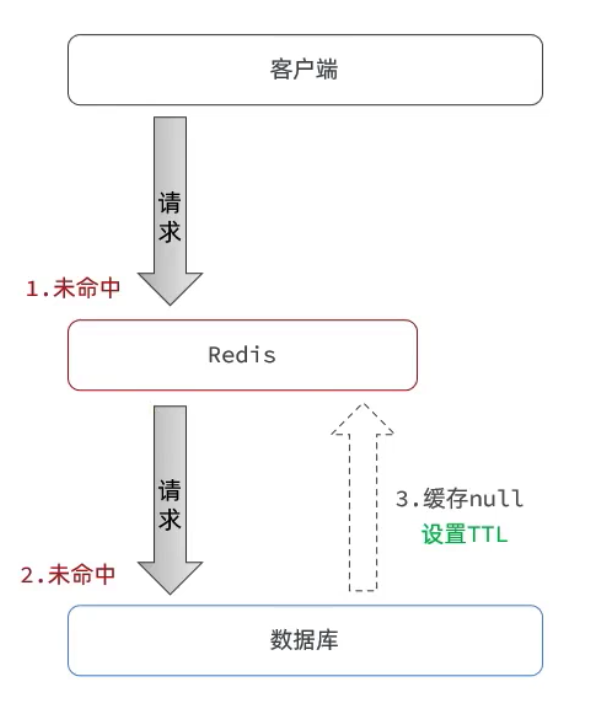
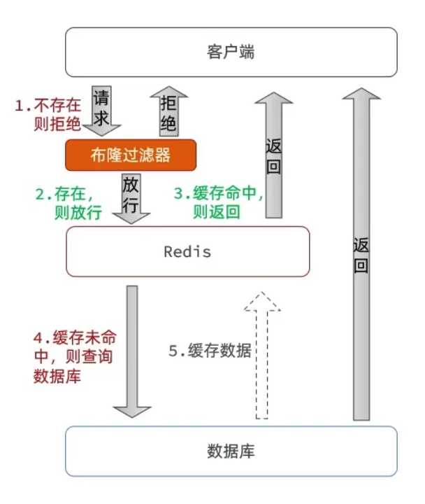
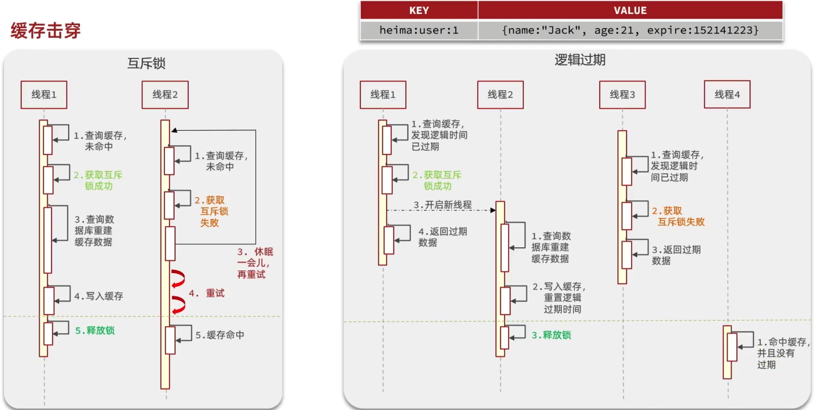

# 缓存更新策略
1.内存淘汰

说明：不用自己维护，利用redis的内存淘汰机制，当内存不足时自动淘汰部分数据。下次查询时更新缓存

一致性：差

维护成本：无

2.超时剔除

说明：给缓存数据添加ttl时间，到期后自动删除缓存。下次查询时更新缓存

一致性：一般

维护成本：低

3.主动更新

说明：编写业务逻辑，在修改数据库的同时，更新缓存

一致性：好

维护成本：高

业务场景：

    低一致性需求：使用内存淘汰机制，例如店铺类型的查询缓存
 
    高一致性需求：主动更新，并以超时踢除作为兜底方案，例如店铺详情查询的缓存
 
        读操作：
        
            缓存命中则直接返回
            
            缓存未命中则查询数据库，并写入缓存，设定超时时间

        写操作：
        
            先写数据库，然后再删除缓存

            要确保数据库与缓存操作的原子性

主动更新策略
 
（1）*由缓存的调用者，在更新数据库的同时更新缓存（推荐）

（2）缓存与数据库整合为一个服务，由服务来维护一致性。调用者调用该服务，无需关心缓存一致性问题

（3）调用者只操作，由其他线程异步的将缓存数据持久化到数据库，保证最终一致。

# 操作缓存和数据库时有三个问题需要考虑：

1.删除缓存还是更新缓存？
    
    更新缓存：每次更新数据库都更新缓存，无效写操作较多 (不推荐)

    删除缓存：更新数据库时让缓存失效，查询时再更新缓存 (推荐)

2.如何保证缓存与数据库操作的同时成功或失败？

    单体系统，将缓存与数据库操作放在一个事务
    
    分布式系统，利用TCC等分布式事务方案

3.先操作缓存还是先操作数据库？

3.1:先删除缓存，再操作数据库
 
3.2:先操作数据库，再删除缓存

各自的问题：多线程同时进入

# 缓存穿透

缓存穿透是指客户端请求的数据在缓存中和数据库中都不存在，这样缓存永远不会生效，这些请求都会打到数据库

常见解决方案有两种：

一：缓存空对象（推荐）

    优点：实现简单，维护方便

    缺点：

        额外的内存消耗
        
        可能造成短期的不一致

二：布隆过滤

    优点：内存占用较少，没有多余key

    缺点：实现复杂，存在误判可能

## 缓存穿透解决方案还有哪些？
    
缓存null值

布隆过滤

增强ID的复杂度，避免被猜测ID规律

做好数据的基础格式校验

加强用户权限校验

做好热点参数的限流

# 缓存雪崩

缓存雪崩是指在同一时段大量的缓存key同时失效或者redis服务宕机，导致大量请求到达数据库，带来巨大压力。

解决方案：

    给不同的key的ttl添加随机值
    
    利用redis集群提高服务的可用性

    给缓存业务添加降级限流策略

    给业务添加多级缓存

# 缓存击穿

缓存击穿也叫热点key问题，就是一个被高并发访问并且缓存重建业务较复杂的key突然失效来，无数的请求访问会在瞬间给数据库带来巨大的冲击。

    常见的解决方案有两种：

        互斥锁

            优点：
                （1）没有额外的内存消耗
            
                （2）保证一致性

                （3）实现简单

            缺点：
                
                （1）线程无需等待，性能受影响
            
                （2）可能有死锁风险

        逻辑过期
        
            优点：线程无需等待，性能较好

            缺点：
    
                （1）不保证一致性

                （2）有额外内存消耗

                （3）实现复杂

# 缓存工具封装

基于stringredistemplate封装一个缓存工具类，满足下列需求：

方法一：将任意Java对象序列化为json并存储在string类型的key中，并且可以设置ttl过期时间

方法二：将任意Java对象序列化为json并存储在string类型的key中，并且可以设置逻辑过期时间，用于处理缓存击穿问题。

方法三：根据指定的key查询缓存，并反序列化为指定类型，利用缓存空值的方式解决缓存穿透问题

方法四：根据指定的key查询缓存，并反序列化为指定类型，需要利用逻辑过期解决缓存击穿问题

