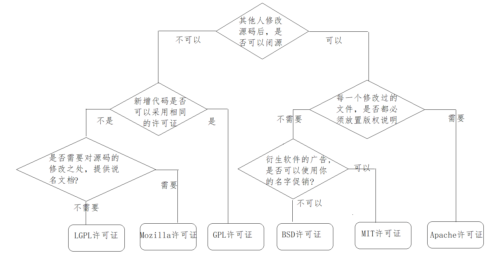
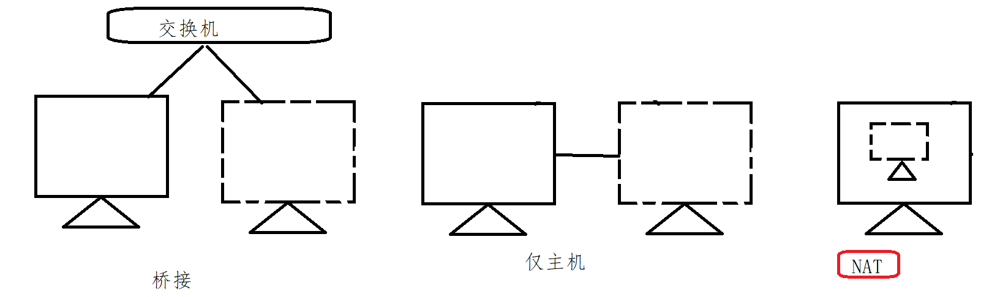
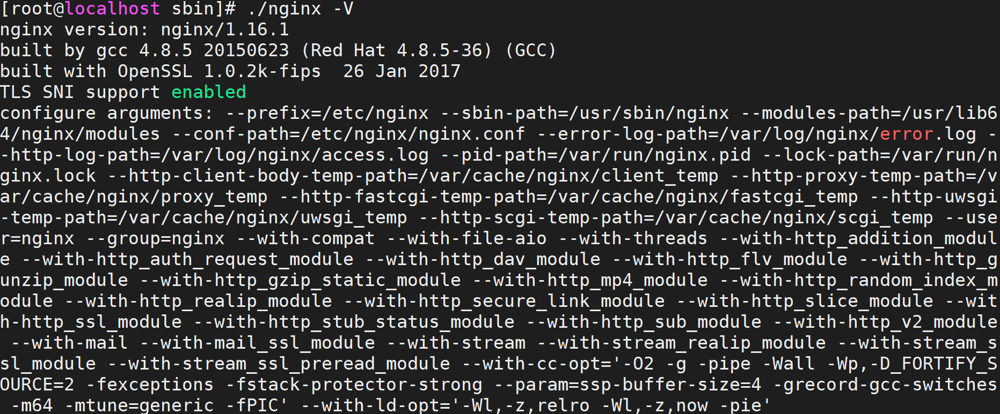
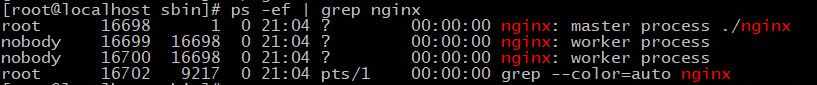
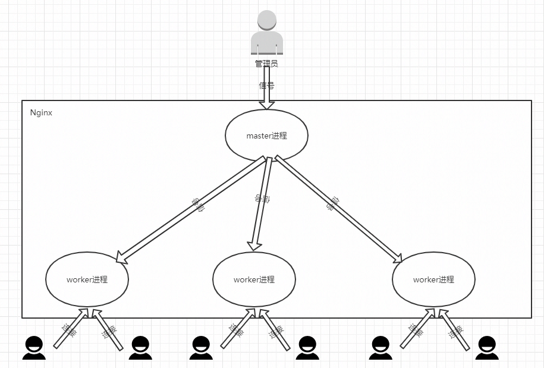
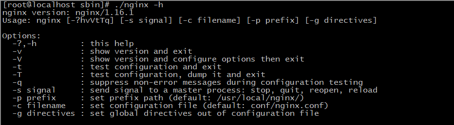

## Nginx简介

### 背景介绍

Nginx（“engine x”）一个具有高性能的【HTTP】和【反向代理】的【WEB服务器】，同时也是一个【POP3/SMTP/IMAP代理服务器】，是由伊戈尔·赛索耶夫(俄罗斯人)使用C语言编写的，Nginx的第一个版本是2004年10月4号发布的0.1.0版本。另外值得一提的是伊戈尔·赛索耶夫将Nginx的源码进行了开源，这也为Nginx的发展提供了良好的保障。


#### 名词解释

1. WEB服务器：

WEB服务器也叫网页服务器，英文名叫Web Server，主要功能是为用户提供网上信息浏览服务。

2. HTTP:

HTTP是超文本传输协议的缩写，是用于从WEB服务器传输超文本到本地浏览器的传输协议，也是互联网上应用最为广泛的一种网络协议。HTTP是一个客户端和服务器端请求和应答的标准，客户端是终端用户，服务端是网站，通过使用Web浏览器、网络爬虫或者其他工具，客户端发起一个到服务器上指定端口的HTTP请求。

3. POP3/SMTP/IMAP：

POP3(Post Offic Protocol 3)邮局协议的第三个版本，

SMTP(Simple Mail Transfer Protocol)简单邮件传输协议，

IMAP(Internet Mail Access Protocol)交互式邮件存取协议，

通过上述名词的解释，我们可以了解到Nginx也可以作为电子邮件代理服务器。

4. 反向代理

正向代理


反向代理


### 常见服务器对比

在介绍这一节内容之前，我们先来认识一家公司叫Netcraft。

```
Netcraft公司于1994年底在英国成立，多年来一直致力于互联网市场以及在线安全方面的咨询服务，其中在国际上最具影响力的当属其针对网站服务器、SSL市场所做的客观严谨的分析研究，公司官网每月公布的调研数据（Web Server Survey）已成为当今人们了解全球网站数量以及服务器市场分额情况的主要参考依据，时常被诸如华尔街杂志，英国BBC，Slashdot等媒体报道或引用。
```

我们先来看一组数据，我们先打开Nginx的官方网站  <http://nginx.org/>,找到Netcraft公司公布的数据，对当前主流服务器产品进行介绍。


上面这张图展示了2019年全球主流Web服务器的市场情况，其中有Apache、Microsoft-IIS、google Servers、Nginx、Tomcat等，而我们在了解新事物的时候，往往习惯通过类比来帮助自己理解事物的概貌。所以下面我们把几种常见的服务器来给大家简单介绍下：

#### IIS

​	全称(Internet Information Services)即互联网信息服务，是由微软公司提供的基于windows系统的互联网基本服务。windows作为服务器在稳定性与其他一些性能上都不如类UNIX操作系统，因此在需要高性能Web服务器的场合下，IIS可能就会被"冷落".

#### Tomcat

​	Tomcat是一个运行Servlet和JSP的Web应用软件，Tomcat技术先进、性能稳定而且开放源代码，因此深受Java爱好者的喜爱并得到了部分软件开发商的认可，成为目前比较流行的Web应用服务器。但是Tomcat天生是一个重量级的Web服务器，对静态文件和高并发的处理比较弱。

#### Apache

​	Apache的发展时期很长，同时也有过一段辉煌的业绩。从上图可以看出大概在2014年以前都是市场份额第一的服务器。Apache有很多优点，如稳定、开源、跨平台等。但是它出现的时间太久了，在它兴起的年代，互联网的产业规模远远不如今天，所以它被设计成一个重量级的、不支持高并发的Web服务器。在Apache服务器上，如果有数以万计的并发HTTP请求同时访问，就会导致服务器上消耗大量能存，操作系统内核对成百上千的Apache进程做进程间切换也会消耗大量的CUP资源，并导致HTTP请求的平均响应速度降低，这些都决定了Apache不可能成为高性能的Web服务器。这也促使了Lighttpd和Nginx的出现。

#### Lighttpd

​	Lighttpd是德国的一个开源的Web服务器软件，它和Nginx一样，都是轻量级、高性能的Web服务器，欧美的业界开发者比较钟爱Lighttpd,而国内的公司更多的青睐Nginx，同时网上Nginx的资源要更丰富些。

#### 其他的服务器

Google Servers，Weblogic, Webshpere(IBM)...

经过各个服务器的对比，种种迹象都表明，Nginx将以性能为王。这也是我们为什么选择Nginx的理由。

#### Nginx的优点

##### (1)速度更快、并发更高

单次请求或者高并发请求的环境下，Nginx都会比其他Web服务器响应的速度更快。一方面在正常情况下，单次请求会得到更快的响应，另一方面，在高峰期(如有数以万计的并发请求)，Nginx比其他Web服务器更快的响应请求。Nginx之所以有这么高的并发处理能力和这么好的性能原因在于Nginx采用了多进程和I/O多路复用(epoll)的底层实现。

##### (2)配置简单，扩展性强

Nginx的设计极具扩展性，它本身就是由很多模块组成，这些模块的使用可以通过配置文件的配置来添加。这些模块有官方提供的也有第三方提供的模块，如果需要完全可以开发服务自己业务特性的定制模块。

##### (3)高可靠性

Nginx采用的是多进程模式运行，其中有一个master主进程和N多个worker进程，worker进程的数量我们可以手动设置，每个worker进程之间都是相互独立提供服务，并且master主进程可以在某一个worker进程出错时，快速去"拉起"新的worker进程提供服务。

##### (4)热部署

现在互联网项目都要求以7*24小时进行服务的提供，针对于这一要求，Nginx也提供了热部署功能，即可以在Nginx不停止的情况下，对Nginx进行文件升级、更新配置和更换日志文件等功能。

##### (5)成本低、BSD许可证

BSD是一个开源的许可证，世界上的开源许可证有很多，现在比较流行的有六种分别是GPL、BSD、MIT、Mozilla、Apache、LGPL。这六种的区别是什么，我们可以通过下面一张图来解释下：



Nginx本身是开源的，我们不仅可以免费的将Nginx应用在商业领域，而且还可以在项目中直接修改Nginx的源码来定制自己的特殊要求。这些点也都是Nginx为什么能吸引无数开发者继续为Nginx来贡献自己的智慧和青春。OpenRestry [Nginx+Lua]   Tengine[淘宝]

### Nginx的功能特性及常用功能

Nginx提供的基本功能服务从大体上归纳为"基本HTTP服务"、“高级HTTP服务”和"邮件服务"等三大类。

#### 基本HTTP服务

Nginx可以提供基本HTTP服务，可以作为HTTP代理服务器和反向代理服务器，支持通过缓存加速访问，可以完成简单的负载均衡和容错，支持包过滤功能，支持SSL等。

- 处理静态文件、处理索引文件以及支持自动索引；
- 提供反向代理服务器，并可以使用缓存加上反向代理，同时完成负载均衡和容错；
- 提供对FastCGI、memcached等服务的缓存机制，，同时完成负载均衡和容错；
- 使用Nginx的模块化特性提供过滤器功能。Nginx基本过滤器包括gzip压缩、ranges支持、chunked响应、XSLT、SSI以及图像缩放等。其中针对包含多个SSI的页面，经由FastCGI或反向代理，SSI过滤器可以并行处理。
- 支持HTTP下的安全套接层安全协议SSL.
- 支持基于加权和依赖的优先权的HTTP/2

#### 高级HTTP服务

- 支持基于名字和IP的虚拟主机设置
- 支持HTTP/1.0中的KEEP-Alive模式和管线(PipeLined)模型连接
- 自定义访问日志格式、带缓存的日志写操作以及快速日志轮转。
- 提供3xx~5xx错误代码重定向功能
- 支持重写（Rewrite)模块扩展
- 支持重新加载配置以及在线升级时无需中断正在处理的请求
- 支持网络监控
- 支持FLV和MP4流媒体传输

#### 邮件服务

Nginx提供邮件代理服务也是其基本开发需求之一，主要包含以下特性：

- 支持IMPA/POP3代理服务功能
- 支持内部SMTP代理服务功能

#### Nginx常用的功能模块

```
静态资源部署
Rewrite地址重写
	正则表达式
反向代理
负载均衡
	轮询、加权轮询、ip_hash、url_hash、fair
Web缓存
环境部署
	高可用的环境
用户认证模块...
```

Nginx的核心组成

```
nginx二进制可执行文件
nginx.conf配置文件
error.log错误的日志记录
access.log访问日志记录
```

## Nginx环境准备

### Nginx版本介绍

Nginx的官方网站为: http://nginx.org

打开源码可以看到如下的页面内容


Nginx的官方下载网站为<http://nginx.org/en/download.html>，当然你也可以之间在首页选中右边的download进入版本下载网页。在下载页面我们会看到如下内容：


### 获取Nginx源码

<http://nginx.org/download/>

打开上述网站，就可以查看到Nginx的所有版本，选中自己需要的版本进行下载。下载我们可以直接在windows上下载然后上传到服务器，也可以直接从服务器上下载，这个时候就需要准备一台服务器。

### 


### 准备服务器系统

环境准备

```
VMware WorkStation
Centos7
MobaXterm
	xsheel,SecureCRT
网络
```

(1)确认centos的内核

准备一个内核为2.6及以上版本的操作系统，因为linux2.6及以上内核才支持epoll,而Nginx需要解决高并发压力问题是需要用到epoll，所以我们需要有这样的版本要求。

我们可以使用`uname -a`命令来查询linux的内核版本。


(2)确保centos能联网

```
ping www.baidu.com
```



(3)确认关闭防火墙

这一项的要求仅针对于那些对linux系统的防火墙设置规则不太清楚的，建议大家把防火墙都关闭掉，因为我们此次课程主要的内容是对Nginx的学习，把防火墙关闭掉，可以省掉后续Nginx学习过程中遇到的诸多问题。

关闭的方式有如下两种：

```
systemctl stop firewalld      关闭运行的防火墙，系统重新启动后，防火墙将重新打开
systemctl disable firewalld   永久关闭防火墙，，系统重新启动后，防火墙依然关闭
systemctl status firewalld	 查看防火墙状态
```

（4）确认停用selinux

selinux(security-enhanced linux),美国安全局对于强制访问控制的实现，在linux2.6内核以后的版本中，selinux已经成功内核中的一部分。可以说selinux是linux史上最杰出的新安全子系统之一。虽然有了selinux，我们的系统会更安全，但是对于我们的学习Nginx的历程中，会多很多设置，所以这块建议大家将selinux进行关闭。


sestatus查看状态


如果查看不是disabled状态，我们可以通过修改配置文件来进行设置,修改SELINUX=disabled，然后重启下系统即可生效。

```
vim /etc/selinux/config
```


### Nginx安装方式介绍

Nginx的安装方式有两种分别是:

```
通过Nginx源码
	通过Nginx源码简单安装 (1)
	通过Nginx源码复杂安装 (3)
通过yum安装 (2)
```

如果通过Nginx源码安装需要提前准备的内容：

##### GCC编译器

Nginx是使用C语言编写的程序，因此想要运行Nginx就需要安装一个编译工具。GCC就是一个开源的编译器集合，用于处理各种各样的语言，其中就包含了C语言。

使用命令`yum install -y gcc`来安装

安装成功后，可以通过`gcc --version`来查看gcc是否安装成功

##### PCRE

Nginx在编译过程中需要使用到PCRE库（perl Compatible Regular Expressoin 兼容正则表达式库)，因为在Nginx的Rewrite模块和http核心模块都会使用到PCRE正则表达式语法。

可以使用命令`yum install -y pcre pcre-devel`来进行安装

安装成功后，可以通过`rpm -qa pcre pcre-devel`来查看是否安装成功

##### zlib

zlib库提供了开发人员的压缩算法，在Nginx的各个模块中需要使用gzip压缩，所以我们也需要提前安装其库及源代码zlib和zlib-devel

可以使用命令`yum install -y zlib zlib-devel`来进行安装

安装成功后，可以通过`rpm -qa zlib zlib-devel`来查看是否安装成功

##### OpenSSL

OpenSSL是一个开放源代码的软件库包，应用程序可以使用这个包进行安全通信，并且避免被窃听。

SSL:Secure Sockets Layer安全套接协议的缩写，可以在Internet上提供秘密性传输，其目标是保证两个应用间通信的保密性和可靠性。在Nginx中，如果服务器需要提供安全网页时就需要用到OpenSSL库，所以我们需要对OpenSSL的库文件及它的开发安装包进行一个安装。

可以使用命令`yum install -y openssl openssl-devel`来进行安装

安装成功后，可以通过`rpm -qa openssl openssl-devel`来查看是否安装成功

上述命令，一个个来的话比较麻烦，我们也可以通过一条命令来进行安装

`yum install -y gcc pcre pcre-devel zlib zlib-devel openssl openssl-devel`进行全部安装。


#### 方案一：Nginx的源码简单安装

(1)进入官网查找需要下载版本的链接地址，然后使用wget命令进行下载

```
wget http://nginx.org/download/nginx-1.16.1.tar.gz
```

(2)建议大家将下载的资源进行包管理

```
mkdir -p nginx/core
mv nginx-1.16.1.tar.gz nginx/core
```

(3)解压缩

```
tar -xzf nginx-1.16.1.tar.gz
```

(4)进入资源文件中，发现configure

```
./configure
```

(5)编译

```
make
```

(6)安装

```
make install
```


#### 方案二：yum安装

使用源码进行简单安装，我们会发现安装的过程比较繁琐，需要提前准备GCC编译器、PCRE兼容正则表达式库、zlib压缩库、OpenSSL安全通信的软件库包，然后才能进行Nginx的安装。

（1）安装yum-utils

```
sudo yum  install -y yum-utils
```

（2）添加yum源文件

```
vim /etc/yum.repos.d/nginx.repo
```

```
[nginx-stable]
name=nginx stable repo
baseurl=http://nginx.org/packages/centos/$releasever/$basearch/
gpgcheck=1
enabled=1
gpgkey=https://nginx.org/keys/nginx_signing.key
module_hotfixes=true

[nginx-mainline]
name=nginx mainline repo
baseurl=http://nginx.org/packages/mainline/centos/$releasever/$basearch/
gpgcheck=1
enabled=0
gpgkey=https://nginx.org/keys/nginx_signing.key
module_hotfixes=true
```

（3）查看是否安装成功

```
yum list | grep nginx
```


（4）使用yum进行安装

```
yun install -y nginx
```

（5）查看nginx的安装位置

```
whereis nginx
```


（6）启动测试

#### 源码简单安装和yum安装的差异：

这里先介绍一个命令: `./nginx -V`,通过该命令可以查看到所安装Nginx的版本及相关配置信息。

简单安装


yum安装



##### 解压Nginx目录

执行`tar -zxvf nginx-1.16.1.tar.gz`对下载的资源进行解压缩，进入压缩后的目录，可以看到如下结构


内容解释：

auto:存放的是编译相关的脚本

CHANGES:版本变更记录

CHANGES.ru:俄罗斯文的版本变更记录

conf:nginx默认的配置文件

configure:nginx软件的自动脚本程序,是一个比较重要的文件，作用如下：

​	（1）检测环境及根据环境检测结果生成C代码

​	（2）生成编译代码需要的Makefile文件

contrib:存放的是几个特殊的脚本文件，其中README中对脚本有着详细的说明

html:存放的是Nginx自带的两个html页面，访问Nginx的首页和错误页面

LICENSE:许可证的相关描述文件

man:nginx的man手册

README:Nginx的阅读指南

src:Nginx的源代码

#### 方案三:Nginx的源码复杂安装

这种方式和简单的安装配置不同的地方在第一步，通过`./configure`来对编译参数进行设置，需要我们手动来指定。那么都有哪些参数可以进行设置，接下来我们进行一个详细的说明。

PATH:是和路径相关的配置信息

with:是启动模块，默认是关闭的

without:是关闭模块，默认是开启的

我们先来认识一些简单的路径配置已经通过这些配置来完成一个简单的编译：

--prefix=PATH

```
指向Nginx的安装目录，默认值为/usr/local/nginx   
```

--sbin-path=PATH

```
指向(执行)程序文件(nginx)的路径,默认值为<prefix>/sbin/nginx
```

--modules-path=PATH

```
指向Nginx动态模块安装目录，默认值为<prefix>/modules
```

--conf-path=PATH

```
指向配置文件(nginx.conf)的路径,默认值为<prefix>/conf/nginx.conf
```

--error-log-path=PATH 

```
指向错误日志文件的路径,默认值为<prefix>/logs/error.log
```

--http-log-path=PATH  

```
指向访问日志文件的路径,默认值为<prefix>/logs/access.log
```

--pid-path=PATH

```
指向Nginx启动后进行ID的文件路径，默认值为<prefix>/logs/nginx.pid
```

--lock-path=PATH

```
指向Nginx锁文件的存放路径,默认值为<prefix>/logs/nginx.lock
```

要想使用可以通过如下命令

```
./configure --prefix=/usr/local/nginx \
--sbin-path=/usr/local/nginx/sbin/nginx \
--modules-path=/usr/local/nginx/modules \
--conf-path=/usr/local/nginx/conf/nginx.conf \
--error-log-path=/usr/local/nginx/logs/error.log \
--http-log-path=/usr/local/nginx/logs/access.log \
--pid-path=/usr/local/nginx/logs/nginx.pid \
--lock-path=/usr/local/nginx/logs/nginx.lock
```

在使用上述命令之前，需要将之前服务器已经安装的nginx进行卸载，卸载的步骤分为三步骤：

步骤一：需要将nginx的进程关闭

```
./nginx -s stop
```

步骤二:将安装的nginx进行删除

```
rm -rf /usr/local/nginx
```

步骤三:将安装包之前编译的环境清除掉

```
make clean
```

### Nginx目录结构分析

在使用Nginx之前，我们先对安装好的Nginx目录文件进行一个分析，在这块给大家介绍一个工具tree，通过tree我们可以很方面的去查看centos系统上的文件目录结构，当然，如果想使用tree工具，就得先通过`yum install -y tree`来进行安装，安装成功后，可以通过执行`tree /usr/local/nginx`(tree后面跟的是Nginx的安装目录)，获取的结果如下：


conf:nginx所有配置文件目录

​    CGI(Common Gateway Interface)通用网关【接口】，主要解决的问题是从客户端发送一个请求和数据，服务端获取到请求和数据后可以调用调用CGI【程序】处理及相应结果给客户端的一种标准规范。

​	fastcgi.conf:fastcgi相关配置文件

​	fastcgi.conf.default:fastcgi.conf的备份文件

​	fastcgi_params:fastcgi的参数文件

​	fastcgi_params.default:fastcgi的参数备份文件

​	scgi_params:scgi的参数文件

​	scgi_params.default：scgi的参数备份文件

​    uwsgi_params:uwsgi的参数文件

​	uwsgi_params.default:uwsgi的参数备份文件

​	mime.types:记录的是HTTP协议中的Content-Type的值和文件后缀名的对应关系

​	mime.types.default:mime.types的备份文件

​	nginx.conf:这个是Nginx的核心配置文件，这个文件非常重要，也是我们即将要学习的重点

​	nginx.conf.default:nginx.conf的备份文件

​	koi-utf、koi-win、win-utf这三个文件都是与编码转换映射相关的配置文件，用来将一种编码转换成另一种编码

html:存放nginx自带的两个静态的html页面

​	50x.html:访问失败后的失败页面

​	index.html:成功访问的默认首页

logs:记录入门的文件，当nginx服务器启动后，这里面会有 access.log error.log 和nginx.pid三个文件出现。

sbin:是存放执行程序文件nginx

​	nginx是用来控制Nginx的启动和停止等相关的命令。


### Nginx服务器启停命令

Nginx安装完成后，接下来我们要学习的是如何启动、重启和停止Nginx的服务。

对于Nginx的启停在linux系统中也有很多种方式，我们本次课程介绍两种方式：

1. Nginx服务的信号控制

2. Nginx的命令行控制

#### 方式一:Nginx服务的信号控制

```
Nginx中的master和worker进程?
Nginx的工作方式?
如何获取进程的PID?
信号有哪些?
如何通过信号控制Nginx的启停等相关操作?
```

前面在提到Nginx的高性能，其实也和它的架构模式有关。Nginx默认采用的是多进程的方式来工作的，当将Nginx启动后，我们通过`ps -ef | grep nginx`命令可以查看到如下内容：



从上图中可以看到,Nginx后台进程中包含一个master进程和多个worker进程，master进程主要用来管理worker进程，包含接收外界的信息，并将接收到的信号发送给各个worker进程，监控worker进程的状态，当worker进程出现异常退出后，会自动重新启动新的worker进程。而worker进程则是专门用来处理用户请求的，各个worker进程之间是平等的并且相互独立，处理请求的机会也是一样的。nginx的进程模型，我们可以通过下图来说明下：



我们现在作为管理员，只需要通过给master进程发送信号就可以来控制Nginx,这个时候我们需要有两个前提条件，一个是要操作的master进程，一个是信号。

（1）要想操作Nginx的master进程，就需要获取到master进程的进程号ID。获取方式简单介绍两个，

方式一：通过`ps -ef | grep nginx`；

方式二：在讲解nginx的`./configure`的配置参数的时候，有一个参数是`--pid-path=PATH`默认是`/usr/local/nginx/logs/nginx.pid`,所以可以通过查看该文件来获取nginx的master进程ID.

（2）信号

| 信号     | 作用                                                       |
| -------- | ---------------------------------------------------------- |
| TERM/INT | 立即关闭整个服务                                           |
| QUIT     | "优雅"地关闭整个服务                                       |
| HUP      | 重读配置文件并使用服务对新配置项生效                       |
| USR1     | 重新打开日志文件，可以用来进行日志切割                     |
| USR2     | 平滑升级到最新版的nginx                                    |
| WINCH    | 所有子进程不在接收处理新连接，相当于给work进程发送QUIT指令 |

调用命令为`kill -signal PID`

signal:即为信号；PID即为获取到的master线程ID

1. 发送TERM/INT信号给master进程，会将Nginx服务立即关闭。

```
kill -TERM PID / kill -TERM `cat /usr/local/nginx/logs/nginx.pid`
kill -INT PID / kill -INT `cat /usr/local/nginx/logs/nginx.pid`
```

2. 发送QUIT信号给master进程，master进程会控制所有的work进程不再接收新的请求，等所有请求处理完后，在把进程都关闭掉。

```
kill -QUIT PID / kill -TERM `cat /usr/local/nginx/logs/nginx.pid`
```

3. 发送HUP信号给master进程，master进程会把控制旧的work进程不再接收新的请求，等处理完请求后将旧的work进程关闭掉，然后根据nginx的配置文件重新启动新的work进程

```
kill -HUP PID / kill -TERM `cat /usr/local/nginx/logs/nginx.pid`
```

4. 发送USR1信号给master进程，告诉Nginx重新开启日志文件

```
kill -USR1 PID / kill -TERM `cat /usr/local/nginx/logs/nginx.pid`
```

5. 发送USR2信号给master进程，告诉master进程要平滑升级，这个时候，会重新开启对应的master进程和work进程，整个系统中将会有两个master进程，并且新的master进程的PID会被记录在`/usr/local/nginx/logs/nginx.pid`而之前的旧的master进程PID会被记录在`/usr/local/nginx/logs/nginx.pid.oldbin`文件中，接着再次发送QUIT信号给旧的master进程，让其处理完请求后再进行关闭

```
kill -USR2 PID / kill -USR2 `cat /usr/local/nginx/logs/nginx.pid`
```

```
kill -QUIT PID / kill -QUIT `cat /usr/local/nginx/logs/nginx.pid.oldbin`
```


6. 发送WINCH信号给master进程,让master进程控制不让所有的work进程在接收新的请求了，请求处理完后关闭work进程。注意master进程不会被关闭掉

```
kill -WINCH PID /kill -WINCH`cat /usr/local/nginx/logs/nginx.pid`
```

#### 方式二:Nginx的命令行控制

此方式是通过Nginx安装目录下的sbin下的可执行文件nginx来进行Nginx状态的控制，我们可以通过`nginx -h`来查看都有哪些参数可以用：



-?和-h:显示帮助信息

-v:打印版本号信息并退出

-V:打印版本号信息和配置信息并退出

-t:测试nginx的配置文件语法是否正确并退出

-T:测试nginx的配置文件语法是否正确并列出用到的配置文件信息然后退出

-q:在配置测试期间禁止显示非错误消息

-s:signal信号，后面可以跟 ：

​	 stop[快速关闭，类似于TERM/INT信号的作用]

​	quit[优雅的关闭，类似于QUIT信号的作用] 

​	reopen[重新打开日志文件类似于USR1信号的作用] 

​	reload[类似于HUP信号的作用]

-p:prefix，指定Nginx的prefix路径，(默认为: /usr/local/nginx/)

-c:filename,指定Nginx的配置文件路径,(默认为: conf/nginx.conf)

-g:用来补充Nginx配置文件，向Nginx服务指定启动时应用全局的配置

### Nginx服务器版本升级和新增模块

如果想对Nginx的版本进行更新，或者要应用一些新的模块，最简单的做法就是停止当前的Nginx服务，然后开启新的Nginx服务。但是这样会导致在一段时间内，用户是无法访问服务器。为了解决这个问题，我们就需要用到Nginx服务器提供的平滑升级功能。这个也是Nginx的一大特点，使用这种方式，就可以使Nginx在7*24小时不间断的提供服务了。接下来我们分析下需求：

```
需求：Nginx的版本最开始使用的是Nginx-1.14.2,由于服务升级，需要将Nginx的版本升级到Nginx-1.16.1,要求Nginx不能中断提供服务。
```

为了应对上述的需求，这里我们给大家提供两种解决方案:

方案一:使用Nginx服务信号完成Nginx的升级

方案二:使用Nginx安装目录的make命令完成升级

#### 环境准备

（1）先准备两个版本的Nginx分别是 1.14.2和1.16.1

（2）使用Nginx源码安装的方式将1.14.2版本安装成功并正确访问

```
进入安装目录
./configure
make && make install
```

（3）将Nginx1.16.1进行参数配置和编译，不需要进行安装。

```
进入安装目录
./configure
make 
```

#### 方案一:使用Nginx服务信号进行升级

第一步:将1.14.2版本的sbin目录下的nginx进行备份

```
cd /usr/local/nginx/sbin
mv nginx nginxold
```

第二步:将Nginx1.16.1安装目录编译后的objs目录下的nginx文件，拷贝到原来`/usr/local/nginx/sbin`目录下

```
cd ~/nginx/core/nginx-1.16.1/objs
cp nginx /usr/local/nginx/sbin
```

第三步:发送信号USR2给Nginx的1.14.2版本对应的master进程

第四步:发送信号QUIT给Nginx的1.14.2版本对应的master进程

```
kill -QUIT `more /usr/local/logs/nginx.pid.oldbin`
```

#### 方案二:使用Nginx安装目录的make命令完成升级

第一步:将1.14.2版本的sbin目录下的nginx进行备份

```
cd /usr/local/nginx/sbin
mv nginx nginxold
```

第二步:将Nginx1.16.1安装目录编译后的objs目录下的nginx文件，拷贝到原来`/usr/local/nginx/sbin`目录下

```
cd ~/nginx/core/nginx-1.16.1/objs
cp nginx /usr/local/nginx/sbin
```

第三步:进入到安装目录，执行`make upgrade`


第四步:查看是否更新成功

```
./nginx -v
```

在整个过程中，其实Nginx是一直对外提供服务的。并且当Nginx的服务器启动成功后，我们是可以通过浏览器进行直接访问的，同时我们可以通过更改html目录下的页面来修改我们在页面上所看到的内容，那么问题来了，为什么我们要修改html目录下的文件，能不能多添加一些页面是Nginx的功能更加丰富，还有前面聊到Nginx的前端功能又是如何来实现的，这就需要我们对Nginx的核心配置文件进行一个详细的学习。

## Nginx核心配置文件结构

从前面的内容学习中，我们知道Nginx的核心配置文件默认是放在`/usr/local/nginx/conf/nginx.conf`，这一节，我们就来学习下nginx.conf的内容和基本配置方法。

读取Nginx自带的Nginx配置文件，我们将其中的注释部分【学习一个技术点就是在Nginx的配置文件中可以使用`#`来注释】删除掉后，就剩下下面内容:

```conf
worker_processes  1;

events {
    worker_connections  1024;
}

http {
    include       mime.types;
    default_type  application/octet-stream;
    sendfile        on;
    keepalive_timeout  65;

    server {
        listen       80;
        server_name  localhost;
        location / {
            root   html;
            index  index.html index.htm;
        }
        error_page   500 502 503 504  /50x.html;
        location = /50x.html {
            root   html;
        }
    }

}
```

```
指令名	指令值;  #全局块，主要设置Nginx服务器整体运行的配置指令

 #events块,主要设置,Nginx服务器与用户的网络连接,这一部分对Nginx服务器的性能影响较大
events {	 
    指令名	指令值;
}
#http块，是Nginx服务器配置中的重要部分，代理、缓存、日志记录、第三方模块配置...             
http {		
    指令名	指令值;
    server { #server块，是Nginx配置和虚拟主机相关的内容
        指令名	指令值;
        location / { 
        #location块，基于Nginx服务器接收请求字符串与location后面的值进行匹配，对特定请求进行处理
            指令名	指令值;
        }
    }
	...
}
```

简单小结下:

nginx.conf配置文件中默认有三大块：全局块、events块、http块

http块中可以配置多个server块，每个server块又可以配置多个location块。

### 全局块

#### user指令

（1）user:用于配置运行Nginx服务器的worker进程的用户和用户组。

| 语法   | user user [group] |
| ------ | ----------------- |
| 默认值 | nobody            |
| 位置   | 全局块            |

该属性也可以在编译的时候指定，语法如下`./configure --user=user --group=group`,如果两个地方都进行了设置，最终生效的是配置文件中的配置。

该指令的使用步骤:

(1)设置一个用户信息"www"

```
user www;
```


(2) 创建一个用户

```
useradd www
```

(3)修改user属性

```
user www
```

(4)创建`/root/html/index.html`页面，添加如下内容

```html

<!DOCTYPE html>
<html>
<head>
<title>Welcome to nginx!</title>
<style>
    body {
        width: 35em;
        margin: 0 auto;
        font-family: Tahoma, Verdana, Arial, sans-serif;
    }
</style>
</head>
<body>
<h1>Welcome to nginx!</h1>
<p>If you see this page, the nginx web server is successfully installed and
working. Further configuration is required.</p>

<p>For online documentation and support please refer to
<a href="http://nginx.org/">nginx.org</a>.<br/>
Commercial support is available at
<a href="http://nginx.com/">nginx.com</a>.</p>

<p><em>Thank you for using nginx.</em></p>
<p><em>I am WWW</em></p>
</body>
</html>
```

(5)修改nginx.conf

```
location / {
	root   /root/html;
	index  index.html index.htm;
}
```

(5)测试启动访问

```
页面会报403拒绝访问的错误
```

(6)分析原因

```
因为当前用户没有访问/root/html目录的权限
```

(7)将文件创建到 `/home/www/html/index.html`,修改配置

```
location / {
	root   /home/www/html;
	index  index.html index.htm;
}
```

(8)再次测试启动访问

```
能正常访问。
```

综上所述，使用user指令可以指定启动运行工作进程的用户及用户组，这样对于系统的权限访问控制的更加精细，也更加安全。

#### work process指令

master_process:用来指定是否开启工作进程。

| 语法   | master_process on\|off; |
| ------ | ----------------------- |
| 默认值 | master_process on;      |
| 位置   | 全局块                  |

worker_processes:用于配置Nginx生成工作进程的数量，这个是Nginx服务器实现并发处理服务的关键所在。理论上来说workder process的值越大，可以支持的并发处理量也越多，但事实上这个值的设定是需要受到来自服务器自身的限制，建议将该值和服务器CPU的内核数保存一致。

| 语法   | worker_processes     num/auto; |
| ------ | ------------------------------ |
| 默认值 | 1                              |
| 位置   | 全局块                         |

如果将worker_processes设置成2，则会看到如下内容:


#### 其他指令

daemon：设定Nginx是否以守护进程的方式启动。

守护式进程是linux后台执行的一种服务进程，特点是独立于控制终端，不会随着终端关闭而停止。

| 语法   | daemon on\|off; |
| ------ | --------------- |
| 默认值 | daemon on;      |
| 位置   | 全局块          |

pid:用来配置Nginx当前master进程的进程号ID存储的文件路径。

| 语法   | pid file;                              |
| ------ | -------------------------------------- |
| 默认值 | 默认为:/usr/local/nginx/logs/nginx.pid |
| 位置   | 全局块                                 |

该属性可以通过`./configure --pid-path=PATH`来指定

error_log:用来配置Nginx的错误日志存放路径

| 语法   | error_log  file [日志级别];     |
| ------ | ------------------------------- |
| 默认值 | error_log logs/error.log error; |
| 位置   | 全局块、http、server、location  |

该属性可以通过`./configure --error-log-path=PATH`来指定

其中日志级别的值有：debug|info|notice|warn|error|crit|alert|emerg，翻译过来为试|信息|通知|警告|错误|临界|警报|紧急，这块建议大家设置的时候不要设置成info以下的等级，因为会带来大量的磁盘I/O消耗，影响Nginx的性能。

（5）include:用来引入其他配置文件，使Nginx的配置更加灵活

| 语法   | include file; |
| ------ | ------------- |
| 默认值 | 无            |
| 位置   | any           |

### events块

（1）accept_mutex:用来设置Nginx网络连接序列化

| 语法   | accept_mutex on\|off; |
| ------ | --------------------- |
| 默认值 | accept_mutex on;      |
| 位置   | events                |

这个配置主要可以用来解决常说的"惊群"问题。大致意思是在某一个时刻，客户端发来一个请求连接，Nginx后台是以多进程的工作模式，也就是说有多个worker进程会被同时唤醒，但是最终只会有一个进程可以获取到连接，如果每次唤醒的进程数目太多，就会影响Nginx的整体性能。如果将上述值设置为on(开启状态)，将会对多个Nginx进程接收连接进行序列号，一个个来唤醒接收，就防止了多个进程对连接的争抢。


（2）multi_accept:用来设置是否允许同时接收多个网络连接

| 语法   | multi_accept on\|off; |
| ------ | --------------------- |
| 默认值 | multi_accept off;     |
| 位置   | events                |

如果multi_accept被禁止了，nginx一个工作进程只能同时接受一个新的连接。否则，一个工作进程可以同时接受所有的新连接

（3）worker_connections：用来配置单个worker进程最大的连接数

| 语法   | worker_connections number; |
| ------ | -------------------------- |
| 默认值 | worker_commections 512;    |
| 位置   | events                     |

这里的连接数不仅仅包括和前端用户建立的连接数，而是包括所有可能的连接数。另外，number值不能大于操作系统支持打开的最大文件句柄数量。

（4）use:用来设置Nginx服务器选择哪种事件驱动来处理网络消息。

| 语法   | use  method;   |
| ------ | -------------- |
| 默认值 | 根据操作系统定 |
| 位置   | events         |

注意：此处所选择事件处理模型是Nginx优化部分的一个重要内容，method的可选值有select/poll/epoll/kqueue等，之前在准备centos环境的时候，我们强调过要使用linux内核在2.6以上，就是为了能使用epoll函数来优化Nginx。

另外这些值的选择，我们也可以在编译的时候使用

`--with-select_module`、`--without-select_module`、

` --with-poll_module`、` --without-poll_module`来设置是否需要将对应的事件驱动模块编译到Nginx的内核。

#### events指令配置实例

打开Nginx的配置文件 nginx.conf,添加如下配置

```
events{
	accept_mutex on;
	multi_accept on;
	worker_commections 1024;
	use epoll;
}
```

启动测试

```
./nginx -t
./nginx -s reload
```

### http块

#### 定义MIME-Type

我们都知道浏览器中可以显示的内容有HTML、XML、GIF等种类繁多的文件、媒体等资源，浏览器为了区分这些资源，就需要使用MIME Type。所以说MIME Type是网络资源的媒体类型。Nginx作为web服务器，也需要能够识别前端请求的资源类型。

在Nginx的配置文件中，默认有两行配置

```
include mime.types;
default_type application/octet-stream;
```

（1）default_type:用来配置Nginx响应前端请求默认的MIME类型。

| 语法   | default_type mime-type;   |
| ------ | ------------------------- |
| 默认值 | default_type text/plain； |
| 位置   | http、server、location    |

在default_type之前还有一句`include mime.types`,include之前我们已经介绍过，相当于把mime.types文件中MIMT类型与相关类型文件的文件后缀名的对应关系加入到当前的配置文件中。

举例来说明：

有些时候请求某些接口的时候需要返回指定的文本字符串或者json字符串，如果逻辑非常简单或者干脆是固定的字符串，那么可以使用nginx快速实现，这样就不用编写程序响应请求了，可以减少服务器资源占用并且响应性能非常快。

如何实现:

```
location /get_text {
	#这里也可以设置成text/plain
    default_type text/html;
    return 200 "This is nginx's text";
}
location /get_json{
    default_type application/json;
    return 200 '{"name":"TOM","age":18}';
}
```

#### 自定义服务日志

Nginx中日志的类型分access.log、error.log。

access.log:用来记录用户所有的访问请求。

error.log:记录nginx本身运行时的错误信息，不会记录用户的访问请求。

Nginx服务器支持对服务日志的格式、大小、输出等进行设置，需要使用到两个指令，分别是access_log和log_format指令。

（1）access_log:用来设置用户访问日志的相关属性。

| 语法   | access_log path[format[buffer=size]] |
| ------ | ------------------------------------ |
| 默认值 | access_log logs/access.log combined; |
| 位置   | `http`, `server`, `location`         |

（2）log_format:用来指定日志的输出格式。

| 语法   | log_format name [escape=default\|json\|none] string....; |
| ------ | -------------------------------------------------------- |
| 默认值 | log_format combined "...";                               |
| 位置   | http                                                     |

#### 其他配置指令

（1）sendfile:用来设置Nginx服务器是否使用sendfile()传输文件，该属性可以大大提高Nginx处理静态资源的性能

| 语法   | sendfile on\|off；     |
| ------ | ---------------------- |
| 默认值 | sendfile off;          |
| 位置   | http、server、location |

（2）keepalive_timeout:用来设置长连接的超时时间。

》为什么要使用keepalive？

```
我们都知道HTTP是一种无状态协议，客户端向服务端发送一个TCP请求，服务端响应完毕后断开连接。
如何客户端向服务端发送多个请求，每个请求都需要重新创建一次连接，效率相对来说比较多，使用keepalive模式，可以告诉服务器端在处理完一个请求后保持这个TCP连接的打开状态，若接收到来自这个客户端的其他请求，服务端就会利用这个未被关闭的连接，而不需要重新创建一个新连接，提升效率，但是这个连接也不能一直保持，这样的话，连接如果过多，也会是服务端的性能下降，这个时候就需要我们进行设置其的超时时间。
```

| 语法   | keepalive_timeout time; |
| ------ | ----------------------- |
| 默认值 | keepalive_timeout 75s;  |
| 位置   | http、server、location  |

（3）keepalive_requests:用来设置一个keep-alive连接使用的次数。

| 语法   | keepalive_requests number; |
| ------ | -------------------------- |
| 默认值 | keepalive_requests 100;    |
| 位置   | http、server、location     |

### server块和location块

server块和location块都是我们要重点讲解和学习的内容，因为我们后面会对Nginx的功能进行详细讲解，所以这块内容就放到静态资源部署的地方给大家详细说明。

本节我们主要来认识下Nginx默认给的nginx.conf中的相关内容，以及server块与location块在使用的时候需要注意的一些内容。

```
	server {
        listen       80;
        server_name  localhost;
        location / {
            root   html;
            index  index.html index.htm;
        }
       
        error_page   500 502 503 504 404  /50x.html;
        location = /50x.html {
            root   html;
        }
    }
```
