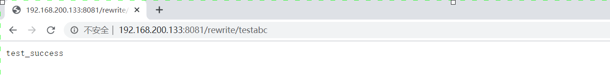
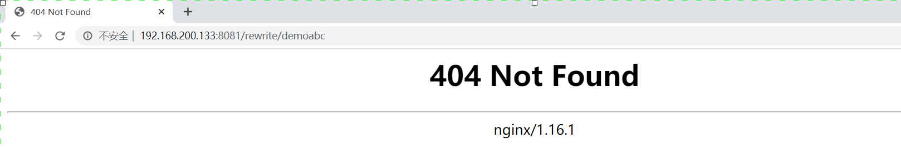
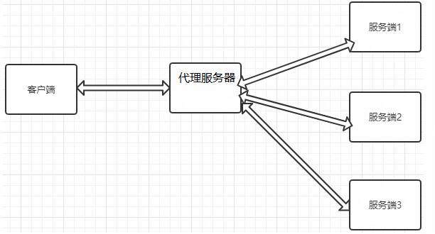
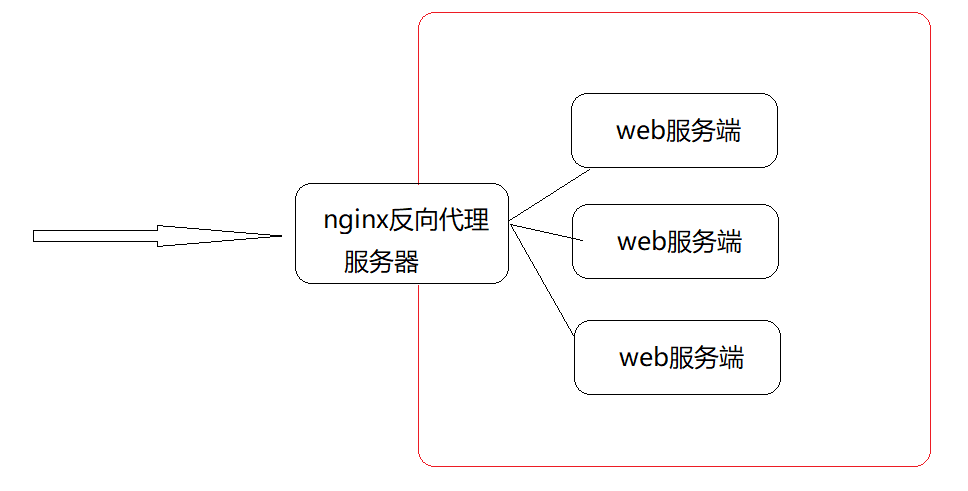

## Rewrite功能配置

Rewrite是Nginx服务器提供的一个重要基本功能，是Web服务器产品中几乎必备的功能。主要的作用是用来实现URL的重写。www.jd.com
注意:Nginx服务器的Rewrite功能的实现依赖于PCRE的支持，因此在编译安装Nginx服务器之前，需要安装PCRE库。Nginx使用的是ngx_http_rewrite_module模块来解析和处理Rewrite功能的相关配置。

Rewrite的相关命令

```
set指令
if指令
break指令
return指令
rewrite指令
rewrite_log指令
```

Rewrite的应用场景

```
域名跳转
域名镜像
独立域名
目录自动添加"/"
合并目录
防盗链的实现
```

### Rewrite的相关指令

#### set指令

该指令用来设置一个新的变量。

| 语法   | set $variable value; |
| ------ | -------------------- |
| 默认值 | —                    |
| 位置   | server、location、if |

variable:变量的名称，该变量名称要用"$"作为变量的第一个字符，且不要与Nginx服务器预设的全局变量同名。

value:变量的值，可以是字符串、其他变量或者变量的组合等。

#### Rewrite常用全局变量

| 变量               | 说明                                                         |
| ------------------ | ------------------------------------------------------------ |
| $args              | 变量中存放了请求URL中的请求参数。比如http://192.168.200.133/server?arg1=value1&args2=value2中的"arg1=value1&arg2=value2"，功能和$query_string一样 |
| $http_user_agent   | 变量存储的是用户访问服务的代理信息(如果通过浏览器访问，记录的是浏览器的相关版本信息) |
| $host              | 变量存储的是访问服务器的server_name值                        |
| $document_uri      | 变量存储的是当前访问地址的URI。比如http://192.168.200.133/server?id=10&name=zhangsan中的"/server"，功能和$uri一样 |
| $document_root     | 变量存储的是当前请求对应location的root值，如果未设置，默认指向Nginx自带html目录所在位置 |
| $content_length    | 变量存储的是请求头中的Content-Length的值                     |
| $content_type      | 变量存储的是请求头中的Content-Type的值                       |
| $http_cookie       | 变量存储的是客户端的cookie信息，可以通过add_header Set-Cookie 'cookieName=cookieValue'来添加cookie数据 |
| $limit_rate        | 变量中存储的是Nginx服务器对网络连接速率的限制，也就是Nginx配置中对limit_rate指令设置的值，默认是0，不限制。 |
| $remote_addr       | 变量中存储的是客户端的IP地址                                 |
| $remote_port       | 变量中存储了客户端与服务端建立连接的端口号                   |
| $remote_user       | 变量中存储了客户端的用户名，需要有认证模块才能获取           |
| $scheme            | 变量中存储了访问协议                                         |
| $server_addr       | 变量中存储了服务端的地址                                     |
| $server_name       | 变量中存储了客户端请求到达的服务器的名称                     |
| $server_port       | 变量中存储了客户端请求到达服务器的端口号                     |
| $server_protocol   | 变量中存储了客户端请求协议的版本，比如"HTTP/1.1"             |
| $request_body_file | 变量中存储了发给后端服务器的本地文件资源的名称               |
| $request_method    | 变量中存储了客户端的请求方式，比如"GET","POST"等             |
| $request_filename  | 变量中存储了当前请求的资源文件的路径名                       |
| $request_uri       | 变量中存储了当前请求的URI，并且携带请求参数，比如http://192.168.200.133/server?id=10&name=zhangsan中的"/server?id=10&name=zhangsan" |

上述参数还可以在日志文件中使用，这个就要用到前面我们介绍的`log_format`指令

```
log_format main '$remote_addr - $request - $status-$request_uri  $http_user_agent';

access_log logs/access.log main;
```

#### if指令

该指令用来支持条件判断，并根据条件判断结果选择不同的Nginx配置。

| 语法   | if  (condition){...} |
| ------ | -------------------- |
| 默认值 | —                    |
| 位置   | server、location     |

condition为判定条件，可以支持以下写法：

1. 变量名。如果变量名对应的值为空字符串或"0"，if都判断为false,其他条件为true。

```
if ($param){
	
}
```

2. 使用"="和"!="比较变量和字符串是否相等，满足条件为true，不满足为false

```
if ($request_method = POST){
	return 405;
}
```

注意：此处和Java不太一样的地方是字符串不需要添加引号,并且等号和不等号前后到需要加空格。

3. 使用正则表达式对变量进行匹配，匹配成功返回true，否则返回false。变量与正则表达式之间使用"~","~*","!~","!~\*"来连接。

   "~"代表匹配正则表达式过程中区分大小写，

   "~\*"代表匹配正则表达式过程中不区分大小写

   "!~"和"!~\*"刚好和上面取相反值，如果匹配上返回false,匹配不上返回true

```
if ($http_user_agent ~ MSIE){
	#$http_user_agent的值中是否包含MSIE字符串，如果包含返回true
}
```

注意：正则表达式字符串一般不需要加引号，但是如果字符串中包含"}"或者是";"等字符时，就需要把引号加上。

4. 判断请求的文件是否存在使用"-f"和"!-f",


```
if (-f $request_filename){
	#判断请求的文件是否存在
}
if (!-f $request_filename){
	#判断请求的文件是否不存在
}
```

5. 判断请求的目录是否存在使用"-d"和"!-d"

6. 判断请求的目录或者文件是否存在使用"-e"和"!-e"

7. 判断请求的文件是否可执行使用"-x"和"!-x"


#### break指令

该指令用于中断当前相同作用域中的其他Nginx配置。与该指令处于同一作用域的Nginx配置中，位于它前面的指令配置生效，位于后面的指令配置无效。并且break还有另外一个功能就是终止当前的匹配并把当前的URI在本location进行重定向访问处理。

| 语法   | break;               |
| ------ | -------------------- |
| 默认值 | —                    |
| 位置   | server、location、if |

例子:

```
location /testbreak{
	default_type text/plain;
	set $username TOM;
	if ($args){
		Set $username JERRY;
        break;
		set $username ROSE;
	}
	add_header username $username;
	return 200 $username;
}
```

#### return指令

该指令用于完成对请求的处理，直接向客户端返回。在return后的所有Nginx配置都是无效的。

| 语法   | return code [text];<br/>return code URL;<br/>return URL; |
| ------ | -------------------------------------------------------- |
| 默认值 | —                                                        |
| 位置   | server、location、if                                     |

code:为返回给客户端的HTTP状态代理。可以返回的状态代码为0~999的任意HTTP状态代理

text:为返回给客户端的响应体内容，支持变量的使用

URL:为返回给客户端的URL地址

```
location /testreturn {

	return 200 success;
}

location /testreturn {

	return https://www.baidu.com; // 302重定向到百度
}

location /testreturn {
	return 302 https://www.baidu.com;
}

location /testreturn {
	return 302 www.baidu.com;//不允许这么写
}
```

#### rewrite指令

该指令通过正则表达式的使用来改变URI。可以同时存在一个或者多个指令，按照顺序依次对URL进行匹配和处理。

| 语法   | rewrite regex replacement [flag]; |
| ------ | --------------------------------- |
| 默认值 | —                                 |
| 位置   | server、location、if              |

regex:用来匹配URI的正则表达式

replacement:匹配成功后，用于替换URI中被截取内容的字符串。如果该字符串是以"http://"或者"https://"开头的，则不会继续向下对URI进行其他处理，而是直接返回重写后的URI给客户端。

```
location rewrite {
	rewrite ^/rewrite/url\w*$ https://www.baidu.com;
	rewrite ^/rewrite/(test)\w*$ /$1;
	rewrite ^/rewrite/(demo)\w*$ /$1;
}
location /test{
	default_type text/plain;
	return 200 test_success;
}
location /demo{
	default_type text/plain;
	return 200 demo_success;
}
```

flag:用来设置rewrite对URI的处理行为，可选值有如下：

- last:终止继续在本location块中处理接收到的URI，并将此处重写的URI作为一个新的URI，使用各location块进行处理。该标志将重写后的URI重写在server块中执行，为重写后的URI提供了转入到其他location块的机会。

```
location rewrite {
	rewrite ^/rewrite/(test)\w*$ /$1 last;
	rewrite ^/rewrite/(demo)\w*$ /$1 last;
}
location /test{
	default_type text/plain;
	return 200 test_success;
}
location /demo{
	default_type text/plain;
	return 200 demo_success;
}
```

访问 `http://192.168.200.133:8081/rewrite/testabc`,能正确访问



- break：将此处重写的URI作为一个新的URI,在本块中继续进行处理。该标志将重写后的地址在当前的location块中执行，不会将新的URI转向其他的location块。

```
location rewrite {
    #/test   /usr/local/nginx/html/test/index.html
	rewrite ^/rewrite/(test)\w*$ /$1 break;
	rewrite ^/rewrite/(demo)\w*$ /$1 break;
}
location /test{
	default_type text/plain;
	return 200 test_success;
}
location /demo{
	default_type text/plain;
	return 200 demo_success;
}
```

访问 `http://192.168.200.133:8081/rewrite/demoabc`,页面报404错误



- redirect：将重写后的URI返回给客户端，状态码为302，指明是临时重定向URI,主要用在replacement变量不是以"http://"或者"https://"开头的情况。

```
location rewrite {
	rewrite ^/rewrite/(test)\w*$ /$1 redirect;
	rewrite ^/rewrite/(demo)\w*$ /$1 redirect;
}
location /test{
	default_type text/plain;
	return 200 test_success;
}
location /demo{
	default_type text/plain;
	return 200 demo_success;
}
```

访问`http://192.168.200.133:8081/rewrite/testabc`请求会被临时重定向，浏览器地址也会发生改变

- permanent：将重写后的URI返回给客户端，状态码为301，指明是永久重定向URI,主要用在replacement变量不是以"http://"或者"https://"开头的情况。

```
location rewrite {
	rewrite ^/rewrite/(test)\w*$ /$1 permanent;
	rewrite ^/rewrite/(demo)\w*$ /$1 permanent;
}
location /test{
	default_type text/plain;
	return 200 test_success;
}
location /demo{
	default_type text/plain;
	return 200 demo_success;
}
```

访问`http://192.168.200.133:8081/rewrite/testabc`请求会被永久重定向，浏览器地址也会发生改变

#### rewrite_log指令

该指令配置是否开启URL重写日志的输出功能。

| 语法   | rewrite_log on\|off;       |
| ------ | -------------------------- |
| 默认值 | rewrite_log off;           |
| 位置   | http、server、location、if |

开启后，URL重写的相关日志将以notice级别输出到error_log指令配置的日志文件汇总。

```
rewrite_log on;
error_log  logs/error.log notice;
```

### Rewrite的案例

#### 域名跳转

》问题分析

先来看一个效果，如果我们想访问京东网站，大家都知道我们可以输入`www.jd.com`,但是同样的我们也可以输入`www.360buy.com`同样也都能访问到京东网站。这个其实是因为京东刚开始的时候域名就是www.360buy.com，后面由于各种原因把自己的域名换成了www.jd.com, 虽然说域名变量，但是对于以前只记住了www.360buy.com的用户来说，我们如何把这部分用户也迁移到我们新域名的访问上来，针对于这个问题，我们就可以使用Nginx中Rewrite的域名跳转来解决。

》环境准备

- 准备三个域名：

```
vim /etc/hosts
```

```
127.0.0.1   www.itcast.cn
127.0.0.1   www.itheima.cn
127.0.0.1   www.itheima.com
```

- 通过Nginx实现访问www.itcast.cn

```
server {
	listen 80;
	server_name www.itcast.cn;
	location /{
		default_type text/html;
		return 200 '<h1>welcome to itcast</h1>';
	}
}
```

》通过Rewrite完成将www.ithema.com和www.itheima.cn的请求跳转到www.itcast.com

```
server {
	listen 80;
	server_name www.itheima.com www.itheima.cn;
	rewrite ^/ http://www.itcast.cn;
}
```

问题描述:如何在域名跳转的过程中携带请求的URI？

修改配置信息

```
server {
	listen 80;
	server_name www.itheima.com www.itheima.cn;
	rewrite ^(.*) http://www.itcast.cn$1；
}
```

#### 域名镜像

镜像网站指定是将一个完全相同的网站分别放置到几台服务器上，并分别使用独立的URL进行访问。其中一台服务器上的网站叫主站，其他的为镜像网站。镜像网站和主站没有太大的区别，可以把镜像网站理解为主站的一个备份节点。可以通过镜像网站提供网站在不同地区的响应速度。镜像网站可以平衡网站的流量负载、可以解决网络宽带限制、封锁等。


而我们所说的域名镜像和网站镜像比较类似，上述案例中，将www.itheima.com和 www.itheima.cn都能跳转到www.itcast.cn，那么www.itcast.cn我们就可以把它起名叫主域名，其他两个就是我们所说的镜像域名，当然如果我们不想把整个网站做镜像，只想为其中某一个子目录下的资源做镜像，我们可以在location块中配置rewrite功能，比如:

```
server {
    listen          80;
    server_name     www.itheima.cn www.itheima.com;
    location /user {
    	rewrite ^/user(.*)$ http://www.itcast.cn$1;
    }
    location /emp{
        default_type text/html;
        return 200 '<h1>emp_success</h1>';
    }
}

```

#### 独立域名

一个完整的项目包含多个模块，比如购物网站有商品搜索模块、商品详情模块和购物车模块等，那么我们如何为每一个模块设置独立的域名。

需求：

```
http://search.itcast.com:81  访问商品搜索模块
http://item.itcast.com:82	  访问商品详情模块
http://cart.itcast.com:83	  访问商品购物车模块
```

```
server{
	listen 81;
	server_name search.itcast.com;
	rewrite ^(.*) http://www.itcast.cn/search$1;
}
server{
	listen 82;
	server_name item.itcast.com;
	rewrite ^(.*) http://www.itcast.cn/item$1;
}
server{
	listen 83;
	server_name cart.itcast.com;
	rewrite ^(.*) http://www.itcast.cn/cart$1;
}
```

#### 目录自动添加"/"

问题描述

通过一个例子来演示下问题:

```
server {
	listen	8082;
	server_name localhost;
	location /heima {
		root html;
		index index.html;
	}
}

```

通过`http://192.168.200.133:8082/heima`和通过`http://192.168.200.133:8082/heima/`访问的区别？

如果不加斜杠，Nginx服务器内部会自动做一个301的重定向，重定向的地址会有一个指令叫server_name_in_redirect on|off;来决定重定向的地址：

```
如果该指令为on
	重定向的地址为:  http://server_name:8082/目录名/;
	http://localhost:8082/heima/
如果该指令为off
	重定向的地址为:  http://原URL中的域名:8082/目录名/;
	http://192.168.200.133:8082/heima/
```

所以就拿刚才的地址来说，http://192.168.200.133:8082/heima如果不加斜杠，那么按照上述规则，如果指令server_name_in_redirect为on，则301重定向地址变为 http://localhost:8082/heima/,如果为off，则301重定向地址变为http://192.168.200.133:8082/heima/。后面这个是正常的，前面地址就有问题。

注意server_name_in_redirect指令在Nginx的0.8.48版本之前默认都是on，之后改成了off,所以现在我们这个版本不需要考虑这个问题，但是如果是0.8.48以前的版本并且server_name_in_redirect设置为on，我们如何通过rewrite来解决这个问题？

解决方案

我们可以使用rewrite功能为末尾没有斜杠的URL自动添加一个斜杠

```
server {
	listen	80;
	server_name localhost;
	server_name_in_redirect on;
	location /heima {
		if (-d $request_filename){
			rewrite ^/(.*)([^/])$ http://$host/$1$2/ permanent;
		}
	}
}
```

#### 合并目录

搜索引擎优化(SEO)是一种利用搜索引擎的搜索规则来提高目的网站在有关搜索引擎内排名的方式。我们在创建自己的站点时，可以通过很多中方式来有效的提供搜索引擎优化的程度。其中有一项就包含URL的目录层级一般不要超过三层，否则的话不利于搜索引擎的搜索也给客户端的输入带来了负担，但是将所有的文件放在一个目录下又会导致文件资源管理混乱并且访问文件的速度也会随着文件增多而慢下来，这两个问题是相互矛盾的，那么使用rewrite如何解决上述问题?

举例，网站中有一个资源文件的访问路径时 /server/11/22/33/44/20.html,也就是说20.html存在于第5级目录下，如果想要访问该资源文件，客户端的URL地址就要写成 `http://192.168.200.133/server/11/22/33/44/20.html`,

```
server {
	listen 8083;
	server_name localhost;
	location /server{
		root html;
	}
}
```

但是这个是非常不利于SEO搜索引擎优化的，同时客户端也不好记.使用rewrite我们可以进行如下配置:

```
server {
	listen 8083;
	server_name localhost;
	location /server{
		rewrite ^/server-([0-9]+)-([0-9]+)-([0-9]+)-([0-9]+)\.html$ /server/$1/$2/$3/$4/$5.html last;
	}
}
```

这样的花，客户端只需要输入http://www.web.name/server-11-22-33-44-20.html就可以访问到20.html页面了。这里也充分利用了rewrite指令支持正则表达式的特性。

#### 防盗链

防盗链之前我们已经介绍过了相关的知识，在rewrite中的防盗链和之前将的原理其实都是一样的，只不过通过rewrite可以将防盗链的功能进行完善下，当出现防盗链的情况，我们可以使用rewrite将请求转发到自定义的一张图片和页面，给用户比较好的提示信息。下面我们就通过根据文件类型实现防盗链的一个配置实例:

```
location /images {
    root html;
    valid_referers none blocked www.baidu.com;
    if ($invalid_referer){
        #return 403;
        rewrite ^/    /images/forbidden.png break;
    }
}

```

## Nginx反向代理

### Nginx反向代理概述

关于正向代理和反向代理，我们在前面的章节已经通过一张图给大家详细的介绍过了，简而言之就是正向代理代理的对象是客户端，反向代理代理的是服务端，这是两者之间最大的区别。

Nginx即可以实现正向代理，也可以实现反向代理。

我们先来通过一个小案例演示下Nginx正向代理的简单应用。

先提需求：


(1)服务端的设置：

```
http {
  log_format main 'client send request=>clientIp=$remote_addr serverIp=>$host';
	server{
		listen 80;
		server_name	localhost;
		access_log logs/access.log main;
		location {
			root html;
			index index.html index.htm;
		}
	}
}
```

(2)使用客户端访问服务端，打开日志查看结果


(3)代理服务器设置：

```
server {

        listen  82;
        resolver 8.8.8.8;
        location /{
                proxy_pass http://$host$request_uri;
        }
    }

```

(4)查看代理服务器的IP(192.168.200.146)和Nginx配置监听的端口(82)

(5)在客户端配置代理服务器


(6)设置完成后，再次通过浏览器访问服务端


通过对比，上下两次的日志记录，会发现虽然我们是客户端访问服务端，但是如何使用了代理，那么服务端能看到的只是代理发送过去的请求，这样的化，就使用Nginx实现了正向代理的设置。

但是Nginx正向代理，在实际的应用中不是特别多，所以我们简单了解下，接下来我们继续学习Nginx的反向代理，这是Nginx比较重要的一个功能。

### Nginx反向代理的配置语法

Nginx反向代理模块的指令是由`ngx_http_proxy_module`模块进行解析，该模块在安装Nginx的时候已经自己加装到Nginx中了，接下来我们把反向代理中的常用指令一一介绍下：

```
proxy_pass
proxy_set_header
proxy_redirect
```

#### proxy_pass

该指令用来设置被代理服务器地址，可以是主机名称、IP地址加端口号形式。

| 语法   | proxy_pass URL; |
| ------ | --------------- |
| 默认值 | —               |
| 位置   | location        |

URL:为要设置的被代理服务器地址，包含传输协议(`http`,`https://`)、主机名称或IP地址加端口号、URI等要素。

举例：

```
proxy_pass http://www.baidu.com;
location /server{}
proxy_pass http://192.168.200.146;
    http://192.168.200.146/server/index.html
proxy_pass http://192.168.200.146/;
    http://192.168.200.146/index.html
```

大家在编写proxy_pass的时候，后面的值要不要加"/"?

接下来通过例子来说明刚才我们提到的问题：

```
server {
	listen 80;
	server_name localhost;
	location /{
		#proxy_pass http://192.168.200.146;
		proxy_pass http://192.168.200.146/;
	}
}
当客户端访问 http://localhost/index.html,效果是一样的
server{
	listen 80;
	server_name localhost;
	location /server{
		#proxy_pass http://192.168.200.146;
		proxy_pass http://192.168.200.146/;
	}
}
当客户端访问 http://localhost/server/index.html
这个时候，第一个proxy_pass就变成了http://localhost/server/index.html
第二个proxy_pass就变成了http://localhost/index.html效果就不一样了。
```

#### proxy_set_header

该指令可以更改Nginx服务器接收到的客户端请求的请求头信息，然后将新的请求头发送给代理的服务器

| 语法   | proxy_set_header field value;                                |
| ------ | ------------------------------------------------------------ |
| 默认值 | proxy_set_header Host $proxy_host;<br/>proxy_set_header Connection close; |
| 位置   | http、server、location                                       |

需要注意的是，如果想要看到结果，必须在被代理的服务器上来获取添加的头信息。

被代理服务器： [192.168.200.146]

```
server {
        listen  8080;
        server_name localhost;
        default_type text/plain;
        return 200 $http_username;
}
```

代理服务器: [192.168.200.133]

```
server {
        listen  8080;
        server_name localhost;
        location /server {
                proxy_pass http://192.168.200.146:8080/;
                proxy_set_header username TOM;
        }
    }

```

访问测试

#### proxy_redirect

该指令是用来重置头信息中的"Location"和"Refresh"的值。

| 语法   | proxy_redirect redirect replacement;<br/>proxy_redirect default;<br/>proxy_redirect off; |
| ------ | ------------------------------------------------------------ |
| 默认值 | proxy_redirect default;                                      |
| 位置   | http、server、location                                       |

》为什么要用该指令?

服务端[192.168.200.146]

```
server {
    listen  8081;
    server_name localhost;
    if (!-f $request_filename){
    	return 302 http://192.168.200.146;
    }
}

```

代理服务端[192.168.200.133]

```
server {
	listen  8081;
	server_name localhost;
	location / {
		proxy_pass http://192.168.200.146:8081/;
		proxy_redirect http://192.168.200.146 http://192.168.200.133;
	}
}
```

》该指令的几组选项

proxy_redirect redirect replacement;

```
redirect:目标,Location的值
replacement:要替换的值
```

proxy_redirect default;

```
default;
将location块的uri变量作为replacement,
将proxy_pass变量作为redirect进行替换
```

proxy_redirect off;

```
关闭proxy_redirect的功能
```

### Nginx反向代理实战



服务器1,2,3存在两种情况

```
第一种情况: 三台服务器的内容不一样。
第二种情况: 三台服务器的内容是一样。
```


1. 如果服务器1、服务器2和服务器3的内容不一样，那我们可以根据用户请求来分发到不同的服务器。

```
代理服务器
server {
        listen          8082;
        server_name     localhost;
        location /server1 {
                proxy_pass http://192.168.200.146:9001/;
        }
        location /server2 {
                proxy_pass http://192.168.200.146:9002/;
        }
        location /server3 {
                proxy_pass http://192.168.200.146:9003/;
        }
}

服务端
server1
server {
        listen          9001;
        server_name     localhost;
        default_type text/html;
        return 200 '<h1>192.168.200.146:9001</h1>'
}
server2
server {
        listen          9002;
        server_name     localhost;
        default_type text/html;
        return 200 '<h1>192.168.200.146:9002</h1>'
}
server3
server {
        listen          9003;
        server_name     localhost;
        default_type text/html;
        return 200 '<h1>192.168.200.146:9003</h1>'
}
```

2. 如果服务器1、服务器2和服务器3的内容是一样的，该如何处理?

### Nginx的安全控制

关于web服务器的安全是比较大的一个话题，里面所涉及的内容很多，Nginx反向代理是如何来提升web服务器的安全呢？

```
安全隔离
```

什么是安全隔离?

通过代理分开了客户端到应用程序服务器端的连接，实现了安全措施。在反向代理之前设置防火墙，仅留一个入口供代理服务器访问。



#### 如何使用SSL对流量进行加密

翻译成大家能熟悉的说法就是将我们常用的http请求转变成https请求，那么这两个之间的区别简单的来说两个都是HTTP协议，只不过https是身披SSL外壳的http.

HTTPS是一种通过计算机网络进行安全通信的传输协议。它经由HTTP进行通信，利用SSL/TLS建立全通信，加密数据包，确保数据的安全性。

SSL(Secure Sockets Layer)安全套接层

TLS(Transport Layer Security)传输层安全

上述这两个是为网络通信提供安全及数据完整性的一种安全协议，TLS和SSL在传输层和应用层对网络连接进行加密。

总结来说为什么要使用https:

```
http协议是明文传输数据，存在安全问题，而https是加密传输，相当于http+ssl，并且可以防止流量劫持。
```

Nginx要想使用SSL，需要满足一个条件即需要添加一个模块`--with-http_ssl_module`,而该模块在编译的过程中又需要OpenSSL的支持，这个我们之前已经准备好了。


##### nginx添加SSL的支持

（1）完成 `--with-http_ssl_module`模块的增量添加

```
》将原有/usr/local/nginx/sbin/nginx进行备份
》拷贝nginx之前的配置信息
》在nginx的安装源码进行配置指定对应模块  ./configure --with-http_ssl_module
》通过make模板进行编译
》将objs下面的nginx移动到/usr/local/nginx/sbin下
》在源码目录下执行  make upgrade进行升级，这个可以实现不停机添加新模块的功能
```

##### Nginx的SSL相关指令

因为刚才我们介绍过该模块的指令都是通过ngx_http_ssl_module模块来解析的。

》ssl:该指令用来在指定的服务器开启HTTPS,可以使用 listen 443 ssl,后面这种方式更通用些。

| 语法   | ssl on \| off; |
| ------ | -------------- |
| 默认值 | ssl off;       |
| 位置   | http、server   |

```
server{
	listen 443 ssl;
}
```

》ssl_certificate:为当前这个虚拟主机指定一个带有PEM格式证书的证书。

| 语法   | ssl_certificate file; |
| ------ | --------------------- |
| 默认值 | —                     |
| 位置   | http、server          |

》ssl_certificate_key:该指令用来指定PEM secret key文件的路径

| 语法   | ssl_ceritificate_key file; |
| ------ | -------------------------- |
| 默认值 | —                          |
| 位置   | http、server               |

》ssl_session_cache:该指令用来配置用于SSL会话的缓存

| 语法   | ssl_sesion_cache off\|none\|[builtin[:size]] [shared:name:size] |
| ------ | ------------------------------------------------------------ |
| 默认值 | ssl_session_cache none;                                      |
| 位置   | http、server                                                 |

off:禁用会话缓存，客户端不得重复使用会话

none:禁止使用会话缓存，客户端可以重复使用，但是并没有在缓存中存储会话参数

builtin:内置OpenSSL缓存，仅在一个工作进程中使用。

shared:所有工作进程之间共享缓存，缓存的相关信息用name和size来指定

》ssl_session_timeout：开启SSL会话功能后，设置客户端能够反复使用储存在缓存中的会话参数时间。

| 语法   | ssl_session_timeout time; |
| ------ | ------------------------- |
| 默认值 | ssl_session_timeout 5m;   |
| 位置   | http、server              |

》ssl_ciphers:指出允许的密码，密码指定为OpenSSL支持的格式

| 语法   | ssl_ciphers ciphers;          |
| ------ | ----------------------------- |
| 默认值 | ssl_ciphers HIGH:!aNULL:!MD5; |
| 位置   | http、server                  |

可以使用`openssl ciphers`查看openssl支持的格式。

》ssl_prefer_server_ciphers：该指令指定是否服务器密码优先客户端密码

| 语法   | ssl_perfer_server_ciphers on\|off; |
| ------ | ---------------------------------- |
| 默认值 | ssl_perfer_server_ciphers off;     |
| 位置   | http、server                       |

##### 生成证书

方式一：使用阿里云/腾讯云等第三方服务进行购买。

方式二:使用openssl生成证书

先要确认当前系统是否有安装openssl

```
openssl version
```

安装下面的命令进行生成

```
mkdir /root/cert
cd /root/cert
openssl genrsa -des3 -out server.key 1024
openssl req -new -key server.key -out server.csr
cp server.key server.key.org
openssl rsa -in server.key.org -out server.key
openssl x509 -req -days 365 -in server.csr -signkey server.key -out server.crt
```

##### 开启SSL实例

```
server {
    listen       443 ssl;
    server_name  localhost;

    ssl_certificate      server.cert;
    ssl_certificate_key  server.key;

    ssl_session_cache    shared:SSL:1m;
    ssl_session_timeout  5m;

    ssl_ciphers  HIGH:!aNULL:!MD5;
    ssl_prefer_server_ciphers  on;

    location / {
        root   html;
        index  index.html index.htm;
    }
}
```

（4）验证

### 反向代理系统调优

反向代理值Buffer和Cache

Buffer翻译过来是"缓冲"，Cache翻译过来是"缓存"。


总结下：

```
相同点:
两种方式都是用来提供IO吞吐效率，都是用来提升Nginx代理的性能。
不同点:
缓冲主要用来解决不同设备之间数据传递速度不一致导致的性能低的问题，缓冲中的数据一旦此次操作完成后，就可以删除。
缓存主要是备份，将被代理服务器的数据缓存一份到代理服务器，这样的话，客户端再次获取相同数据的时候，就只需要从代理服务器上获取，效率较高，缓存中的数据可以重复使用，只有满足特定条件才会删除.
```

（1）Proxy Buffer相关指令

》proxy_buffering :该指令用来开启或者关闭代理服务器的缓冲区；

| 语法   | proxy_buffering on\|off; |
| ------ | ------------------------ |
| 默认值 | proxy_buffering on;      |
| 位置   | http、server、location   |

》proxy_buffers:该指令用来指定单个连接从代理服务器读取响应的缓存区的个数和大小。

| 语法   | proxy_buffers number size;                |
| ------ | ----------------------------------------- |
| 默认值 | proxy_buffers 8 4k \| 8K;(与系统平台有关) |
| 位置   | http、server、location                    |

number:缓冲区的个数

size:每个缓冲区的大小，缓冲区的总大小就是number*size

》proxy_buffer_size:该指令用来设置从被代理服务器获取的第一部分响应数据的大小。保持与proxy_buffers中的size一致即可，当然也可以更小。

| 语法   | proxy_buffer_size size;                     |
| ------ | ------------------------------------------- |
| 默认值 | proxy_buffer_size 4k \| 8k;(与系统平台有关) |
| 位置   | http、server、location                      |

》proxy_busy_buffers_size：该指令用来限制同时处于BUSY状态的缓冲总大小。

| 语法   | proxy_busy_buffers_size size;    |
| ------ | -------------------------------- |
| 默认值 | proxy_busy_buffers_size 8k\|16K; |
| 位置   | http、server、location           |

》proxy_temp_path:当缓冲区存满后，仍未被Nginx服务器完全接受，响应数据就会被临时存放在磁盘文件上，该指令设置文件路径

| 语法   | proxy_temp_path  path;      |
| ------ | --------------------------- |
| 默认值 | proxy_temp_path proxy_temp; |
| 位置   | http、server、location      |

注意path最多设置三层。  

》proxy_temp_file_write_size：该指令用来设置磁盘上缓冲文件的大小。

| 语法   | proxy_temp_file_write_size size;    |
| ------ | ----------------------------------- |
| 默认值 | proxy_temp_file_write_size 8K\|16K; |
| 位置   | http、server、location              |

通用网站的配置

```
proxy_buffering on;
proxy_buffer_size 4 32k;
proxy_busy_buffers_size 64k;
proxy_temp_file_write_size 64k;
```

根据项目的具体内容进行相应的调节。