# Nginx负载均衡

## 负载均衡概述

早期的网站流量和业务功能都比较简单，单台服务器足以满足基本的需求，但是随着互联网的发展，业务流量越来越大并且业务逻辑也跟着越来越复杂，单台服务器的性能及单点故障问题就凸显出来了，因此需要多台服务器进行性能的水平扩展及避免单点故障出现。那么如何将不同用户的请求流量分发到不同的服务器上呢？


## 负载均衡的原理及处理流程

系统的扩展可以分为纵向扩展和横向扩展。

纵向扩展是从单机的角度出发，通过增加系统的硬件处理能力来提升服务器的处理能力

横向扩展是通过添加机器来满足大型网站服务的处理能力。

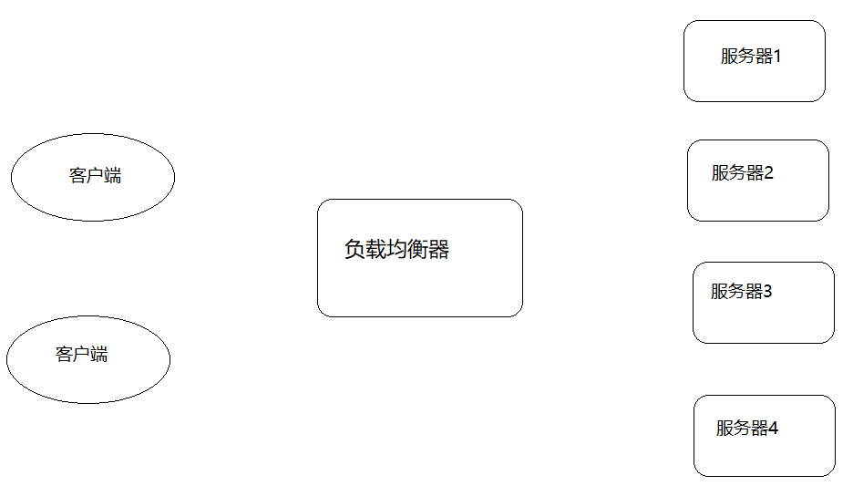

这里面涉及到两个重要的角色分别是"应用集群"和"负载均衡器"。

应用集群：将同一应用部署到多台机器上，组成处理集群，接收负载均衡设备分发的请求，进行处理并返回响应的数据。

负载均衡器:将用户访问的请求根据对应的负载均衡算法，分发到集群中的一台服务器进行处理。

### 负载均衡的作用

1、解决服务器的高并发压力，提高应用程序的处理性能。

2、提供故障转移，实现高可用。

3、通过添加或减少服务器数量，增强网站的可扩展性。

4、在负载均衡器上进行过滤，可以提高系统的安全性。


## 负载均衡常用的处理方式

#### 方式一:用户手动选择

这种方式比较原始，只要实现的方式就是在网站主页上面提供不同线路、不同服务器链接方式，让用户来选择自己访问的具体服务器，来实现负载均衡。


#### 方式二:DNS轮询方式

DNS

```
域名系统（服务）协议（DNS）是一种分布式网络目录服务，主要用于域名与 IP 地址的相互转换。
```

大多域名注册商都支持对同一个主机名添加多条A记录，这就是DNS轮询，DNS服务器将解析请求按照A记录的顺序，随机分配到不同的IP上，这样就能完成简单的负载均衡。DNS轮询的成本非常低，在一些不重要的服务器，被经常使用。

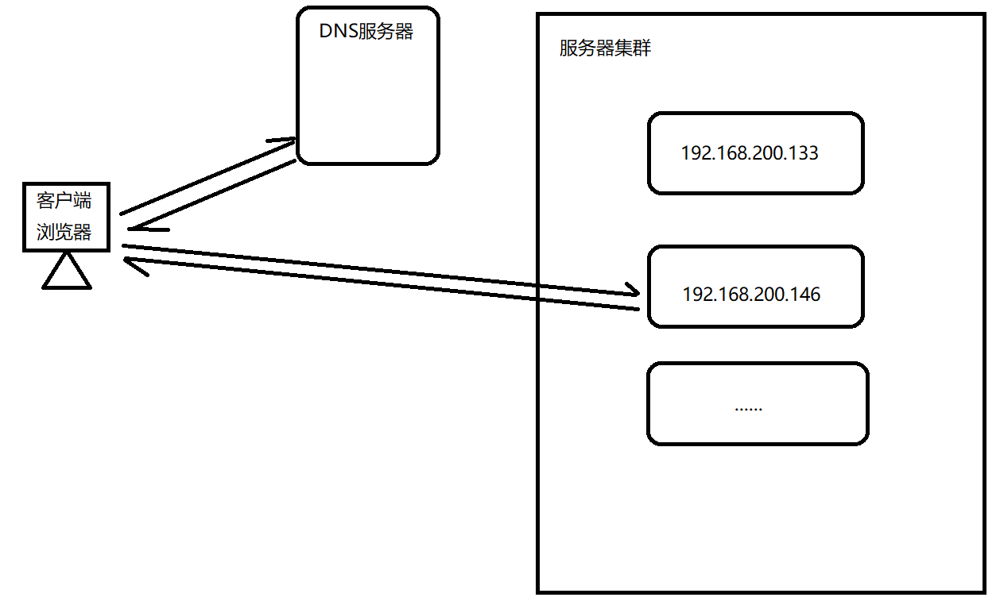


如下是我们为某一个域名添加的IP地址，用2台服务器来做负载均衡。

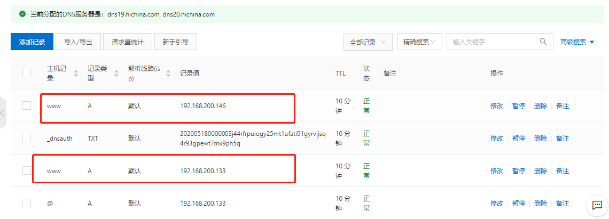


验证:

```
ping www.nginx521.cn
```

清空本地的dns缓存

```
ipconfig/flushdns
```

我们发现使用DNS来实现轮询，不需要投入过多的成本，虽然DNS轮询成本低廉，但是DNS负载均衡存在明显的缺点。

1.可靠性低

假设一个域名DNS轮询多台服务器，如果其中的一台服务器发生故障，那么所有的访问该服务器的请求将不会有所回应，即使你将该服务器的IP从DNS中去掉，但是由于各大宽带接入商将众多的DNS存放在缓存中，以节省访问时间，导致DNS不会实时更新。所以DNS轮流上一定程度上解决了负载均衡问题，但是却存在可靠性不高的缺点。

2.负载均衡不均衡

DNS负载均衡采用的是简单的轮询负载算法，不能区分服务器的差异，不能反映服务器的当前运行状态，不能做到为性能好的服务器多分配请求，另外本地计算机也会缓存已经解析的域名到IP地址的映射，这也会导致使用该DNS服务器的用户在一定时间内访问的是同一台Web服务器，从而引发Web服务器减的负载不均衡。

负载不均衡则会导致某几台服务器负荷很低，而另外几台服务器负荷确很高，处理请求的速度慢，配置高的服务器分配到的请求少，而配置低的服务器分配到的请求多。

#### 方式三:四/七层负载均衡

介绍四/七层负载均衡之前，我们先了解一个概念，OSI(open system interconnection),叫开放式系统互联模型，这个是由国际标准化组织ISO指定的一个不基于具体机型、操作系统或公司的网络体系结构。该模型将网络通信的工作分为七层。

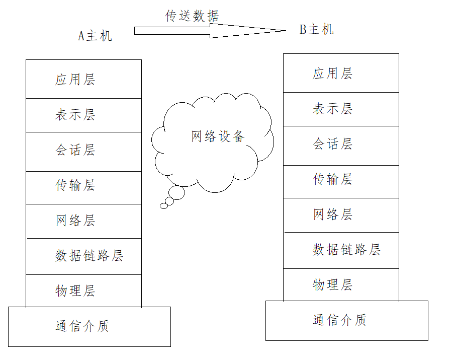

应用层：为应用程序提供网络服务。

表示层：对数据进行格式化、编码、加密、压缩等操作。

会话层：建立、维护、管理会话连接。

传输层：建立、维护、管理端到端的连接，常见的有TCP/UDP。

网络层：IP寻址和路由选择

数据链路层：控制网络层与物理层之间的通信。

物理层：比特流传输。

所谓四层负载均衡指的是OSI七层模型中的传输层，主要是基于IP+PORT的负载均衡

```
实现四层负载均衡的方式：
硬件：F5 BIG-IP、Radware等
软件：LVS、Nginx、Hayproxy等
```

所谓的七层负载均衡指的是在应用层，主要是基于虚拟的URL或主机IP的负载均衡

```
实现七层负载均衡的方式：
软件：Nginx、Hayproxy等
```

四层和七层负载均衡的区别

```
四层负载均衡数据包是在底层就进行了分发，而七层负载均衡数据包则在最顶端进行分发，所以四层负载均衡的效率比七层负载均衡的要高。
四层负载均衡不识别域名，而七层负载均衡识别域名。
```

处理四层和七层负载以为其实还有二层、三层负载均衡，二层是在数据链路层基于mac地址来实现负载均衡，三层是在网络层一般采用虚拟IP地址的方式实现负载均衡。

实际环境采用的模式

```
四层负载(LVS)+七层负载(Nginx)
```

### Nginx七层负载均衡

Nginx要实现七层负载均衡需要用到proxy_pass代理模块配置。Nginx默认安装支持这个模块，我们不需要再做任何处理。Nginx的负载均衡是在Nginx的反向代理基础上把用户的请求根据指定的算法分发到一组【upstream虚拟服务池】。

#### Nginx七层负载均衡的指令

##### upstream指令

该指令是用来定义一组服务器，它们可以是监听不同端口的服务器，并且也可以是同时监听TCP和Unix socket的服务器。服务器可以指定不同的权重，默认为1。

| 语法   | upstream name {...} |
| ------ | ------------------- |
| 默认值 | —                   |
| 位置   | http                |

##### server指令

该指令用来指定后端服务器的名称和一些参数，可以使用域名、IP、端口或者unix socket

| 语法   | server name [paramerters] |
| ------ | ------------------------- |
| 默认值 | —                         |
| 位置   | upstream                  |

#### Nginx七层负载均衡的实现流程

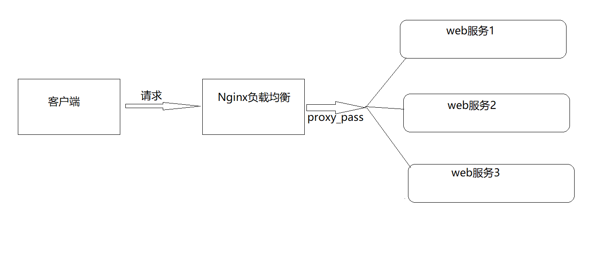

服务端设置

```
server {
    listen   9001;
    server_name localhost;
    default_type text/html;
    location /{
    	return 200 '<h1>192.168.200.146:9001</h1>';
    }
}
server {
    listen   9002;
    server_name localhost;
    default_type text/html;
    location /{
    	return 200 '<h1>192.168.200.146:9002</h1>';
    }
}
server {
    listen   9003;
    server_name localhost;
    default_type text/html;
    location /{
    	return 200 '<h1>192.168.200.146:9003</h1>';
    }
}
```

负载均衡器设置

```
upstream backend{
	server 192.168.200.146:9091;
	server 192.168.200.146:9092;
	server 192.168.200.146:9093;
}
server {
	listen 8083;
	server_name localhost;
	location /{
		proxy_pass http://backend;
	}
}
```

#### 负载均衡状态

代理服务器在负责均衡调度中的状态有以下几个：

| 状态         | 概述                              |
| ------------ | --------------------------------- |
| down         | 当前的server暂时不参与负载均衡    |
| backup       | 预留的备份服务器                  |
| max_fails    | 允许请求失败的次数                |
| fail_timeout | 经过max_fails失败后, 服务暂停时间 |
| max_conns    | 限制最大的接收连接数              |

##### down

down:将该服务器标记为永久不可用，那么该代理服务器将不参与负载均衡。

```
upstream backend{
	server 192.168.200.146:9001 down;
	server 192.168.200.146:9002
	server 192.168.200.146:9003;
}
server {
	listen 8083;
	server_name localhost;
	location /{
		proxy_pass http://backend;
	}
}
```

该状态一般会对需要停机维护的服务器进行设置。


##### backup

backup:将该服务器标记为备份服务器，当主服务器不可用时，将用来传递请求。

```
upstream backend{
	server 192.168.200.146:9001 down;
	server 192.168.200.146:9002 backup;
	server 192.168.200.146:9003;
}
server {
	listen 8083;
	server_name localhost;
	location /{
		proxy_pass http://backend;
	}
}
```

此时需要将9094端口的访问禁止掉来模拟下唯一能对外提供访问的服务宕机以后，backup的备份服务器就要开始对外提供服务，此时为了测试验证，我们需要使用防火墙来进行拦截。

介绍一个工具`firewall-cmd`,该工具是Linux提供的专门用来操作firewall的。

查询防火墙中指定的端口是否开放

```
firewall-cmd --query-port=9001/tcp
```

如何开放一个指定的端口

```
firewall-cmd --permanent --add-port=9002/tcp
```

批量添加开发端口

```
firewall-cmd --permanent --add-port=9001-9003/tcp
```

如何移除一个指定的端口

```
firewall-cmd --permanent --remove-port=9003/tcp
```

重新加载

```
firewall-cmd --reload
```

其中

​	 --permanent表示设置为持久

​	 --add-port表示添加指定端口

​	 --remove-port表示移除指定端口

##### max_conns

max_conns=number:用来设置代理服务器同时活动链接的最大数量，默认为0，表示不限制，使用该配置可以根据后端服务器处理请求的并发量来进行设置，防止后端服务器被压垮。

##### max_fails和fail_timeout

max_fails=number:设置允许请求代理服务器失败的次数，默认为1。

fail_timeout=time:设置经过max_fails失败后，服务暂停的时间，默认是10秒。

```
upstream backend{
	server 192.168.200.133:9001 down;
	server 192.168.200.133:9002 backup;
	server 192.168.200.133:9003 max_fails=3 fail_timeout=15;
}
server {
	listen 8083;
	server_name localhost;
	location /{
		proxy_pass http://backend;
	}
}
```


#### 负载均衡策略

介绍完Nginx负载均衡的相关指令后，我们已经能实现将用户的请求分发到不同的服务器上，那么除了采用默认的分配方式以外，我们还能采用什么样的负载算法?

Nginx的upstream支持如下六种方式的分配算法，分别是:

| 算法名称   | 说明             |
| ---------- | ---------------- |
| 轮询       | 默认方式         |
| weight     | 权重方式         |
| ip_hash    | 依据ip分配方式   |
| least_conn | 依据最少连接方式 |
| url_hash   | 依据URL分配方式  |
| fair       | 依据响应时间方式 |

##### 轮询

是upstream模块负载均衡默认的策略。每个请求会按时间顺序逐个分配到不同的后端服务器。轮询不需要额外的配置。

```
upstream backend{
	server 192.168.200.146:9001 weight=1;
	server 192.168.200.146:9002;
	server 192.168.200.146:9003;
}
server {
	listen 8083;
	server_name localhost;
	location /{
		proxy_pass http://backend;
	}
}
```


##### weight加权[加权轮询]

weight=number:用来设置服务器的权重，默认为1，权重数据越大，被分配到请求的几率越大；该权重值，主要是针对实际工作环境中不同的后端服务器硬件配置进行调整的，所有此策略比较适合服务器的硬件配置差别比较大的情况。

```
upstream backend{
	server 192.168.200.146:9001 weight=10;
	server 192.168.200.146:9002 weight=5;
	server 192.168.200.146:9003 weight=3;
}
server {
	listen 8083;
	server_name localhost;
	location /{
		proxy_pass http://backend;
	}
}
```

##### ip_hash

当对后端的多台动态应用服务器做负载均衡时，ip_hash指令能够将某个客户端IP的请求通过哈希算法定位到同一台后端服务器上。这样，当来自某一个IP的用户在后端Web服务器A上登录后，在访问该站点的其他URL，能保证其访问的还是后端web服务器A。

| 语法   | ip_hash; |
| ------ | -------- |
| 默认值 | —        |
| 位置   | upstream |

```
upstream backend{
	ip_hash;
	server 192.168.200.146:9001;
	server 192.168.200.146:9002;
	server 192.168.200.146:9003;
}
server {
	listen 8083;
	server_name localhost;
	location /{
		proxy_pass http://backend;
	}
}
```

需要额外多说一点的是使用ip_hash指令无法保证后端服务器的负载均衡，可能导致有些后端服务器接收到的请求多，有些后端服务器接收的请求少，而且设置后端服务器权重等方法将不起作用。

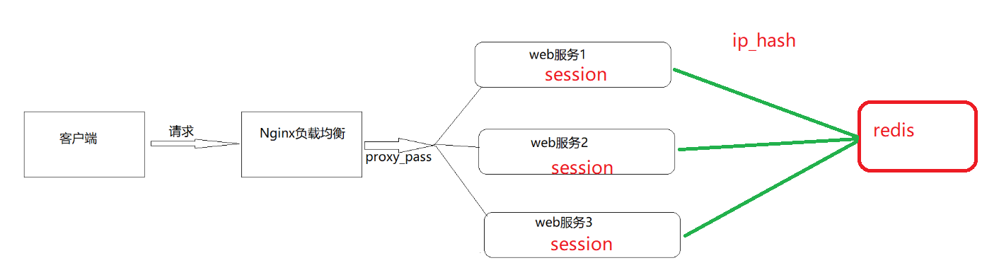

##### least_conn

最少连接，把请求转发给连接数较少的后端服务器。轮询算法是把请求平均的转发给各个后端，使它们的负载大致相同；但是，有些请求占用的时间很长，会导致其所在的后端负载较高。这种情况下，least_conn这种方式就可以达到更好的负载均衡效果。

```
upstream backend{
	least_conn;
	server 192.168.200.146:9001;
	server 192.168.200.146:9002;
	server 192.168.200.146:9003;
}
server {
	listen 8083;
	server_name localhost;
	location /{
		proxy_pass http://backend;
	}
}
```

此负载均衡策略适合请求处理时间长短不一造成服务器过载的情况。

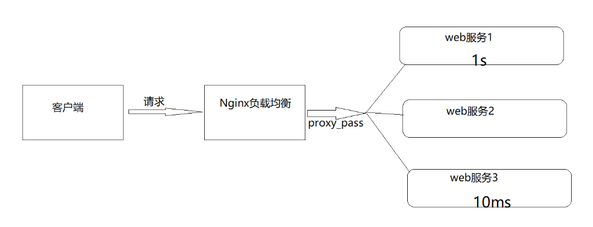

##### url_hash

按访问url的hash结果来分配请求，使每个url定向到同一个后端服务器，要配合缓存命中来使用。同一个资源多次请求，可能会到达不同的服务器上，导致不必要的多次下载，缓存命中率不高，以及一些资源时间的浪费。而使用url_hash，可以使得同一个url（也就是同一个资源请求）会到达同一台服务器，一旦缓存住了资源，再此收到请求，就可以从缓存中读取。

```
upstream backend{
	hash &request_uri;
	server 192.168.200.146:9001;
	server 192.168.200.146:9002;
	server 192.168.200.146:9003;
}
server {
	listen 8083;
	server_name localhost;
	location /{
		proxy_pass http://backend;
	}
}
```

访问如下地址：

```
http://192.168.200.133:8083/a
http://192.168.200.133:8083/b
http://192.168.200.133:8083/c
```


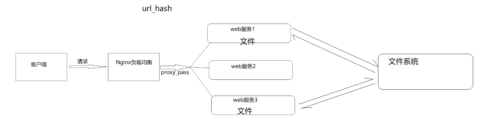


##### fair

fair采用的不是内建负载均衡使用的轮换的均衡算法，而是可以根据页面大小、加载时间长短智能的进行负载均衡。那么如何使用第三方模块的fair负载均衡策略。

```
upstream backend{
	fair;
	server 192.168.200.146:9001;
	server 192.168.200.146:9002;
	server 192.168.200.146:9003;
}
server {
	listen 8083;
	server_name localhost;
	location /{
		proxy_pass http://backend;
	}
}
```

但是如何直接使用会报错，因为fair属于第三方模块实现的负载均衡。需要添加`nginx-upstream-fair`,如何添加对应的模块:

1. 下载nginx-upstream-fair模块

```
下载地址为:
	https://github.com/gnosek/nginx-upstream-fair
```

2. 将下载的文件上传到服务器并进行解压缩

```
unzip nginx-upstream-fair-master.zip
```

3. 重命名资源

```
mv nginx-upstream-fair-master fair
```

4. 使用./configure命令将资源添加到Nginx模块中

```
./configure --add-module=/root/fair
```

5. 编译

```
make
```

编译可能会出现如下错误，ngx_http_upstream_srv_conf_t结构中缺少default_port


解决方案:

在Nginx的源码中 src/http/ngx_http_upstream.h,找到`ngx_http_upstream_srv_conf_s`，在模块中添加添加default_port属性

```
in_port_t	   default_port
```


然后再进行make.

6. 更新Nginx


​	 6.1 将sbin目录下的nginx进行备份

```
mv /usr/local/nginx/sbin/nginx /usr/local/nginx/sbin/nginxold
```

​	6.2 将安装目录下的objs中的nginx拷贝到sbin目录

```
cd objs
cp nginx /usr/local/nginx/sbin
```

​	 6.3 更新Nginx

```
cd ../
make upgrade
```

7. 编译测试使用Nginx

上面介绍了Nginx常用的负载均衡的策略，有人说是5种，是把轮询和加权轮询归为一种，也有人说是6种。那么在咱们以后的开发中到底使用哪种，这个需要根据实际项目的应用场景来决定的。

#### 负载均衡案例

##### 案例一：对所有请求实现一般轮询规则的负载均衡

```
upstream backend{
	server 192.168.200.146:9001;
	server 192.168.200.146:9002;
	server 192.168.200.146:9003;
}
server {
	listen 8083;
	server_name localhost;
	location /{
		proxy_pass http://backend;
	}
}
```

##### 案例二：对所有请求实现加权轮询规则的负载均衡

```
upstream backend{
	server 192.168.200.146:9001 weight=7;
	server 192.168.200.146:9002 weight=5;
	server 192.168.200.146:9003 weight=3;
}
server {
	listen 8083;
	server_name localhost;
	location /{
		proxy_pass http://backend;
	}
}
```

##### 案例三：对特定资源实现负载均衡

```
upstream videobackend{
	server 192.168.200.146:9001;
	server 192.168.200.146:9002;
}
upstream filebackend{
	server 192.168.200.146:9003;
	server 192.168.200.146:9004;
}
server {
	listen 8084;
	server_name localhost;
	location /video/ {
		proxy_pass http://videobackend;
	}
	location /file/ {
		proxy_pass http://filebackend;
	}
}
```

##### 案例四：对不同域名实现负载均衡

```
upstream itcastbackend{
	server 192.168.200.146:9001;
	server 192.168.200.146:9002;
}
upstream itheimabackend{
	server 192.168.200.146:9003;
	server 192.168.200.146:9004;
}
server {
	listen	8085;
	server_name www.itcast.cn;
	location / {
		proxy_pass http://itcastbackend;
	}
}
server {
	listen	8086;
	server_name www.itheima.cn;
	location / {
		proxy_pass http://itheimabackend;
	}
}
```

##### 案例五：实现带有URL重写的负载均衡

```
upstream backend{
	server 192.168.200.146:9001;
	server 192.168.200.146:9002;
	server 192.168.200.146:9003;
}
server {
	listen	80;
	server_name localhost;
	location /file/ {
		rewrite ^(/file/.*) /server/$1 last;
	}
	location / {
		proxy_pass http://backend;
	}
}
```

### Nginx四层负载均衡

Nginx在1.9之后，增加了一个stream模块，用来实现四层协议的转发、代理、负载均衡等。stream模块的用法跟http的用法类似，允许我们配置一组TCP或者UDP等协议的监听，然后通过proxy_pass来转发我们的请求，通过upstream添加多个后端服务，实现负载均衡。

四层协议负载均衡的实现，一般都会用到LVS、HAProxy、F5等，要么很贵要么配置很麻烦，而Nginx的配置相对来说更简单，更能快速完成工作。

#### 添加stream模块的支持

Nginx默认是没有编译这个模块的，需要使用到stream模块，那么需要在编译的时候加上`--with-stream`。

完成添加`--with-stream`的实现步骤:

```
》将原有/usr/local/nginx/sbin/nginx进行备份
》拷贝nginx之前的配置信息
》在nginx的安装源码进行配置指定对应模块  ./configure --with-stream
》通过make模板进行编译
》将objs下面的nginx移动到/usr/local/nginx/sbin下
》在源码目录下执行  make upgrade进行升级，这个可以实现不停机添加新模块的功能
```

#### Nginx四层负载均衡的指令

##### stream指令

该指令提供在其中指定流服务器指令的配置文件上下文。和http指令同级。

| 语法   | stream { ... } |
| ------ | -------------- |
| 默认值 | —              |
| 位置   | main           |

##### upstream指令

该指令和http的upstream指令是类似的。


#### 四层负载均衡的案例

##### 需求分析

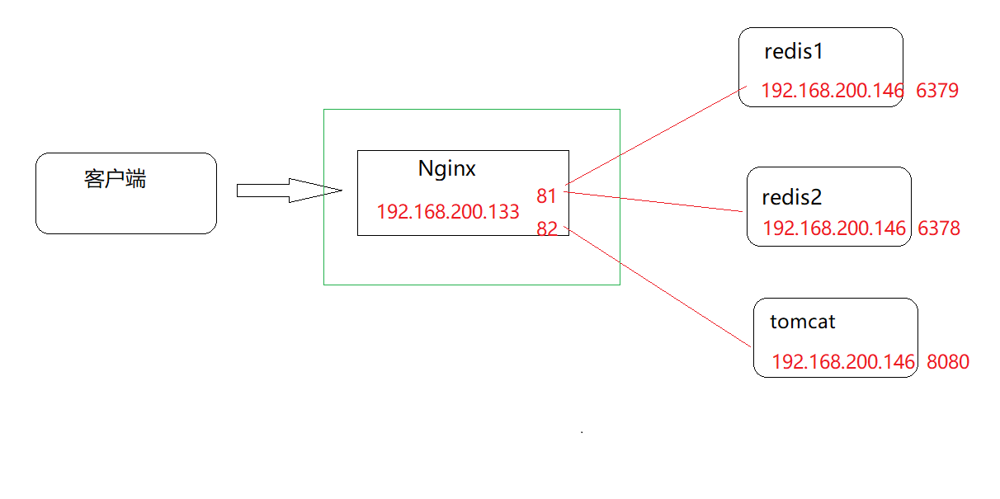

实现步骤

(1)准备Redis服务器,在一条服务器上准备三个Redis，端口分别是6379,6378

1.上传redis的安装包，`redis-4.0.14.tar.gz`

2.将安装包进行解压缩

```
tar -zxf redis-4.0.14.tar.gz
```

3.进入redis的安装包

```
cd redis-4.0.14
```

4.使用make和install进行编译和安装

```
make PREFIX=/usr/local/redis/redis01 install
```

5.拷贝redis配置文件`redis.conf`到/usr/local/redis/redis01/bin目录中

```
cp redis.conf	/usr/local/redis/redis01/bin
```

6.修改redis.conf配置文件

```
port  6379      #redis的端口
daemonize yes   #后台启动redis
```

7.将redis01复制一份为redis02

```
cd /usr/local/redis
cp -r redis01 redis02
```

8.将redis02文件文件夹中的redis.conf进行修改

```
port  6378      #redis的端口
daemonize yes   #后台启动redis
```

9.分别启动，即可获取两个Redis.并查看

```
ps -ef | grep redis
```

使用Nginx将请求分发到不同的Redis服务器上。

(2)准备Tomcat服务器.

1.上传tomcat的安装包，`apache-tomcat-8.5.56.tar.gz`

2.将安装包进行解压缩

```
tar -zxf apache-tomcat-8.5.56.tar.gz
```

3.进入tomcat的bin目录

```
cd apache-tomcat-8.5.56/bin
./startup
```

nginx.conf配置

```
stream {
        upstream redisbackend {
                server 192.168.200.146:6379;
                server 192.168.200.146:6378;
        }
        upstream tomcatbackend {
        		server 192.168.200.146:8080;
        }
        server {
                listen  81;
                proxy_pass redisbackend;
        }
        server {
        		listen	82;
        		proxy_pass tomcatbackend;
        }
}
```

访问测试。

# Nginx缓存集成

## 缓存的概念

缓存就是数据交换的缓冲区(称作:Cache),当用户要获取数据的时候，会先从缓存中去查询获取数据，如果缓存中有就会直接返回给用户，如果缓存中没有，则会发请求从服务器重新查询数据，将数据返回给用户的同时将数据放入缓存，下次用户就会直接从缓存中获取数据。

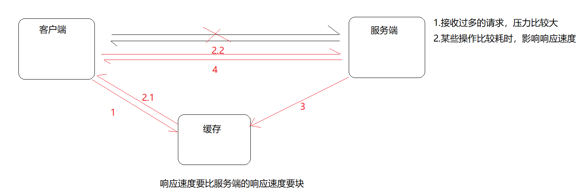

缓存其实在很多场景中都有用到，比如：


| 场景             | 作用                     |
| ---------------- | ------------------------ |
| 操作系统磁盘缓存 | 减少磁盘机械操作         |
| 数据库缓存       | 减少文件系统的IO操作     |
| 应用程序缓存     | 减少对数据库的查询       |
| Web服务器缓存    | 减少对应用服务器请求次数 |
| 浏览器缓存       | 减少与后台的交互次数     |

缓存的优点

​	1.减少数据传输，节省网络流量，加快响应速度，提升用户体验；

​	2.减轻服务器压力；

​	3.提供服务端的高可用性；

缓存的缺点

​	1.数据的不一致

​	2.增加成本


本次课程注解讲解的是Nginx,Nginx作为web服务器，Nginx作为Web缓存服务器，它介于客户端和应用服务器之间，当用户通过浏览器访问一个URL时，web缓存服务器会去应用服务器获取要展示给用户的内容，将内容缓存到自己的服务器上，当下一次请求到来时，如果访问的是同一个URL，web缓存服务器就会直接将之前缓存的内容返回给客户端，而不是向应用服务器再次发送请求。web缓存降低了应用服务器、数据库的负载，减少了网络延迟，提高了用户访问的响应速度，增强了用户的体验。

## Nginx的web缓存服务

Nginx是从0.7.48版开始提供缓存功能。Nginx是基于Proxy Store来实现的，其原理是把URL及相关组合当做Key,在使用MD5算法对Key进行哈希，得到硬盘上对应的哈希目录路径，从而将缓存内容保存在该目录中。它可以支持任意URL连接，同时也支持404/301/302这样的非200状态码。Nginx即可以支持对指定URL或者状态码设置过期时间，也可以使用purge命令来手动清除指定URL的缓存。

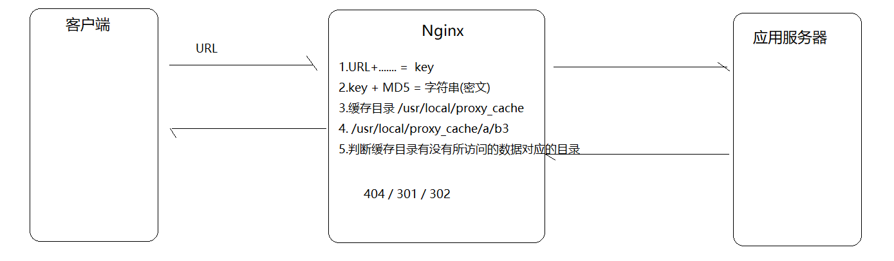


## Nginx缓存设置的相关指令

Nginx的web缓存服务主要是使用`ngx_http_proxy_module`模块相关指令集来完成，接下来我们把常用的指令来进行介绍下。

### proxy_cache_path

该指定用于设置缓存文件的存放路径

| 语法   | proxy_cache_path path [levels=number] <br/>keys_zone=zone_name:zone_size [inactive=time]\[max_size=size]; |
| ------ | ------------------------------------------------------------ |
| 默认值 | —                                                            |
| 位置   | http                                                         |

path:缓存路径地址,如：

```
/usr/local/proxy_cache
```

levels: 指定该缓存空间对应的目录，最多可以设置3层，每层取值为1|2如 :

```
levels=1:2   缓存空间有两层目录，第一次是1个字母，第二次是2个字母
举例说明:
itheima[key]通过MD5加密以后的值为 43c8233266edce38c2c9af0694e2107d
levels=1:2   最终的存储路径为/usr/local/proxy_cache/d/07
levels=2:1:2 最终的存储路径为/usr/local/proxy_cache/7d/0/21
levels=2:2:2 最终的存储路径为??/usr/local/proxy_cache/7d/10/e2
```

keys_zone:用来为这个缓存区设置名称和指定大小，如：

```
keys_zone=itcast:200m  缓存区的名称是itcast,大小为200M,1M大概能存储8000个keys
```

inactive:指定缓存的数据多次时间未被访问就将被删除，如：

```
inactive=1d   缓存数据在1天内没有被访问就会被删除
```

max_size:设置最大缓存空间，如果缓存空间存满，默认会覆盖缓存时间最长的资源，如:

```
max_size=20g
```

配置实例:

```
http{
	proxy_cache_path /usr/local/proxy_cache keys_zone=itcast:200m  levels=1:2:1 inactive=1d max_size=20g;
}
```

### proxy_cache

该指令用来开启或关闭代理缓存，如果是开启则自定使用哪个缓存区来进行缓存。

| 语法   | proxy_cache zone_name\|off; |
| ------ | --------------------------- |
| 默认值 | proxy_cache off;            |
| 位置   | http、server、location      |

zone_name：指定使用缓存区的名称

### proxy_cache_key

该指令用来设置web缓存的key值，Nginx会根据key值MD5哈希存缓存。

| 语法   | proxy_cache_key key;                              |
| ------ | ------------------------------------------------- |
| 默认值 | proxy_cache_key \$scheme\$proxy_host$request_uri; |
| 位置   | http、server、location                            |

### proxy_cache_valid

该指令用来对不同返回状态码的URL设置不同的缓存时间

| 语法   | proxy_cache_valid [code ...] time; |
| ------ | ---------------------------------- |
| 默认值 | —                                  |
| 位置   | http、server、location             |

如：

```
proxy_cache_valid 200 302 10m;
proxy_cache_valid 404 1m;
为200和302的响应URL设置10分钟缓存，为404的响应URL设置1分钟缓存
proxy_cache_valid any 1m;
对所有响应状态码的URL都设置1分钟缓存
```

### proxy_cache_min_uses

该指令用来设置资源被访问多少次后被缓存

| 语法   | proxy_cache_min_uses number; |
| ------ | ---------------------------- |
| 默认值 | proxy_cache_min_uses 1;      |
| 位置   | http、server、location       |

### proxy_cache_methods

该指令用户设置缓存哪些HTTP方法

| 语法   | proxy_cache_methods GET\|HEAD\|POST; |
| ------ | ------------------------------------ |
| 默认值 | proxy_cache_methods GET HEAD;        |
| 位置   | http、server、location               |

默认缓存HTTP的GET和HEAD方法，不缓存POST方法。

## Nginx缓存设置案例

#### 需求分析

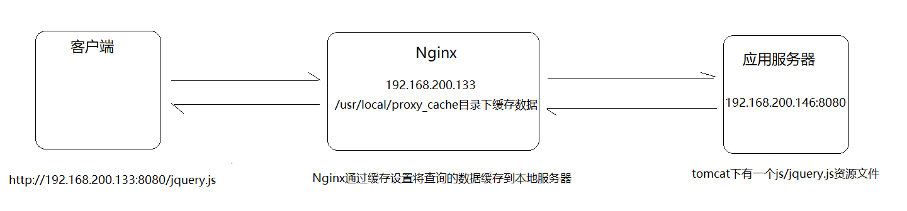


#### 步骤实现

1.环境准备

应用服务器的环境准备

（1）在192.168.200.146服务器上的tomcat的webapps下面添加一个js目录，并在js目录中添加一个jquery.js文件

（2）启动tomcat

（3）访问测试

```
http://192.168.200.146:8080/js/jquery.js
```

Nginx的环境准备

（1）完成Nginx反向代理配置

```
http{
	upstream backend{
		server 192.168.200.146:8080;
	}
	server {
		listen       8080;
        server_name  localhost;
        location / {
        	proxy_pass http://backend/js/;
        }
	}
}
```

（2）完成Nginx缓存配置

4.添加缓存配置

```
http{
	proxy_cache_path /usr/local/proxy_cache levels=2:1 keys_zone=itcast:200m inactive=1d max_size=20g;
	upstream backend{
		server 192.168.200.146:8080;
	}
	server {
		listen       8080;
        server_name  localhost;
        location / {
        	proxy_cache itcast;
            proxy_cache_key itheima;
            proxy_cache_min_uses 5;
            proxy_cache_valid 200 5d;
            proxy_cache_valid 404 30s;
            proxy_cache_valid any 1m;
            add_header nginx-cache "$upstream_cache_status";
        	proxy_pass http://backend/js/;
        }
	}
}
```

## Nginx缓存的清除

### 方式一:删除对应的缓存目录

```
rm -rf /usr/local/proxy_cache/......
```

### 方式二:使用第三方扩展模块

#### ngx_cache_purge

（1）下载ngx_cache_purge模块对应的资源包，并上传到服务器上。

```
ngx_cache_purge-2.3.tar.gz
```

（2）对资源文件进行解压缩

```
tar -zxf ngx_cache_purge-2.3.tar.gz
```

（3）修改文件夹名称，方便后期配置

```
mv ngx_cache_purge-2.3 purge
```

（4）查询Nginx的配置参数

```
nginx -V
```

（5）进入Nginx的安装目录，使用./configure进行参数配置

```
./configure --add-module=/root/nginx/module/purge
```

（6）使用make进行编译

```
make
```

（7）将nginx安装目录的nginx二级制可执行文件备份

```
mv /usr/local/nginx/sbin/nginx /usr/local/nginx/sbin/nginxold
```

（8）将编译后的objs中的nginx拷贝到nginx的sbin目录下

```
cp objs/nginx /usr/local/nginx/sbin
```

（9）使用make进行升级

```
make upgrade
```

（10）在nginx配置文件中进行如下配置

```
server{
	location ~/purge(/.*) {
		proxy_cache_purge itcast itheima;
	}
}
```


## Nginx设置资源不缓存

前面咱们已经完成了Nginx作为web缓存服务器的使用。但是我们得思考一个问题就是不是所有的数据都适合进行缓存。比如说对于一些经常发生变化的数据。如果进行缓存的话，就很容易出现用户访问到的数据不是服务器真实的数据。所以对于这些资源我们在缓存的过程中就需要进行过滤，不进行缓存。

Nginx也提供了这块的功能设置，需要使用到如下两个指令

proxy_no_cache

该指令是用来定义不将数据进行缓存的条件。

| 语法   | proxy_no_cache string ...; |
| ------ | -------------------------- |
| 默认值 | —                          |
| 位置   | http、server、location     |

配置实例

```
proxy_no_cache $cookie_nocache $arg_nocache $arg_comment;
```

proxy_cache_bypass

该指令是用来设置不从缓存中获取数据的条件。

| 语法   | proxy_cache_bypass string ...; |
| ------ | ------------------------------ |
| 默认值 | —                              |
| 位置   | http、server、location         |

配置实例

```
proxy_cache_bypass $cookie_nocache $arg_nocache $arg_comment;
```

上述两个指令都有一个指定的条件，这个条件可以是多个，并且多个条件中至少有一个不为空且不等于"0",则条件满足成立。上面给的配置实例是从官方网站获取的，里面使用到了三个变量，分别是\$cookie_nocache、\$arg_nocache、\$arg_comment

### $cookie_nocache、\$arg_nocache、\$arg_comment

这三个参数分别代表的含义是:

```
$cookie_nocache
指的是当前请求的cookie中键的名称为nocache对应的值
$arg_nocache和$arg_comment
指的是当前请求的参数中属性名为nocache和comment对应的属性值
```

案例演示下:

```
log_format params $cookie_nocache | $arg_nocache | $arg_comment；
server{
	listen	8081;
	server_name localhost;
	location /{
		access_log logs/access_params.log params;
		add_header Set-Cookie 'nocache=999';
		root html;
		index index.html;
	}
}
```

### 案例实现

设置不缓存资源的配置方案

```
server{
	listen	8080;
	server_name localhost;
	location / {
		if ($request_uri ~ /.*\.js$){
           set $nocache 1;
        }
		proxy_no_cache $nocache $cookie_nocache $arg_nocache $arg_comment;
        proxy_cache_bypass $nocache $cookie_nocache $arg_nocache $arg_comment;
	}
}
```

