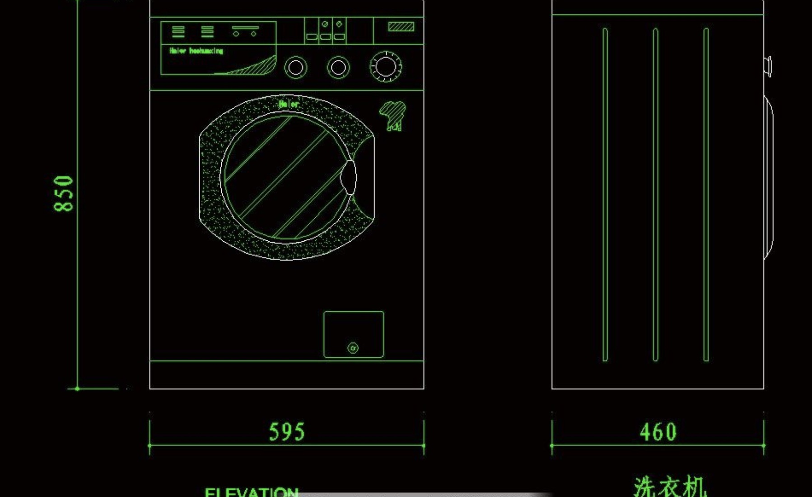

# 面向对象基础

# 目标

- 理解面向对象
- 类和对象
- 添加和获取对象属性
- 魔法方法


# 一. 理解面向对象

面向对象是一种抽象化的编程思想，很多编程语言中都有的一种思想。

例如：洗衣服

思考：几种途径可以完成洗衣服？

答： 手洗 和 机洗。

手洗：找盆 - 放水 - 加洗衣粉 - 浸泡 - 搓洗 - 拧干水 - 倒水 - 漂洗N次 - 拧干 - 晾晒。

机洗：打开洗衣机 - 放衣服 - 加洗衣粉 - 按下开始按钮 - 晾晒。

思考：对比两种洗衣服途径，同学们发现了什么？

答：机洗更简单

思考：机洗，只需要找到一台洗衣机，加入简单操作就可以完成洗衣服的工作，而不需要关心洗衣机内部发生了什么事情。

> 总结：==面向对象就是将编程当成是一个事物，对外界来说，事物是直接使用的，不用去管他内部的情况。而编程就是设置事物能够做什么事。==


# 二. 类和对象

思考：洗衣机洗衣服描述过程中，洗衣机其实就是一个事物，即对象，洗衣机对象哪来的呢？

答：洗衣机是由工厂工人制作出来。

思考：工厂工人怎么制作出的洗衣机？

答：工人根据设计师设计的功能图纸制作洗衣机。

总结：图纸  → 洗衣机 → 洗衣服。

在面向对象编程过程中，有两个重要组成部分：==类== 和 ==对象==。

==类和对象的关系：用类去创建一个对象。==

## 2.1 理解类和对象

### 2.1.1 类

类是对一系列具有相同==特征==和==行为==的事物的统称，是一个==抽象的概念==，不是真实存在的事物。

- 特征即是属性
- 行为即是方法

类比如是制造洗衣机时要用到的图纸，也就是说==类是用来创建对象==。




### 2.1.2 对象

对象是类创建出来的真实存在的事物，例如：洗衣机。

> 注意：开发中，先有类，再有对象。


## 2.2 面向对象实现方法

### 2.2.1 定义类

Python2中类分为：经典类 和 新式类

- 语法

```python
class 类名():
    代码
    ......
```

> 注意：类名要满足标识符命名规则，同时遵循==大驼峰命名习惯==。

- 体验

``` python
class Washer():
    def wash(self):
        print('我会洗衣服')
```

- 拓展：经典类

不由任意内置类型派生出的类，称之为经典类

``` python
class 类名:
    代码
    ......
```


### 2.2.2 创建对象

对象又名实例。

- 语法

``` python
对象名 = 类名()
```

- 体验

``` python
# 创建对象
haier1 = Washer()

# <__main__.Washer object at 0x0000018B7B224240>
print(haier1)

# haier对象调用实例方法
haier1.wash()
```

> 注意：创建对象的过程也叫实例化对象。

### 2.2.3 self

self指的是调用该函数的对象。

``` python
# 1. 定义类
class Washer():
    def wash(self):
        print('我会洗衣服')
        # <__main__.Washer object at 0x0000024BA2B34240>
        print(self)


# 2. 创建对象
haier1 = Washer()
# <__main__.Washer object at 0x0000018B7B224240>
print(haier1)
# haier1对象调用实例方法
haier1.wash()


haier2 = Washer()
# <__main__.Washer object at 0x0000022005857EF0>
print(haier2)
```

> 注意：打印对象和self得到的结果是一致的，都是当前对象的内存中存储地址。


# 三. 添加和获取对象属性

属性即是特征，比如：洗衣机的宽度、高度、重量...

对象属性既可以在类外面添加和获取，也能在类里面添加和获取。

## 3.1 类外面添加对象属性

- 语法

``` python
对象名.属性名 = 值
```

- 体验

``` python
haier1.width = 500
haier1.height = 800
```


## 3.2 类外面获取对象属性

- 语法

``` python
对象名.属性名
```

- 体验

``` python
print(f'haier1洗衣机的宽度是{haier1.width}')
print(f'haier1洗衣机的高度是{haier1.height}')
```


## 3.3 类里面获取对象属性

- 语法

``` python
self.属性名
```

- 体验

``` python
# 定义类
class Washer():
    def print_info(self):
        # 类里面获取实例属性
        print(f'haier1洗衣机的宽度是{self.width}')
        print(f'haier1洗衣机的高度是{self.height}')

# 创建对象
haier1 = Washer()

# 添加实例属性
haier1.width = 500
haier1.height = 800

haier1.print_info()
```


# 四. 魔法方法

在Python中，`__xx__()`的函数叫做魔法方法，指的是具有特殊功能的函数。

## 4.1 `__init__()`

### 4.1.1 体验`__init__()`

思考：洗衣机的宽度高度是与生俱来的属性，可不可以在生产过程中就赋予这些属性呢？

答：理应如此。

==`__init__()`方法的作用：初始化对象。==

``` python
class Washer():
    
    # 定义初始化功能的函数
    def __init__(self):
        # 添加实例属性
        self.width = 500
        self.height = 800


    def print_info(self):
        # 类里面调用实例属性
        print(f'洗衣机的宽度是{self.width}, 高度是{self.height}')


haier1 = Washer()
haier1.print_info()
```

> 注意：
>
> - `__init__()`方法，在创建一个对象时默认被调用，不需要手动调用
> - `__init__(self)`中的self参数，不需要开发者传递，python解释器会自动把当前的对象引用传递过去。


### 4.1.2 带参数的`__init__()`

思考：一个类可以创建多个对象，如何对不同的对象设置不同的初始化属性呢？

答：传参数。

``` python
class Washer():
    def __init__(self, width, height):
        self.width = width
        self.height = height

    def print_info(self):
        print(f'洗衣机的宽度是{self.width}')
        print(f'洗衣机的高度是{self.height}')


haier1 = Washer(10, 20)
haier1.print_info()


haier2 = Washer(30, 40)
haier2.print_info()
```


## 4.2  `__str__()`

当使用print输出对象的时候，默认打印对象的内存地址。如果类定义了`__str__`方法，那么就会打印从在这个方法中 return 的数据。

``` python
class Washer():
    def __init__(self, width, height):
        self.width = width
        self.height = height

    def __str__(self):
        return '这是海尔洗衣机的说明书'


haier1 = Washer(10, 20)
# 这是海尔洗衣机的说明书
print(haier1)
```


## 4.3  `__del__()`

当删除对象时，python解释器也会默认调用`__del__()`方法。

``` python
class Washer():
    def __init__(self, width, height):
        self.width = width
        self.height = height

    def __del__(self):
        print(f'{self}对象已经被删除')


haier1 = Washer(10, 20)

# <__main__.Washer object at 0x0000026118223278>对象已经被删除
del haier1
```


# 五. 综合应用

## 5.1 烤地瓜

### 5.1.1 需求

需求主线：

 1. 被烤的时间和对应的地瓜状态：

    0-3分钟：生的

    3-5分钟：半生不熟

    5-8分钟：熟的

    超过8分钟：烤糊了

    

 2. 添加的调料：

    用户可以按自己的意愿添加调料

    

### 5.1.2 步骤分析

需求涉及一个事物： 地瓜，故案例涉及一个类：地瓜类。

#### 5.1.2.1 定义类

- 地瓜的属性
  - 被烤的时间
  - 地瓜的状态
  - 添加的调料
- 地瓜的方法
  - 被烤
    - 用户根据意愿设定每次烤地瓜的时间
    - 判断地瓜被烤的总时间是在哪个区间，修改地瓜状态
  - 添加调料
    - 用户根据意愿设定添加的调料
    - 将用户添加的调料存储

- 显示对象信息


#### 5.1.2.2 创建对象，调用相关实例方法


### 5.1.3 代码实现

#### 5.1.3.1 定义类

- 地瓜属性
  - 定义地瓜初始化属性，后期根据程序推进更新实例属性

``` python
class SweetPotato():
    def __init__(self):
        # 被烤的时间
        self.cook_time = 0
        # 地瓜的状态
        self.cook_static = '生的'
        # 调料列表
        self.condiments = []
```


#### 5.1.3.2 定义烤地瓜方法

``` python
class SweetPotato():
    ......
    
    def cook(self, time):
        """烤地瓜的方法"""
        self.cook_time += time
        if 0 <= self.cook_time < 3:
            self.cook_static = '生的'
        elif 3 <= self.cook_time < 5:
            self.cook_static = '半生不熟'
        elif 5 <= self.cook_time < 8:
            self.cook_static = '熟了'
        elif self.cook_time >= 8:
            self.cook_static = '烤糊了'
```


#### 5.1.3.3 书写str魔法方法，用于输出对象状态

``` python
class SweetPotato():
		......

    def __str__(self):
        return f'这个地瓜烤了{self.cook_time}分钟, 状态是{self.cook_static}'

```


#### 5.1.3.4  创建对象，测试实例属性和实例方法

``` python 
digua1 = SweetPotato()
print(digua1)
digua1.cook(2)
print(digua1)
```


#### 5.1.3.5 定义添加调料方法，并调用该实例方法

``` python
class SweetPotato():
		......

    def add_condiments(self, condiment):
        """添加调料"""
        self.condiments.append(condiment)
    def __str__(self):
        return f'这个地瓜烤了{self.cook_time}分钟, 状态是{self.cook_static}, 添加的调料有{self.condiments}'
      

digua1 = SweetPotato()
print(digua1)

digua1.cook(2)
digua1.add_condiments('酱油')
print(digua1)

digua1.cook(2)
digua1.add_condiments('辣椒面儿')
print(digua1)

digua1.cook(2)
print(digua1)

digua1.cook(2)
print(digua1)
```


### 5.1.4 代码总览

``` python
# 定义类
class SweetPotato():
    def __init__(self):
        # 被烤的时间
        self.cook_time = 0
        # 地瓜的状态
        self.cook_static = '生的'
        # 调料列表
        self.condiments = []

    def cook(self, time):
        """烤地瓜的方法"""
        self.cook_time += time
        if 0 <= self.cook_time < 3:
            self.cook_static = '生的'
        elif 3 <= self.cook_time < 5:
            self.cook_static = '半生不熟'
        elif 5 <= self.cook_time < 8:
            self.cook_static = '熟了'
        elif self.cook_time >= 8:
            self.cook_static = '烤糊了'

    def add_condiments(self, condiment):
        """添加调料"""
        self.condiments.append(condiment)

    def __str__(self):
        return f'这个地瓜烤了{self.cook_time}分钟, 状态是{self.cook_static}, 添加的调料有{self.condiments}'


digua1 = SweetPotato()
print(digua1)

digua1.cook(2)
digua1.add_condiments('酱油')
print(digua1)

digua1.cook(2)
digua1.add_condiments('辣椒面儿')
print(digua1)

digua1.cook(2)
print(digua1)

digua1.cook(2)
print(digua1)
```


## 5.2 搬家具

### 5.2.1 需求

将小于房子剩余面积的家具摆放到房子中


### 5.2.2 步骤分析

需求涉及两个事物：房子 和 家具，故被案例涉及两个类：房子类 和 家具类。

#### 5.2.2.1 定义类

- 房子类
  - 实例属性
    - 房子地理位置
    - 房子占地面积
    - 房子剩余面积
    - 房子内家具列表
  - 实例方法
    - 容纳家具
  - 显示房屋信息


- 家具类
  - 家具名称
  - 家具占地面积

#### 5.2.2.2 创建对象并调用相关方法


### 5.2.3 代码实现

#### 5.2.3.1 定义类

- 家具类

``` python
class Furniture():
    def __init__(self, name, area):
        # 家具名字
        self.name = name
        # 家具占地面积
        self.area = area
```


- #### 房子类

``` python
class Home():
    def __init__(self, address, area):
        # 地理位置
        self.address = address
        # 房屋面积
        self.area = area
        # 剩余面积
        self.free_area = area
        # 家具列表
        self.furniture = []

    def __str__(self):
        return f'房子坐落于{self.address}, 占地面积{self.area}, 剩余面积{self.free_area}, 家具有{self.furniture}'

    def add_furniture(self, item):
        """容纳家具"""
        if self.free_area >= item.area:
            self.furniture.append(item.name)
            # 家具搬入后，房屋剩余面积 = 之前剩余面积 - 该家具面积
            self.free_area -= item.area
        else:
            print('家具太大，剩余面积不足，无法容纳')
```


#### 5.2.3.2 创建对象并调用实例属性和方法

``` python
bed = Furniture('双人床', 6)
jia1 = Home('北京', 1200)
print(jia1)

jia1.add_furniture(bed)
print(jia1)

sofa = Furniture('沙发', 10)
jia1.add_furniture(sofa)
print(jia1)

ball = Furniture('篮球场', 1500)
jia1.add_furniture(ball)
print(jia1)
```


# 六. 总结

- 面向对象重要组成部分

  - 类
    - 创建类

  ``` python
  class 类名():
    代码
  ```

  - 对象

  ``` python
  对象名 = 类名()
  ```

- 添加对象属性

  - 类外面

  ``` python
  对象名.属性名 = 值
  ```

  - 类里面

  ``` python
  self.属性名 = 值
  ```

- 获取对象属性

  - 类外面

  ``` python
  对象名.属性名
  ```

  - 类里面

  ``` python
  self.属性名
  ```

- 魔法方法

  - `__init__()`: 初始化
  - `__str__()`:输出对象信息
  - `__del__()`:删除对象时调用

