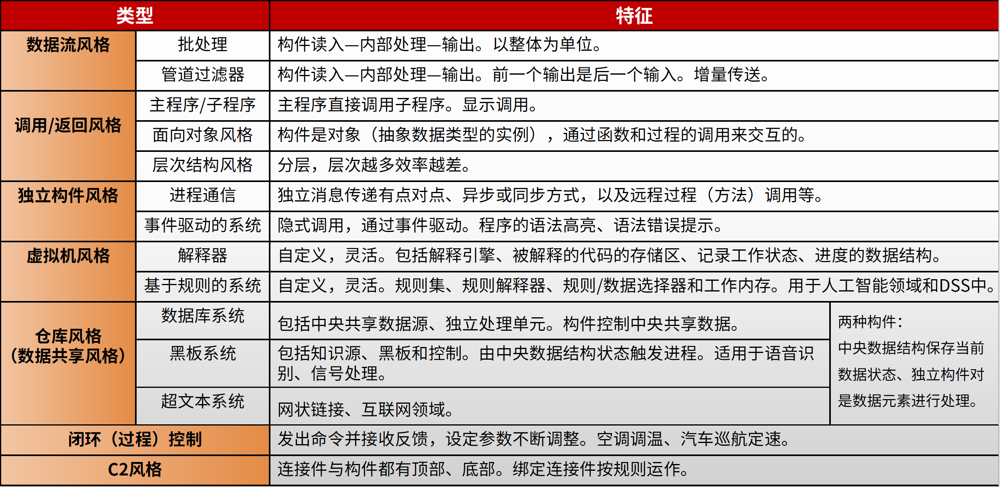

# 架构基本概念

软件架构设计主要关注软件<u>**构件的结构、属性和交互作用**</u> ，并通过多种视图全面描述特定系统的架构。

软件体系结构（架构）风格是描述<u>**某一特定应用领域中系统组织方式的惯用模式**</u>。

定义一个系统家族，即一个体系结构定义**<u>一个词汇表和一组约束</u>**。

- ​	**<u>词汇表中包含一些构件和连接件类型</u>**
- ​    **<u>约束</u>**指出系统是如何将这些构件和连接件组合起来的。体系结构风格反映了领域中众多系统所共有的结构和语义特性，并指导如何将各个模块和子系统有效地组织成一个完整的系统。

# 架构风格

