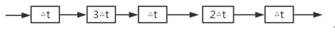
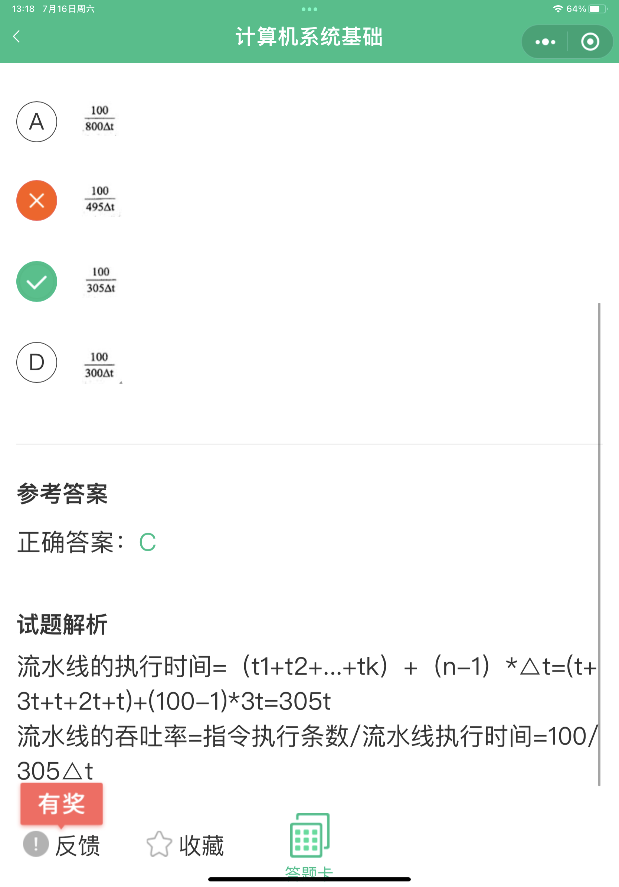
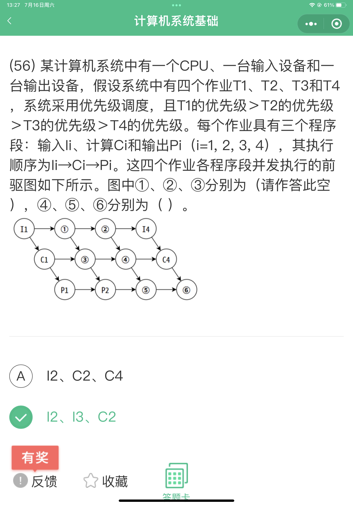
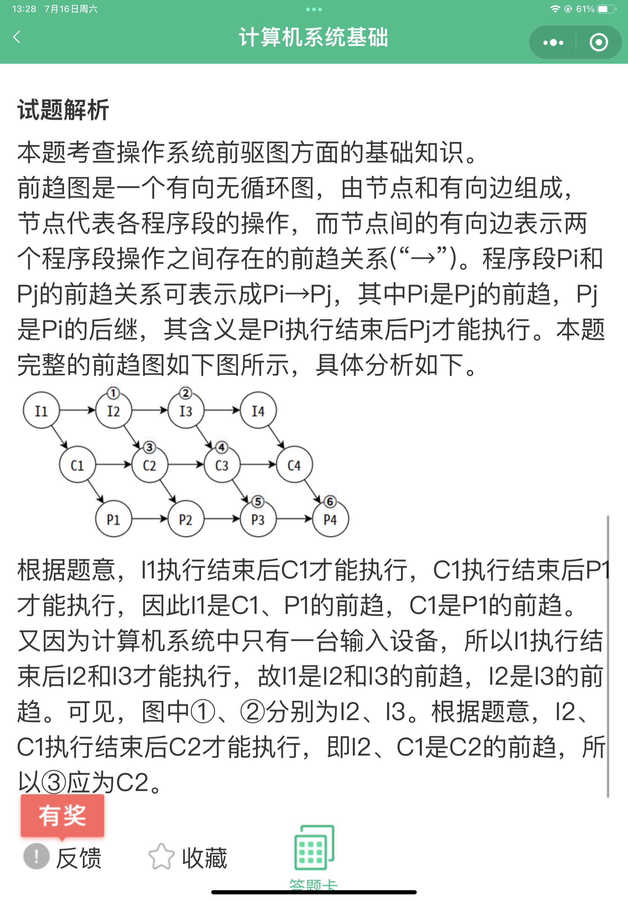

1.RISC(精简指令系统计算机)的特点不包括：（）

A 指令长度固定，指令种类尽量少

**B 寻址方式尽量丰富，指令功能尽可能强**

C 增加寄存器数目，以减少访存次数

D 用硬布线电路实现指令解码，以尽快完成指令译码

---

 2.为了加强对企业信息资源的管理，企业应按照信息化和现代化企业管理要求设置信息管理机构，建立信息中心。信息中心的主要职能不包括 （）
A 处理信息，确定信息处理的方法
B 用先进的信息技术提高业务管理水平
**C 组织招聘信息资源管理员**
D 建立业务部门期望的信息系统和网络

【解析】

本题考查企业信息中心的主要职能。为了加强对企业信息资源的管理，企业应按照信息化和现代化企业管理要求设置信息管理机构，建立信息中心，确定信息主管，统一管理和协调企业信息资源的开发、收集和使用。信息中心是企业的独立机构，直直接由最高层领导并为企业最高管理者提供服务。其主要职能是处理信息，确定信息处理的方法，用先进的信息技术提高业务管理水平，建立业务部门期望的信息系统和网络并预测末来的信息系统和网络，培养信息资源的管理人员等。

---

3.对计算机评价的主要性能指标有时钟频率、（）、运算精度和内存容量等。

A 丢包率           B 端口吞吐量           C 可移植性           D 数据处理速率

【解析】

性能指标，是软、硬件的性能指标的集成。在硬件中，包括计算机、各种通信交换设备、各类网络设备等；在软件中，包括：操作系统、协议以及应用程序等。
对计算机评价的主要性能指标有：时钟频率（主频）；运算速度；运算精度；内存的存储容量；存储器的存取周期；数据处理速率PDR (processing data rate）；吞吐率；各种响应时间；各种利用率；RASIS特性（即：可靠性Reliability、可用性Availability、可维护性、完整性和安全性；平均故障响应时间；兼容性：可扩充性：性能价格比。

---

)

---

对计算机评价的主要性能指标有时钟频率、（）、运算精度和内存容量等。对数据库管理系统评价的主要性能指标有（ **C** ）、数据库所允许的索引数量和最大并发实物处理能力等。

A MIPS        B 支持协议和标准        C 最大连接数        D 时延抖动

【解析】

性能指标，是软、硬件的性能指标的集成。在硬件中，包括计算机、各种通信交换设备、各类网络设备等；在软件中，包括：操作系统、协议以及应用程序等。
对计算机评价的主要性能指标有：时钟频率（主频）；运算速度；运算精度；内存的存储容量；存储器的存取周期；数据处理速率PDR (processing data rate）；吞吐率；各种响应时间；各种利用率；

RASIS特性（即：可靠性Reliability、可用性Availability、可维护性、完整性和安全性；平均故障响应时间；兼容
性；可扩充性；性能价格比。
衡量数据库管理系统的主要性能指标包括数据库本身和管理系统两部分，有：数据库的大小、数据库中表的数量、单个表的大小、表中允许的记录（行）数量、单个记录（行）的大小、表上所允许的索引数量、数据库所允许的索引数量、最大并发事务处理能力、负载均衡能力、最大连接数等等。

---

OMG 接口定义语言 DL 文件包含了六种不同的元素，（）是一个IDL文件核心的内容，（请作答此空） 将映射为 Java 语言中的包(package)或 C++语言中的命名空间(namespace)。
A 模块定义
B 消息结构
C 接囗描述
D 值类型

【解析】

DL是一种接口定义语言，具体的定义会涉及到接口以及相关部分。文件包含的主要元素有：接口描述、模块定义、类型定义、常量定义、异常、值类型。接口描述是IDL文件中最核心的内容。
由于IDL只是一种接口定义语言，最终还是要落地与语言对接的，所以IDL的数据类型要与实现语言进行映。以Java为例，DL接口映射为Java类，而该接口的操作映射为相应的成员函数。模块定义映射为Java语言中的包 (package） 或C++的(namespace)。

---

实时操作系统（RTOS）内核与应用程序之间的接口称为（）

A I/O接口

B PCI

C API

D GUI

【解析】

API (Application Programming Interface,应用程序编程接口）是一些预先定义的函数，目的是提供应用程序与开发人员基于某软件或硬件得以访问一组例程的能力，而又无需访问源码，或理解内部工作机制的细节。
所有操作系统 （不仅仅只是嵌入式操作系统）给应用程序提供的接口，称之为AP1。因此，本题选C。其他选项容易迷惑的有：
PCl是Peripheral Component Interconnect(外设部件互连标准)的缩写，它是目前个人电脑中使用最为广泛的接口，几乎所有的主板产品上都带有这种插槽。
GUI，图形用户界面，又称图形用户接口 (Graphical User Interface） 是用户与操作系统之间的接口。

---

嵌入式处理器是嵌入式系统的核心部件，一般可分为嵌入式微处理器(MPU)、微控制器(MCU)、数宇信号处理器(DSP)和片上系统(SOC)。以下叙述中，错误的是（）。
A、MPU在安全性和可靠性等方面进行增强，适用于运算量较大的智能系统
B、MCU典型代表是单片机，体积小从而使功耗和成本下降
C、DSP处理器对系统结构和指令进行了特殊设计，适合数字信号处理
D、SOC是一个有专用目标的集成电路，其中包括完整系统并有嵌入式软件的全部内容

【解析】

选项A是错的。MPU采用增强型通用微处理器。由于嵌入式系统通常应用于环境比较恶劣的环境中，因而MPU在工作温度、电磁兼容性以及可靠性方面的要求较通用的标准微处理器高。但是，MPU 在功能方面与标准的微处理器基本上是一样的。
选项B是对的。MCU又称单片微型计算机(Single ChipMicrocomputer)或者单片机，是指随着大规模集成电路的出现及其发展，将计算机的CPU、RAM、ROM、定时计数器和多种1/0接口集成在一片芯片上，形成芯片级的计算机，为不同的应用场合做不同组合控制。
典型代表是单片机，体积小从而使功耗和成本下降。
选项C是对的。DSP是一种独特的微处理器，是以数字信号来处理大量信息的器件。其实时运行速度可达每秒数以千万条复杂指令程序，远远超过通用微处理器，它的强大数据处理能力和高运行速度，是最值得称道的两大特色。
选项D是对的。SoC称为系统级芯片，也有称片上系统，意指它是一个产品，是一个有专用目标的集成电路，其中包含完整系统并有嵌入软件的全部内容。

---

某指令流水线由5段组成，各段所需要的时间如下所示

连续输入100条指令时的吞吐率为（）

---
电子政务是对现有的政府形态的一种改造，利用信息技术和其他相关技术，将其管理和服务职能进行集成，在网络上实现政府组织结构和工作流程优化重组。与电子政务相关的行为主体有三个，即政府、（）及居民。

A 部门

B 企事业单位

C 管理机构

D 行政机关

【解析】

电子政务是对现有的政府形态的一种改造，利用信息技术和其他相关技术，将其管理和服务职能进行集成，在网络上实现政府组织结构和工作流程优化重。与电子政务相关的行为主体有三个，即**政府、企（事）业单位及居民**。国家和地方人口信息的采集、处理和利用，属于政府对政府的电子政务活动。

---

DES加密算法的密钥长度为56位，三重DES的密钥长度为（112）位

【解析】

三重DES采用“加密-解密-加密”的过程，密钥长度是112位

这里是官方教材原话，实际是168位长度

---

---

（C）不属于按寻址方式划分的一类存储器。

A 随机存储器

B 顺序存储器

C 相联存储器

D 直接存储器

【解析】

 相联存储器是一种按存储内容来存储和访问的存储器，不属于按寻址方式划分的存储器。

---
